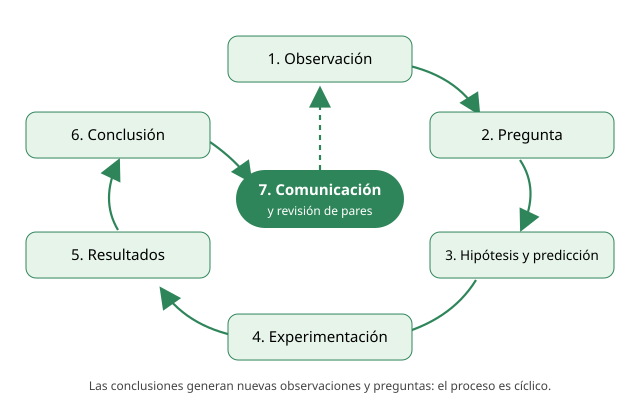

## 3. Etapas de una investigación científica

El llamado «método científico» no es una receta rígida que se sigue siempre en el mismo orden. Es un proceso **cíclico**: los resultados de una investigación generan nuevas preguntas, y a veces hay que volver atrás y reformular la hipótesis. Aun así, conviene conocer sus etapas, porque la PAES pide **identificar** cada una en un texto.

<figure><figcaption>Figura 1. La investigación científica es un ciclo: la conclusión y su comunicación abren nuevas preguntas. Diagrama propio.</figcaption></figure>

### i. Observación

Todo comienza cuando alguien nota un fenómeno y lo registra. La observación puede hacerse con los sentidos o con instrumentos (microscopio, termómetro, sensor). Una buena observación es **objetiva y precisa**: describe lo que ocurre sin interpretarlo.

*Ejemplo:* un grupo de estudiantes nota que las plantas de tomate del invernadero crecen más que las del patio.

### ii. Planteamiento del problema o pregunta de investigación

La observación se transforma en una **pregunta que se pueda responder con evidencia**. Una buena pregunta de investigación:

- es precisa;
- relaciona variables que se pueden medir;
- se puede responder con una investigación (no es una pregunta de opinión ni de valores).

| Pregunta poco útil | Pregunta de investigación |
|---|---|
| ¿Por qué las plantas son tan importantes? | ¿Cómo influye la temperatura del aire en la altura que alcanzan las plantas de tomate en cuatro semanas? |
| ¿Es bueno el fertilizante? | ¿Cómo afecta la cantidad de fertilizante (0, 2, 4 y 6 g) a la masa de los frutos de tomate? |

::: tip
**En la PAES:** cuando te piden «¿qué pregunta pudo guiar esta investigación?», busca la alternativa que relaciona **exactamente** las dos variables del experimento (la que se manipuló y la que se midió). Descarta las preguntas demasiado amplias o que mencionan variables que no se estudiaron.
:::

### iii. Hipótesis

La hipótesis es una **respuesta tentativa** a la pregunta de investigación. No es una adivinanza: se basa en conocimientos previos y observaciones. Debe cumplir dos condiciones:

1. **Ser contrastable**: se puede poner a prueba con un experimento u observaciones.
2. **Ser refutable**: debe existir un resultado posible que la demuestre falsa.

*Ejemplo:* «La mayor temperatura del invernadero aumenta la velocidad de crecimiento de las plantas de tomate».

::: nota
**Hipótesis nula y alternativa.** En muchas investigaciones se plantea una **hipótesis nula** (no hay efecto: «la temperatura no influye en el crecimiento») y una **hipótesis alternativa** (sí hay efecto). El experimento busca evidencia para rechazar la hipótesis nula.
:::

### iv. Predicción

La predicción dice **qué resultado se espera obtener si la hipótesis es correcta**. Se suele redactar como «si…, entonces…».

*Ejemplo:* «**Si** la temperatura aumenta la velocidad de crecimiento, **entonces** las plantas mantenidas a 25 °C serán más altas a las cuatro semanas que las mantenidas a 15 °C».

::: tip
**Hipótesis ≠ predicción.** Es la confusión más frecuente en la PAES.

- La **hipótesis explica** el fenómeno (propone una causa o un mecanismo).
- La **predicción anticipa un resultado medible** del experimento concreto.

Truco: la predicción menciona los grupos, las condiciones o los valores del experimento; la hipótesis es más general.
:::

### v. Experimentación

Se diseña y realiza un procedimiento para poner a prueba la hipótesis. En un experimento se **manipula** la variable independiente, se **mide** la variable dependiente y se **mantienen constantes** las demás variables. El diseño experimental se desarrolla en detalle en la sección 4.

### vi. Resultados

Los datos obtenidos se registran y se organizan en **tablas y gráficos** para encontrar patrones o tendencias. Los resultados se informan **tal como salieron**, aunque contradigan la hipótesis. Un resultado inesperado también es información valiosa.

### vii. Conclusión

La conclusión responde la pregunta de investigación a partir de los resultados:

- si los resultados coinciden con la predicción, la hipótesis **se apoya** (se acepta provisionalmente);
- si no coinciden, la hipótesis **se rechaza** o se reformula.

::: tip
**Una hipótesis nunca se «demuestra» definitivamente.** Un experimento puede aportar evidencia a favor, pero siempre podría aparecer un nuevo resultado que la contradiga. En cambio, un resultado contrario bien obtenido **sí** basta para rechazarla. Por eso en la PAES son sospechosas las alternativas que dicen «se comprueba definitivamente» o «queda demostrado para todos los casos».
:::

Una conclusión válida **no va más allá de los datos**. Si el experimento se hizo con plantas de tomate, no se puede concluir sobre «todas las plantas». Si se probaron temperaturas entre 15 °C y 25 °C, no se puede afirmar qué ocurre a 40 °C.

### viii. Comunicación de los resultados

La investigación se da a conocer mediante artículos científicos, congresos o informes. Antes de publicarse en una revista, el trabajo pasa por la **revisión de pares**: otros especialistas evalúan el diseño, los datos y las conclusiones. La publicación permite que otros **repliquen** el trabajo y construyan sobre él.
