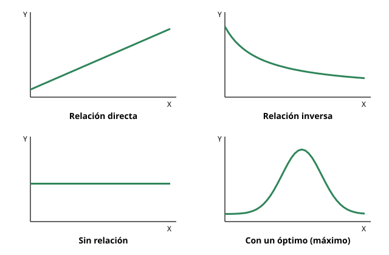

## 8. Tablas y gráficos: procesar, analizar y comunicar evidencia

«Procesar y analizar la evidencia» es una de las habilidades que **más se repite** en la PAES de Ciencias. Casi siempre aparece como una tabla o un gráfico que hay que interpretar. Según el temario oficial, incluye identificar relaciones, patrones o tendencias entre variables, identificar predicciones y resultados, y sacar conclusiones o inferencias a partir de los datos. La habilidad «Comunicar» agrega elegir el recurso adecuado (tabla, gráfico o modelo) para presentar la información.

### a. Las tablas

Una tabla organiza los datos para compararlos con facilidad. Una buena tabla tiene:

- un **título** que dice qué se estudió;
- **encabezados** con el nombre de cada variable y su **unidad** (°C, g, mL, %);
- la **variable independiente** normalmente en la primera columna, y la **dependiente** en las siguientes;
- si hubo réplicas, los datos de cada una y su **promedio**.

::: ejemplo
**Leer una tabla paso a paso**

*Tabla 1. Número de burbujas de O2 liberadas en 5 minutos por una rama de* Elodea *según su distancia a una lámpara (promedio de 3 réplicas).*

| Distancia a la lámpara (cm) | Burbujas en 5 min |
|---|---|
| 10 | 48 |
| 20 | 30 |
| 30 | 17 |
| 40 | 9 |
| 50 | 5 |

1. **Identifica las variables.** La independiente es la distancia a la lámpara, que el investigador varía. La dependiente es el número de burbujas, que se mide.
2. **Describe la tendencia.** A mayor distancia, menos burbujas: es una **relación inversa**.
3. **Interpreta.** Más distancia significa menos luz sobre la planta. Las burbujas son oxígeno producido por la fotosíntesis, así que menos luz implica menor tasa de fotosíntesis.
4. **No te pases de los datos.** La tabla no dice qué ocurre a 5 cm ni a 80 cm, ni si ocurre lo mismo en otras especies.
:::

### b. Tipos de gráficos y cuándo usarlos

| Gráfico | Cuándo se usa | Ejemplo |
|---|---|---|
| **De líneas** | Variable independiente **continua**; mostrar cómo cambia una variable (a menudo en el tiempo) | Crecimiento de una población bacteriana a lo largo de 24 horas |
| **De barras** | Comparar valores entre **categorías** (variable independiente cualitativa o discreta) | Promedio de altura de plantas con cuatro tipos de suelo |
| **Histograma** | Mostrar cómo se **distribuye** una variable continua en intervalos | Número de estudiantes según su estatura en intervalos de 5 cm |
| **Circular (de torta)** | Mostrar las **partes de un todo** (porcentajes que suman 100 %) | Composición porcentual de los gases del aire |
| **De dispersión** | Explorar si existe **relación** entre dos variables cuantitativas | Masa corporal y frecuencia cardíaca de 30 personas |

::: tip
**Habilidad «Comunicar»:** la PAES puede pedirte **elegir el mejor recurso** para presentar una información. Pregúntate: ¿comparo categorías (barras), muestro un cambio continuo (líneas), muestro partes de un todo (circular) o busco una relación entre dos variables medidas (dispersión)?
:::

### c. Relaciones entre variables

<figure><figcaption>Figura 2. Formas típicas de la relación entre una variable independiente (X) y una dependiente (Y). Diagrama propio.</figcaption></figure>

- **Directa:** al aumentar X, aumenta Y. Por ejemplo, la tasa de fotosíntesis cuando aumenta la luz, hasta cierto punto.
- **Inversa:** al aumentar X, disminuye Y. Por ejemplo, las burbujas de O2 al aumentar la distancia a la lámpara.
- **Sin relación:** Y no cambia al variar X.
- **Con un óptimo:** Y aumenta hasta un valor máximo y luego disminuye. Es típico de la actividad de las enzimas según la temperatura o el pH.
- **Con meseta (saturación):** Y aumenta y luego se estabiliza, porque otro factor pasa a ser el limitante. Es típico de la fotosíntesis cuando la luz sigue aumentando.

::: nota
**Proporcionalidad.** Si Y aumenta en la misma proporción que X (al duplicar X se duplica Y), la relación es **directamente proporcional**, y el gráfico es una recta que pasa por el origen. Si al duplicar X, Y se reduce a la mitad, es **inversamente proporcional**. No toda relación directa es proporcional: en la saturación, Y deja de crecer.
:::

### d. Interpretar sin equivocarse

1. **Lee los ejes y las unidades** antes que la curva. Muchos errores vienen de confundir qué variable está en cada eje.
2. **Describe la tendencia completa**, incluyendo cambios de pendiente, máximos y mesetas.
3. **Interpolar vs. extrapolar.**
   - **Interpolar** es estimar un valor **dentro** del rango medido. Es razonable.
   - **Extrapolar** es estimar **fuera** del rango medido. Es arriesgado: la tendencia puede cambiar.
4. **Correlación no es causalidad.** Que dos variables varíen juntas no prueba que una cause la otra. Puede haber una **tercera variable** que afecte a ambas. Por ejemplo, en verano aumentan tanto las ventas de helados como los golpes de calor. Los helados no causan golpes de calor: ambos dependen de la temperatura.
5. **Compara siempre con el control.** El efecto de un tratamiento es la **diferencia** respecto del grupo control, no el valor absoluto.

::: ejemplo
**¿Qué conclusión es correcta?**

Un gráfico muestra que, en un cultivo de levaduras, la producción de CO2 aumenta de 15 °C a 35 °C y luego disminuye hasta 45 °C.

- ✅ «En el rango estudiado, la producción de CO2 de estas levaduras es máxima cerca de 35 °C.» Se ajusta a los datos.
- ❌ «A mayor temperatura, mayor producción de CO2.» Ignora la disminución sobre 35 °C.
- ❌ «Todas las levaduras tienen su máxima actividad a 35 °C.» Generaliza de más: solo se estudió un cultivo.
- ❌ «A 60 °C la producción será cero.» Es una extrapolación fuera del rango medido.
:::
