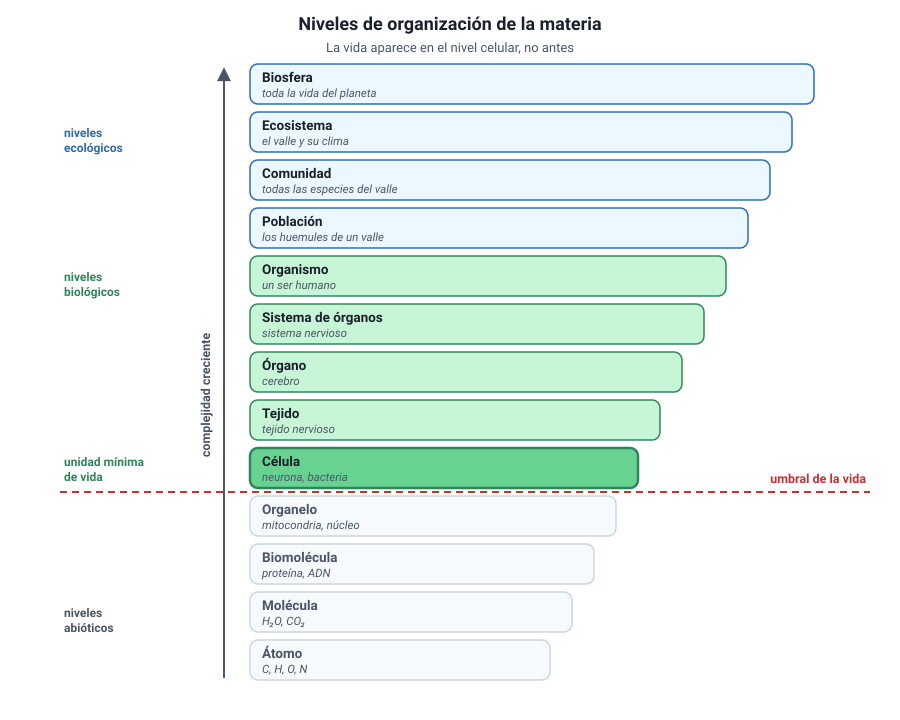

## 2. Los niveles de organización

<figure><figcaption>Figura 1. Los niveles de organización y el punto en que aparece la vida. Diagrama propio.</figcaption></figure>

### a. La escalera completa

La materia viva se ordena en niveles de complejidad creciente. Cada nivel está formado por unidades del nivel anterior, y en cada paso aparece algo nuevo.

| Nivel | Qué es | Ejemplo |
|---|---|---|
| **Átomo** | Unidad de un elemento químico | Un átomo de carbono |
| **Molécula** | Átomos unidos por enlaces | Agua, H2O |
| **Biomolécula** | Molécula característica de los seres vivos | Una proteína, un fosfolípido |
| **Organelo** | Estructura con función propia dentro de la célula | Mitocondria, cloroplasto |
| **Célula** | **Primer nivel con vida** | Un glóbulo rojo, una bacteria |
| **Tejido** | Células semejantes con una misma función | Tejido muscular |
| **Órgano** | Varios tejidos coordinados | Corazón, hoja |
| **Sistema de órganos** | Órganos con una función común | Sistema circulatorio |
| **Organismo** | Individuo completo | Una persona, un roble |
| **Población** | Individuos de la misma especie en un lugar | Los copihues de un bosque |
| **Comunidad** | Poblaciones distintas que conviven | Todas las especies de ese bosque |
| **Ecosistema** | Comunidad más el ambiente físico | El bosque con su suelo, agua y clima |
| **Biosfera** | Todos los ecosistemas del planeta | La Tierra habitada |

::: nota
**Dónde empieza la vida.** El primer nivel que cumple todas las características de un ser vivo es la **célula**. Un organelo aislado no se reproduce ni mantiene su medio interno; una mitocondria fuera de la célula deja de funcionar. Por eso la célula es la unidad de vida, y no la molécula ni el organelo.
:::

### b. Dónde se corta la escalera

No todos los organismos pasan por todos los niveles.

- Una **bacteria** es un organismo unicelular: en ella, el nivel «célula» y el nivel «organismo» coinciden. No tiene tejidos ni órganos.
- Una **esponja** tiene células especializadas, pero no verdaderos órganos.
- Un **ser humano** recorre la escalera completa.

::: tip
**El error más frecuente.** Suponer que todo organismo tiene tejidos y órganos. Si un ítem pregunta qué niveles están presentes en un organismo unicelular, la respuesta no incluye tejido, órgano ni sistema de órganos.
:::

### c. Niveles biológicos y niveles ecológicos

Conviene notar que la escalera cambia de naturaleza a mitad de camino:

- Del átomo al organismo, los niveles describen **cómo está construido un individuo**.
- De la población a la biosfera, describen **cómo se relacionan los individuos entre sí y con el ambiente**.

El organismo es la bisagra: es la última unidad que existe como individuo y la primera que forma parte de conjuntos mayores. Por eso los capítulos 4 a 7 de este libro se mueven en la primera mitad de la escalera y el capítulo 10, en la segunda.
