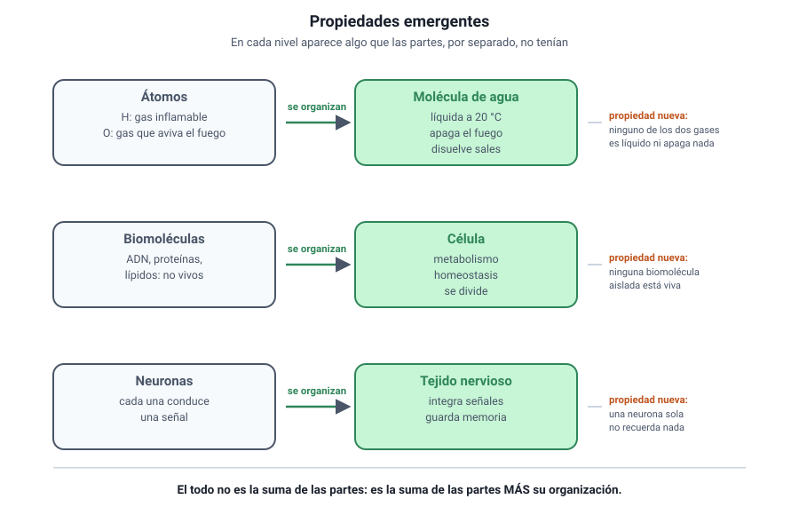

## 3. Las propiedades emergentes

<figure><figcaption>Figura 2. En cada nivel aparecen propiedades que las partes no tenían. Diagrama propio.</figcaption></figure>

### a. Qué es una propiedad emergente

Una **propiedad emergente** es una característica que aparece en un nivel de organización y que **ninguno de sus componentes posee por separado**. No se trata de una suma, sino de algo nuevo que resulta de la interacción entre las partes.

Tres ejemplos que la prueba usa con frecuencia:

| Nivel | Componentes | Propiedad emergente |
|---|---|---|
| **Molécula** | Hidrógeno y oxígeno, ambos gases | El agua es **líquida** a temperatura ambiente y disuelve sales |
| **Célula** | Agua, lípidos, proteínas, ácidos nucleicos | Está **viva**: se nutre, responde y se reproduce |
| **Tejido nervioso** | Neuronas individuales | **Conduce y procesa** información de forma coordinada |

::: nota
**La frase que resume la idea.** El todo es distinto de la suma de sus partes. No mayor ni mejor: **distinto**, porque tiene propiedades que no existen en el nivel inferior. Y esas propiedades desaparecen si se desarma el conjunto: separadas, las neuronas no forman un pensamiento y las biomoléculas no están vivas.
:::

### b. Por qué esto importa para estudiar biología

De aquí se sigue una consecuencia metodológica. Estudiar un sistema **desarmándolo en sus partes** —lo que se llama reduccionismo— es útil y ha dado casi todo lo que sabemos de bioquímica y de genética. Pero no basta: hay preguntas que solo pueden responderse en el nivel donde la propiedad aparece.

- Para saber **cómo** una enzima cataliza una reacción, hay que aislarla y estudiar sus partes.
- Para saber **por qué** un ecosistema se vuelve inestable al perder una especie, hay que estudiar el ecosistema completo.

Los dos enfoques son necesarios y responden preguntas distintas.

### c. Cómo se reconoce en una pregunta

Los ítems sobre propiedades emergentes suelen tener esta forma: describen una característica y preguntan en qué nivel aparece, o piden identificar cuál de varias afirmaciones ilustra una emergencia.

::: tip
**La prueba que conviene aplicar.** Pregúntate si la propiedad existe en las partes aisladas. Si la respuesta es no, es emergente. La conducción del impulso nervioso, por ejemplo, sí existe en una neurona aislada: no es emergente del tejido. En cambio, procesar información coordinando miles de neuronas, sí lo es.
:::
