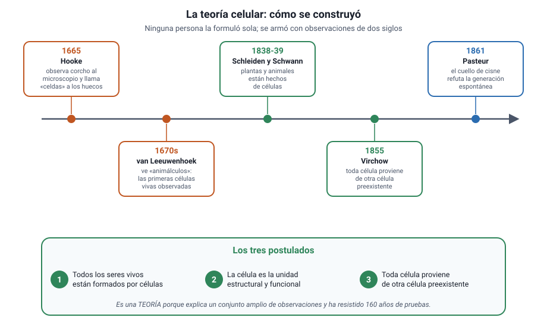

## 4. La teoría celular

<figure><figcaption>Figura 3. Cómo se construyó la teoría celular y cuáles son sus tres postulados. Diagrama propio.</figcaption></figure>

### a. Los tres postulados

La teoría celular sostiene tres cosas:

1. **Todos los seres vivos están formados por una o más células.**
2. **La célula es la unidad estructural y funcional de la vida**, es decir, la unidad más pequeña capaz de realizar todas las funciones vitales.
3. **Toda célula proviene de otra célula preexistente.**

El tercer postulado es el más tardío y el que más cuesta: implica que no hay generación espontánea, que la vida actual desciende de células anteriores y, llevado al extremo, que existe una continuidad ininterrumpida desde las primeras células hasta hoy.

### b. Cómo se construyó

| Momento | Quién | Qué aportó |
|---|---|---|
| **1665** | Robert Hooke | Observa láminas de corcho al microscopio y llama **«celdas»** a los compartimientos vacíos que ve. En realidad eran paredes de células muertas |
| **Década de 1670** | Antonie van Leeuwenhoek | Con lentes propias observa organismos vivos y móviles en agua, saliva y sarro: los primeros microorganismos descritos |
| **1838 y 1839** | Matthias Schleiden y Theodor Schwann | Generalizan: las plantas y los animales están formados por células. Es el primer enunciado de la teoría |
| **1855** | Rudolf Virchow | Formula el tercer postulado: **toda célula proviene de otra célula** |
| **1861** | Louis Pasteur | Con sus matraces de cuello de cisne refuta experimentalmente la generación espontánea |

::: nota
**Por qué es una teoría y no una hipótesis.** No porque sea una suposición, sino al revés: una **teoría científica** es una explicación amplia, sostenida por muchísima evidencia independiente, que organiza un campo entero. La teoría celular lleva casi dos siglos resistiendo pruebas y ninguna observación la ha contradicho. El capítulo 1 desarrolla esta distinción, que la PAES pregunta con frecuencia.
:::

### c. El experimento que cerró la discusión

El diseño de Pasteur es un caso de estudio del capítulo 1 y conviene tenerlo claro, porque combina teoría celular y método científico.

- **Problema:** ¿pueden los microorganismos surgir espontáneamente de un caldo nutritivo?
- **Diseño:** hirvió caldo en matraces con el cuello estirado en forma de S. El aire entraba, pero el polvo y los microorganismos quedaban atrapados en la curva.
- **Resultado:** el caldo permanecía estéril indefinidamente. Al inclinar el matraz para que el líquido tocara la curva, o al romper el cuello, aparecían microorganismos en poco tiempo.
- **Conclusión:** los microorganismos no surgen del caldo; llegan desde fuera.

::: tip
**Lo que hace elegante a ese experimento.** El cuello de cisne permite separar dos variables que hasta entonces iban juntas: **el contacto con el aire** y **la entrada de microorganismos**. Quienes defendían la generación espontánea sostenían que hervir destruía algo del aire; el diseño de Pasteur deja entrar el aire y aun así no aparece nada. Ese es el tipo de control que la PAES pide reconocer.
:::

### d. Las excepciones aparentes

Dos casos que la prueba usa para poner a prueba la comprensión de la teoría:

- **Los virus.** No están formados por células, no tienen metabolismo propio y solo se multiplican dentro de una célula que infectan. Por eso la mayoría de los autores **no los considera seres vivos**, y no constituyen una excepción a la teoría celular, sino un caso fuera de ella.
- **La primera célula.** Si toda célula proviene de otra, ¿de dónde salió la primera? La teoría celular describe lo que ocurre **hoy** en los seres vivos; el origen de la vida es una pregunta distinta, que se estudia con otras herramientas y que el capítulo 9 aborda al tratar la historia de la vida.
