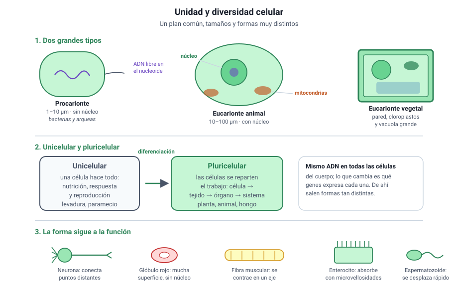

## 5. Unidad y diversidad celular

<figure><figcaption>Figura 4. Todas las células comparten un plan común y difieren en tamaño, forma y complejidad. Diagrama propio.</figcaption></figure>

### a. Lo que todas las células comparten

Por distintas que sean, todas las células tienen cuatro cosas:

1. **Membrana plasmática**, que las separa del medio y controla lo que entra y sale.
2. **Citoplasma**, el medio interno donde ocurren las reacciones.
3. **Material genético**, ADN que contiene las instrucciones.
4. **Ribosomas**, donde se fabrican las proteínas.

Esa coincidencia no es casual: es una de las evidencias de que todos los seres vivos comparten un ancestro común, como verás en el capítulo 9.

### b. Dos grandes tipos

| | **Procarionte** | **Eucarionte** |
|---|---|---|
| Núcleo definido | No: el ADN está en el citoplasma, en una zona llamada nucleoide | Sí, rodeado por envoltura nuclear |
| Organelos membranosos | No | Sí: mitocondrias, retículo, Golgi y otros |
| Tamaño habitual | 1 a 10 µm | 10 a 100 µm |
| Ejemplos | Bacterias y arqueas | Protozoos, hongos, plantas y animales |

El capítulo 4 desarrolla esta comparación en detalle; aquí basta con el criterio que las separa: **la presencia o ausencia de un núcleo delimitado por membrana**.

### c. Unicelulares y pluricelulares

| | Unicelular | Pluricelular |
|---|---|---|
| Número de células | Una | Muchas |
| Especialización | La única célula hace todo | Las células se **diferencian** y se reparten el trabajo |
| Niveles presentes | Célula = organismo | Célula, tejido, órgano, sistema, organismo |
| Ejemplos | Bacterias, levaduras, paramecios | Plantas, animales, hongos pluricelulares |

::: nota
**La diferenciación celular es la clave de lo pluricelular.** Todas las células de tu cuerpo tienen el mismo ADN, pero una neurona y un glóbulo blanco no se parecen en nada. La diferencia no está en los genes que tienen, sino en **cuáles expresan**. Esa idea se desarrolla en el capítulo 6, y explica por qué la forma de una célula permite deducir su función, como verás en el capítulo 4.
:::

### d. La forma sigue a la función

La diversidad de formas celulares no es arbitraria. Cada tipo de célula tiene la forma que su tarea exige:

| Célula | Forma característica | Para qué |
|---|---|---|
| **Neurona** | Prolongaciones muy largas | Conectar puntos distantes del cuerpo |
| **Glóbulo rojo** | Disco bicóncavo, sin núcleo | Maximizar superficie y transportar oxígeno |
| **Célula muscular** | Alargada y con filamentos ordenados | Contraerse en un solo eje |
| **Espermatozoide** | Flagelo y casi sin citoplasma | Desplazarse rápido |
| **Enterocito** | Con microvellosidades en la cara libre | Aumentar la superficie de absorción |

::: tip
**Cómo se pregunta.** La PAES rara vez pide el nombre de una célula: pide **inferir la función a partir de la forma**, o al revés. Ante una célula con mucha superficie, piensa en absorción o intercambio; ante muchas mitocondrias, en gasto de energía; ante mucho retículo rugoso, en producción de proteínas para exportar.
:::
