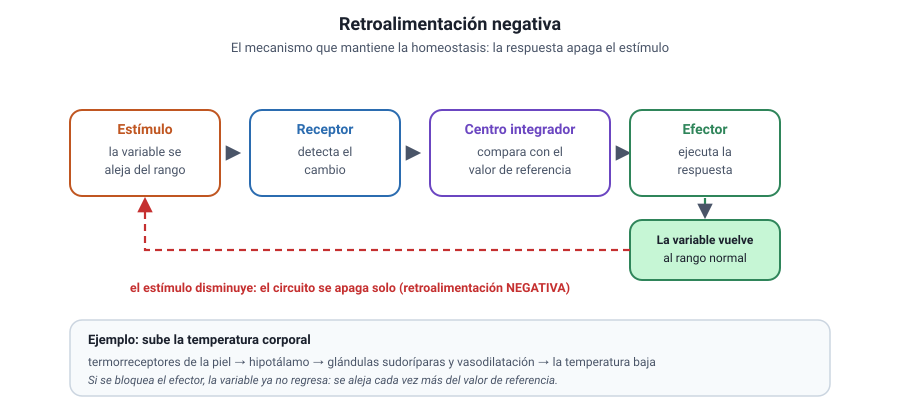

## 6. Características de los sistemas biológicos

Si la célula es la unidad de lo vivo, ¿qué hace que algo esté vivo? No hay una sola propiedad que baste: lo vivo se reconoce por un **conjunto** de características que aparecen juntas. Un cristal crece pero no se reproduce; un virus tiene material genético pero no metabolismo propio. La vida es el paquete completo.

### a. Las siete características

| Característica | En qué consiste | Ejemplo |
|---|---|---|
| **Organización** | Estructura ordenada en niveles jerárquicos, con la célula como unidad | Un músculo: filamentos en células, células en fibras, fibras en tejido |
| **Metabolismo** | Conjunto de reacciones que transforman materia y energía | La respiración celular degrada glucosa y libera energía utilizable |
| **Homeostasis** | Mantención del medio interno dentro de un rango estrecho, pese a los cambios externos | La temperatura corporal se mantiene cerca de 37 °C con frío o calor |
| **Irritabilidad** | Capacidad de detectar estímulos y responder a ellos | La pupila se contrae con luz intensa |
| **Crecimiento y desarrollo** | Aumento de tamaño y cambio ordenado de forma y función a lo largo del tiempo | Un embrión se divide, se diferencia y forma órganos |
| **Reproducción** | Generación de nuevos individuos, con transmisión del material genético | Una bacteria se divide; un helecho produce esporas |
| **Adaptación y evolución** | Cambio de las poblaciones a través de las generaciones, por selección natural | Bacterias de una población que resisten un antibiótico dejan más descendencia |

::: nota
**Ojo con dos confusiones frecuentes.** La **adaptación evolutiva** ocurre en **poblaciones** y a lo largo de generaciones: un individuo no se adapta, se aclimata. Y el **crecimiento** de un ser vivo no es lo mismo que el de un cristal: el cristal suma material desde fuera, el organismo lo incorpora, lo transforma y lo integra a su propia estructura.
:::

### b. Los seres vivos son sistemas abiertos

Un **sistema abierto** intercambia materia y energía con su entorno. Todos los seres vivos lo son, y no podrían ser de otro modo: ninguno fabrica su propia materia de la nada ni recicla su energía indefinidamente.

- **Entra:** nutrientes, agua, gases y —en los autótrofos— energía luminosa.
- **Sale:** desechos, agua, gases y **calor**, siempre calor.

Ese flujo constante es lo que permite mantener el orden interno. Un organismo aislado de su entorno pierde primero la homeostasis y después la organización: la muerte es, en términos físicos, el fin del intercambio.

::: ejemplo
**Un caso para decidir si está vivo.** En una expedición se encuentra una estructura esférica de 2 µm que contiene ADN, una envoltura lipídica y ribosomas, y que aumenta su masa cuando se la incuba con glucosa y sales. Con esos datos hay organización, metabolismo y crecimiento, pero **no** hay evidencia de reproducción ni de respuesta a estímulos. La conclusión correcta no es «está vivo» ni «no está vivo», sino que **la evidencia disponible es insuficiente** y que el experimento siguiente debe buscar división celular en un cultivo prolongado.
:::

### c. Homeostasis: el mecanismo que la sostiene

<figure><figcaption>Figura 5. La homeostasis se sostiene con circuitos de retroalimentación negativa. Diagrama propio.</figcaption></figure>

La homeostasis no es inmovilidad, es **regulación**. Funciona casi siempre mediante **retroalimentación negativa**: una desviación de la variable regulada activa una respuesta que la devuelve al rango normal.

1. Un **receptor** detecta el cambio (por ejemplo, termorreceptores de la piel).
2. Un **centro integrador** compara el valor detectado con un valor de referencia (el hipotálamo).
3. Un **efector** ejecuta la respuesta (glándulas sudoríparas, músculos, vasos sanguíneos).
4. El cambio resultante **reduce** el estímulo original: el circuito se apaga solo.

::: tip
**Cómo se pregunta.** Un gráfico muestra una variable que oscila en torno a un valor y una flecha que indica una perturbación. Lo que se pide es identificar la variable regulada, el efector, o predecir qué pasa si se bloquea uno de los pasos. Si al bloquear un paso la variable se va cada vez más lejos del valor de referencia, el circuito era de retroalimentación **negativa**.
:::
