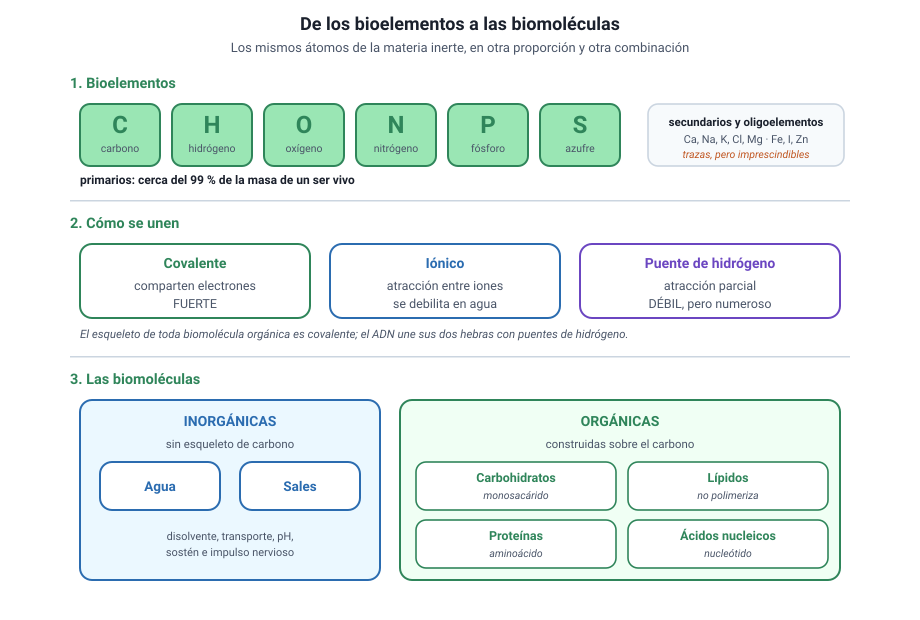

## 2. Bioelementos y enlaces

<figure><figcaption>Figura 1. De los átomos a las cuatro familias de biomoléculas orgánicas. Diagrama propio.</figcaption></figure>

### a. Los mismos átomos, otra proporción

En la materia viva no hay ningún elemento exclusivo. Lo que la distingue es la **proporción**: seis elementos, el **carbono, el hidrógeno, el oxígeno, el nitrógeno, el fósforo y el azufre**, reúnen cerca del 99 % de la masa de cualquier organismo. Se llaman **bioelementos primarios**.

Detrás vienen los **bioelementos secundarios**, como el calcio, el sodio, el potasio, el cloro y el magnesio, presentes en cantidades menores pero constantes. Y más atrás los **oligoelementos**, que aparecen en trazas y que, sin embargo, son imprescindibles: sin hierro no hay hemoglobina, sin yodo no hay hormonas tiroideas, sin zinc no funcionan decenas de enzimas.

::: nota
**«Poco» no significa «prescindible».** Un oligoelemento puede representar una millonésima de la masa corporal y aun así ser mortal su carencia. En la PAES esto suele aparecer como una trampa: una alternativa afirma que un elemento presente en trazas es poco importante. Es falsa.
:::

### b. Por qué el carbono

El carbono ocupa el centro de la química de la vida por tres razones:

1. **Forma cuatro enlaces covalentes**, lo que permite construir estructuras ramificadas y tridimensionales.
2. **Se une a sí mismo** formando cadenas largas, anillos y esqueletos estables.
3. **Se combina con los otros cinco primarios**, de modo que sobre el mismo esqueleto pueden colgarse grupos químicos muy distintos.

Esa versatilidad explica que existan millones de moléculas orgánicas distintas construidas prácticamente con los mismos ingredientes.

### c. Los tres tipos de unión que importan

| Unión | Cómo funciona | Fuerza | Dónde aparece |
|---|---|---|---|
| **Enlace covalente** | Dos átomos comparten electrones | Fuerte | El esqueleto de toda biomolécula orgánica |
| **Enlace iónico** | Atracción entre iones de carga opuesta | Intermedia; se debilita en agua | Sales minerales, como el cloruro de sodio |
| **Puente de hidrógeno** | Atracción entre un hidrógeno parcialmente positivo y un átomo electronegativo | Débil, pero muy numeroso | Entre moléculas de agua; entre las dos hebras del ADN; en el plegamiento de las proteínas |

::: tip
**Cómo se pregunta.** El puente de hidrógeno es débil **individualmente**, y esa debilidad es justamente lo que lo hace útil: permite que las dos hebras del ADN se separen para copiarse y vuelvan a unirse. Una alternativa que diga que el ADN se mantiene unido por enlaces covalentes entre las hebras es falsa: los covalentes están **dentro** de cada hebra.
:::

### d. Dos grandes familias de biomoléculas

- **Inorgánicas:** agua y sales minerales. No están construidas sobre esqueletos de carbono.
- **Orgánicas:** carbohidratos, lípidos, proteínas y ácidos nucleicos. Todas se basan en el carbono.

Tres de las cuatro familias orgánicas son **polímeros**: se construyen uniendo muchas unidades pequeñas, los **monómeros**. Los lípidos son la excepción, porque no se forman por repetición de una unidad.
