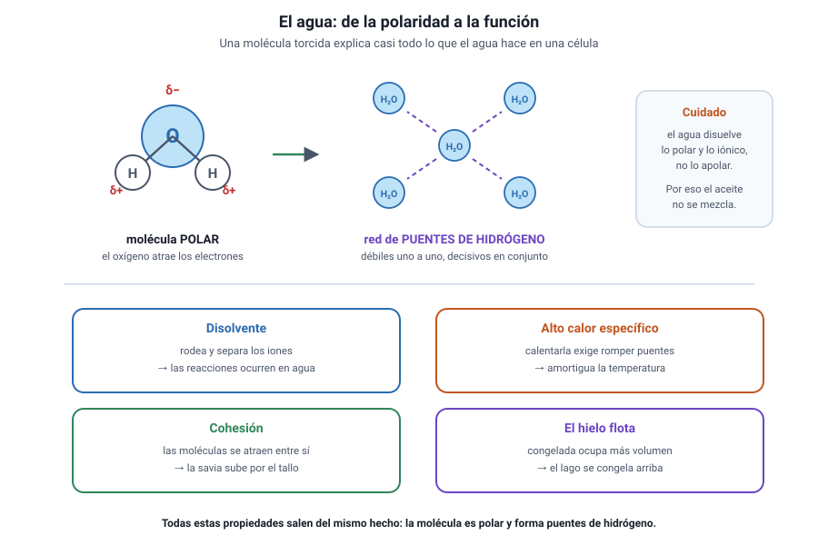

## 3. El agua y las sales minerales

<figure><figcaption>Figura 2. De la polaridad de la molécula de agua a sus funciones biológicas. Diagrama propio.</figcaption></figure>

### a. Una molécula torcida y polar

El agua es una molécula pequeña, pero no lineal: los dos hidrógenos forman un ángulo con el oxígeno. Como el oxígeno atrae los electrones con más fuerza, queda con **carga parcial negativa** y los hidrógenos con **carga parcial positiva**. La molécula es, por lo tanto, **polar**.

De ahí nace todo lo demás: cada molécula de agua puede formar **puentes de hidrógeno** con varias vecinas, y el conjunto se comporta como una red.

### b. Las cuatro propiedades que hay que saber

| Propiedad | De dónde viene | Para qué sirve en un ser vivo |
|---|---|---|
| **Disolvente de sustancias polares e iónicas** | La polaridad rodea a los iones y los separa | Casi todas las reacciones celulares ocurren en solución acuosa |
| **Alto calor específico** | Calentar el agua exige romper muchos puentes de hidrógeno | Amortigua los cambios de temperatura del organismo y del clima |
| **Cohesión y tensión superficial** | Las moléculas se atraen entre sí | Permite que la savia suba por los vasos de una planta |
| **El hielo flota** | Al congelarse, la red de puentes ocupa más volumen | Un lago se congela en la superficie y la vida continúa debajo |

::: nota
**El agua no disuelve todo.** Se la llama «disolvente universal» por costumbre, pero disuelve bien lo **polar** y lo **iónico**, y mal lo **apolar**. Los aceites no se mezclan con el agua justamente por eso, y esa incompatibilidad es la que mantiene ordenada la membrana celular.
:::

### c. Las funciones del agua en la célula

1. **Disolvente:** el medio donde ocurren las reacciones.
2. **Transporte:** lleva nutrientes y desechos dentro del organismo.
3. **Termorregulación:** al evaporarse absorbe mucho calor, y por eso el sudor enfría.
4. **Estructural:** da turgencia a las células vegetales y volumen a los tejidos.
5. **Reactivo:** participa directamente en reacciones, como la hidrólisis y la fotosíntesis.

### d. Las sales minerales

Las sales pueden estar **precipitadas**, dando estructura, o **disueltas** en forma de iones, cumpliendo funciones dinámicas.

| Forma | Ejemplo | Función |
|---|---|---|
| Precipitada | Fosfato de calcio en huesos y dientes | Sostén y protección |
| Precipitada | Carbonato de calcio en conchas y caparazones | Protección |
| Disuelta | Sodio y potasio | Impulso nervioso y contracción muscular |
| Disuelta | Calcio | Contracción muscular, coagulación, señalización |
| Disuelta | Bicarbonato | Amortigua los cambios de pH de la sangre |

::: tip
**Cómo se pregunta.** Un enunciado describe a una persona que pierde mucho sudor y solo repone agua pura. La respuesta esperada es que pierde también **iones**, y que su reposición importa tanto como la del agua. Es la lógica de las bebidas de rehidratación.
:::
