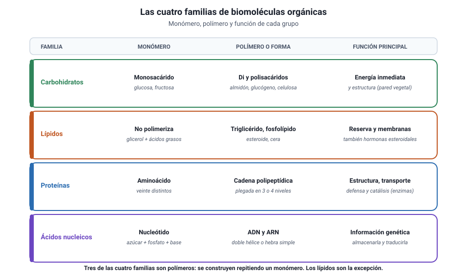

## 4. Carbohidratos

<figure><figcaption>Figura 3. Las cuatro familias orgánicas: monómero, polímero y función. Diagrama propio.</figcaption></figure>

### a. Qué son

Los carbohidratos, también llamados glúcidos o azúcares, están formados por **carbono, hidrógeno y oxígeno**, con el hidrógeno y el oxígeno aproximadamente en la proporción del agua. Son la fuente de energía más accesible de la célula y, en algunos casos, también material de construcción.

### b. Los tres niveles

| Nivel | Qué es | Ejemplos | Función |
|---|---|---|---|
| **Monosacárido** | Un solo azúcar; el monómero | Glucosa, fructosa, galactosa, ribosa | Energía inmediata; la ribosa y la desoxirribosa forman parte de los ácidos nucleicos |
| **Disacárido** | Dos monosacáridos unidos | Sacarosa, lactosa, maltosa | Transporte y reserva a corto plazo |
| **Polisacárido** | Muchos monosacáridos unidos | Almidón, glucógeno, celulosa, quitina | Reserva de energía o estructura |

::: nota
**La glucosa es la moneda corriente.** Es el azúcar que la respiración celular degrada para obtener energía y el que la fotosíntesis produce. Casi todos los demás carbohidratos se convierten en glucosa o derivan de ella.
:::

### c. Reserva y estructura: el mismo ladrillo, otro resultado

El almidón, el glucógeno y la celulosa están hechos del **mismo monómero**, la glucosa. Lo que cambia es el tipo de unión entre las unidades y el grado de ramificación, y ese detalle cambia por completo la función.

| Polisacárido | Dónde está | Función | Rasgo |
|---|---|---|---|
| **Almidón** | Plantas | Reserva de energía | Cadenas con ramificaciones moderadas |
| **Glucógeno** | Animales, en hígado y músculo | Reserva de energía | Muy ramificado: se moviliza rápido |
| **Celulosa** | Pared de las células vegetales | Estructura | Cadenas rectas y paralelas, muy resistentes |
| **Quitina** | Exoesqueleto de artrópodos y pared de hongos | Estructura | Similar a la celulosa, con nitrógeno |

::: tip
**Cómo se pregunta.** «Si el almidón y la celulosa están hechos de glucosa, ¿por qué no podemos digerir la celulosa?» Porque el tipo de enlace entre las glucosas es distinto y las enzimas humanas no lo reconocen. Es el mejor ejemplo de que **la estructura determina la función** incluso con los mismos ladrillos.
:::

### d. Cómo se unen y cómo se separan

- **Síntesis por deshidratación:** al unir dos monómeros se libera una molécula de agua.
- **Hidrólisis:** al romper el enlace se consume una molécula de agua.

Estas dos reacciones inversas valen también para las proteínas y los ácidos nucleicos: son el mecanismo general con que la célula construye y desarma sus polímeros.
