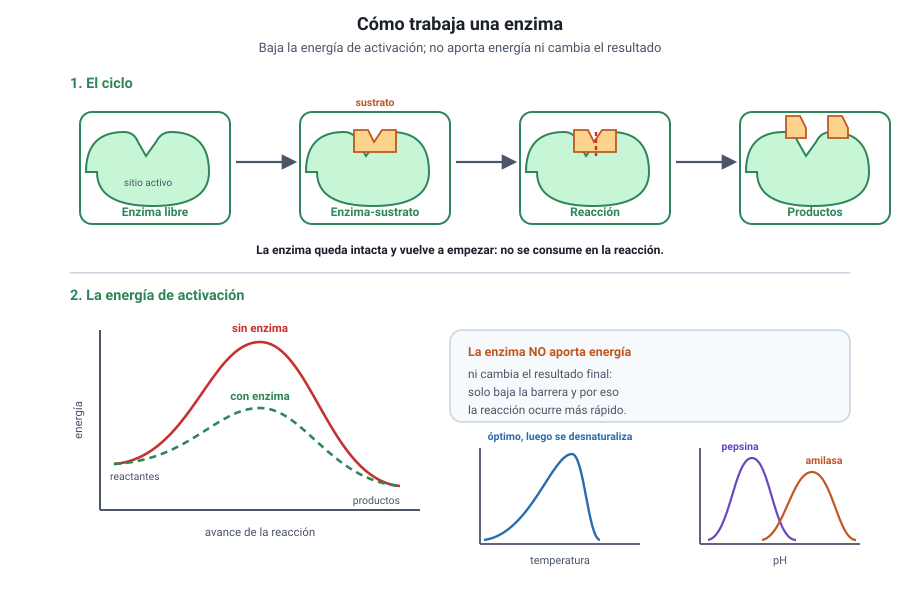

## 6. Proteínas y enzimas

<figure><figcaption>Figura 4. Cómo trabaja una enzima y qué variables la afectan. Diagrama propio.</figcaption></figure>

### a. Veinte letras, un número enorme de palabras

Las proteínas son polímeros de **aminoácidos**, unidos por **enlaces peptídicos**. Existen veinte aminoácidos distintos, y con ellos se construyen todas las proteínas de todos los seres vivos. Una cadena de cien aminoácidos admite una cantidad de combinaciones astronómica: de ahí la diversidad funcional del grupo.

Cada aminoácido tiene la misma parte central y un **grupo lateral** propio, que puede ser polar, apolar o con carga. Ese grupo lateral es el que decide cómo se plegará la cadena.

### b. Los cuatro niveles de estructura

| Nivel | Qué es | De qué depende |
|---|---|---|
| **Primaria** | La secuencia de aminoácidos | Del gen que la codifica |
| **Secundaria** | Hélices y láminas locales | De puentes de hidrógeno del esqueleto |
| **Terciaria** | La forma tridimensional completa de la cadena | De las interacciones entre grupos laterales |
| **Cuaternaria** | La unión de dos o más cadenas | De las interacciones entre subunidades |

::: nota
**La forma es la función.** Una proteína funciona por su forma tridimensional, no por su composición. Si esa forma se pierde —por calor, por pH extremo o por ciertas sustancias— la proteína se **desnaturaliza** y deja de servir, aunque su secuencia siga intacta. Por eso un huevo cocido no vuelve a ser crudo.
:::

### c. Qué hacen las proteínas

| Función | Ejemplo |
|---|---|
| Estructural | Colágeno en la piel, queratina en el pelo |
| Transporte | Hemoglobina, que lleva oxígeno en la sangre |
| Defensa | Anticuerpos |
| Movimiento | Actina y miosina en el músculo |
| Regulación | Insulina y otras hormonas proteicas |
| Catálisis | Enzimas |

### d. Las enzimas

Una **enzima** es una proteína que **acelera una reacción química sin consumirse**. Lo hace disminuyendo la **energía de activación**, es decir, el empujón mínimo que la reacción necesita para ocurrir.

1. El **sustrato** se une al **sitio activo** de la enzima.
2. La unión es **específica**: la forma del sitio activo solo acepta ciertos sustratos.
3. La reacción ocurre y los **productos** se liberan.
4. La enzima queda libre para repetir el ciclo.

::: ejemplo
**Un dato que decide preguntas.** Una enzima no cambia el resultado final de una reacción, ni la vuelve posible si no lo era: solo la hace **más rápida**. Si un enunciado afirma que la enzima «aporta la energía necesaria» o que «desplaza el equilibrio», está equivocado. Lo que hace es bajar la barrera.
:::

### e. Las variables que afectan a una enzima

- **Temperatura:** la actividad sube hasta un óptimo y después cae de golpe, porque la enzima se desnaturaliza. La curva es asimétrica: sube gradualmente y baja bruscamente.
- **pH:** cada enzima tiene un pH óptimo. La pepsina del estómago trabaja cerca de pH 2; la amilasa salival, cerca de pH 7.
- **Concentración de sustrato:** la velocidad aumenta hasta que todas las enzimas están ocupadas y se alcanza una **meseta de saturación**.
- **Inhibidores:** sustancias que se unen a la enzima y reducen su actividad.

::: tip
**Cómo se pregunta.** Un gráfico muestra actividad enzimática contra temperatura, con un máximo y una caída abrupta. Lo que se pide es interpretar la caída: **no** es que la enzima «se canse» ni que «se acabe el sustrato», sino que a temperatura alta pierde su forma tridimensional. La asimetría de la curva es la pista.
:::
