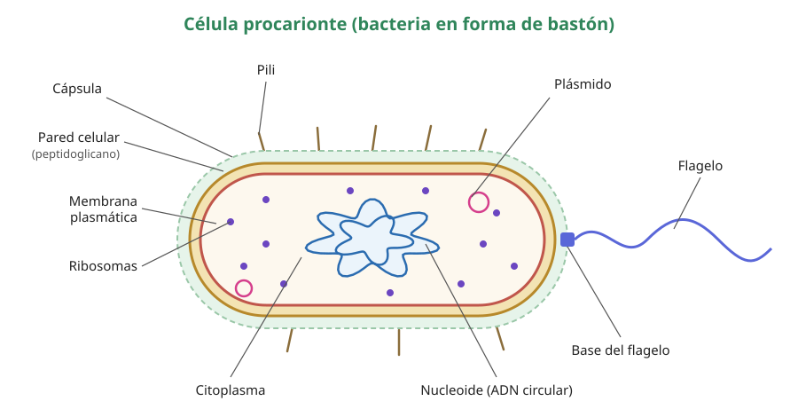

## 3. La célula procarionte

Los procariontes (del griego *pro*, «antes», y *karyon*, «núcleo») son las células más antiguas y más abundantes del planeta. Incluyen dos grandes grupos: las **bacterias** y las **arqueas**. Son pequeñas (en general entre 1 y 5 µm), no tienen núcleo y carecen de organelos rodeados de membrana. Aun así, son muy eficientes: se dividen rápido, habitan casi cualquier ambiente y pueden tener metabolismos que ningún eucarionte posee.

<figure><figcaption>Figura 1. Estructura general de una bacteria. No todas las bacterias tienen cápsula, pili o flagelo. Diagrama propio.</figcaption></figure>

### a. Estructuras de la célula procarionte

| Estructura | Descripción | Función |
|---|---|---|
| **Cápsula** | Capa externa de polisacáridos, viscosa; no está en todas las bacterias | Protege de la desecación y de las defensas del hospedero (dificulta la fagocitosis); permite adherirse a superficies |
| **Pared celular** | Capa rígida por fuera de la membrana. En bacterias está formada por **peptidoglicano** | Da forma y evita que la célula estalle por la entrada de agua (lisis osmótica) |
| **Membrana plasmática** | Bicapa de fosfolípidos con proteínas | Controla el paso de sustancias; en ella ocurren la respiración celular y, en algunas bacterias, la fotosíntesis |
| **Citoplasma** | Medio acuoso con enzimas, ribosomas e inclusiones | Lugar de la mayoría de las reacciones metabólicas |
| **Nucleoide** | Región del citoplasma donde está el cromosoma, en general **una molécula de ADN circular**, sin envoltura | Contiene la información genética esencial |
| **Plásmidos** | Pequeñas moléculas de ADN circular, independientes del cromosoma | Portan genes accesorios, como los de resistencia a antibióticos; se pueden transferir entre bacterias |
| **Ribosomas 70S** | Más pequeños que los eucariontes (80S) | Síntesis de proteínas |
| **Flagelo bacteriano** | Filamento proteico que **gira** como una hélice, impulsado por un «motor» en la membrana | Desplazamiento |
| **Pili (fimbrias)** | Filamentos cortos y numerosos de la superficie | Adherencia a superficies y células; el **pilus sexual** participa en la conjugación (transferencia de plásmidos) |

::: tip
**Errores frecuentes**

- Los procariontes **sí tienen ribosomas**; lo que no tienen son organelos *membranosos*. Los ribosomas no tienen membrana.
- Los procariontes **sí tienen ADN**, pero no dentro de un núcleo.
- El flagelo bacteriano **no** tiene la estructura 9 + 2 de microtúbulos del flagelo eucarionte. Es otra proteína (flagelina) y funciona girando, no ondulando.
:::

### b. La pared bacteriana y los antibióticos

La pared de peptidoglicano es exclusiva de las bacterias, y eso la vuelve un **blanco ideal para los antibióticos**. La **penicilina** impide que se formen los enlaces del peptidoglicano: la bacteria que crece sin una pared sólida absorbe agua por ósmosis y estalla. Las células humanas no tienen pared, así que no se ven afectadas.

Según su pared, las bacterias se clasifican con la **tinción de Gram**:

| | Gram positivas | Gram negativas |
|---|---|---|
| Pared | Capa gruesa de peptidoglicano | Capa delgada de peptidoglicano y una **membrana externa** |
| Color con la tinción | Violeta | Rosado |
| Ejemplo | *Staphylococcus*, *Streptococcus* | *Escherichia coli*, *Salmonella* |

La membrana externa de las Gram negativas actúa como barrera adicional, y por eso muchas de ellas resisten mejor algunos antibióticos.

### c. Bacterias y arqueas

Aunque se parecen al microscopio, las arqueas y las bacterias son dominios distintos:

- las **arqueas** no tienen peptidoglicano en su pared y sus membranas tienen lípidos diferentes;
- muchas viven en ambientes extremos: aguas termales, salares o fondos marinos sin oxígeno. En Chile se han estudiado en el salar de Atacama y en los géiseres del Tatio;
- en varios aspectos moleculares, como su maquinaria para leer el ADN, las arqueas se parecen más a los eucariontes que a las bacterias.

::: nota
**Los tres dominios de la vida.** Carl Woese propuso en 1990, a partir de la comparación del ARN de los ribosomas, clasificar a los seres vivos en tres dominios: **Bacteria**, **Archaea** y **Eukarya**. Este sistema reemplazó a la división en cinco reinos como el nivel más amplio de clasificación. Es un ejemplo de cómo una técnica nueva, la secuenciación, cambia un modelo científico.
:::
