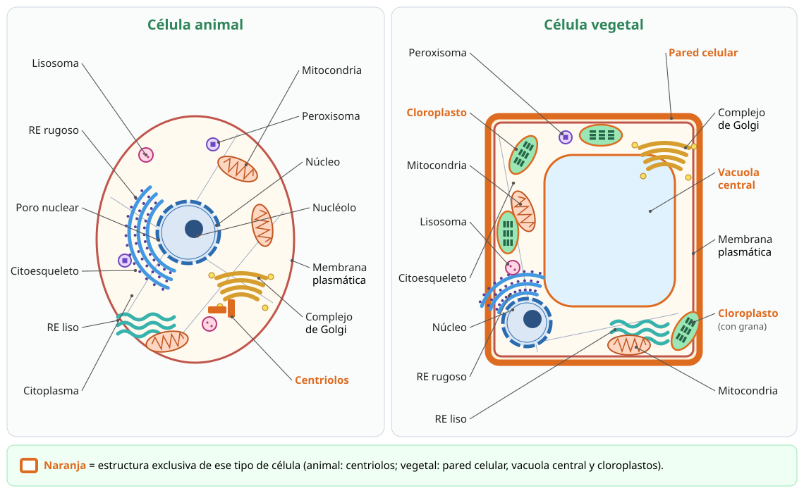

## 4. La célula eucarionte: núcleo y ribosomas

La célula eucarionte (del griego *eu*, «verdadero», y *karyon*, «núcleo») es en general de 10 a 100 veces más grande que una procarionte. Resuelve el problema de su tamaño **dividiendo el trabajo en compartimentos**: sus organelos rodeados de membrana permiten que reacciones incompatibles ocurran al mismo tiempo en lugares distintos. Por ejemplo, la digestión con enzimas muy ácidas ocurre dentro del lisosoma, sin dañar el resto de la célula.

<figure><figcaption>Figura 2. Célula animal (izquierda) y célula vegetal (derecha). Las estructuras exclusivas de cada una se destacan en color. Diagrama propio.</figcaption></figure>

### a. El núcleo

El núcleo es el centro de control de la célula: guarda el ADN y regula qué genes se expresan.

| Componente | Estructura | Función |
|---|---|---|
| **Envoltura nuclear** | **Doble membrana**; la membrana externa se continúa con el retículo endoplasmático rugoso | Separa el ADN del citoplasma |
| **Poros nucleares** | Complejos de proteínas que atraviesan la envoltura | Controlan el tránsito entre núcleo y citoplasma: salen ARN mensajeros y subunidades de ribosomas; entran proteínas, como las enzimas que copian el ADN |
| **Cromatina** | ADN asociado a proteínas llamadas **histonas** | Almacena la información genética. Se compacta en **cromosomas** visibles durante la división celular (capítulo 6) |
| **Nucléolo** | Zona densa dentro del núcleo, sin membrana | Fabrica el ARN ribosomal y ensambla las **subunidades de los ribosomas** |
| **Nucleoplasma** | Medio interno del núcleo | Contiene enzimas y nucleótidos |

::: tip
**Dato útil para las preguntas:** las células que fabrican muchas proteínas, como las células pancreáticas, los linfocitos activados o las neuronas, suelen tener **nucléolos grandes o numerosos**, porque necesitan muchos ribosomas. Si una droga destruye el nucléolo, la célula deja de formar ribosomas nuevos y, con el tiempo, disminuye su síntesis de proteínas.
:::

### b. Los ribosomas

Los ribosomas son **complejos de ARN ribosomal y proteínas**, formados por dos subunidades, una mayor y una menor. **No tienen membrana**, por lo que están presentes tanto en procariontes como en eucariontes. Su función es **sintetizar proteínas** traduciendo la información del ARN mensajero.

En la célula eucarionte hay dos poblaciones de ribosomas, iguales en estructura, pero que fabrican proteínas con destinos distintos:

| Ribosomas **libres** en el citosol | Ribosomas **unidos** al retículo endoplasmático |
|---|---|
| Fabrican proteínas que se quedan en el **citosol** o que van al núcleo, a las mitocondrias, a los cloroplastos o a los peroxisomas | Fabrican proteínas que se **exportan** (secreción), que forman parte de la **membrana** o que van a los **lisosomas** |
| Ejemplo: enzimas de la glucólisis, actina | Ejemplo: insulina, enzimas digestivas, receptores de membrana |

Lo que decide dónde termina un ribosoma es la proteína que está fabricando: si esa proteína comienza con una secuencia «señal», el ribosoma se ancla al retículo y la proteína entra en él a medida que se sintetiza.
