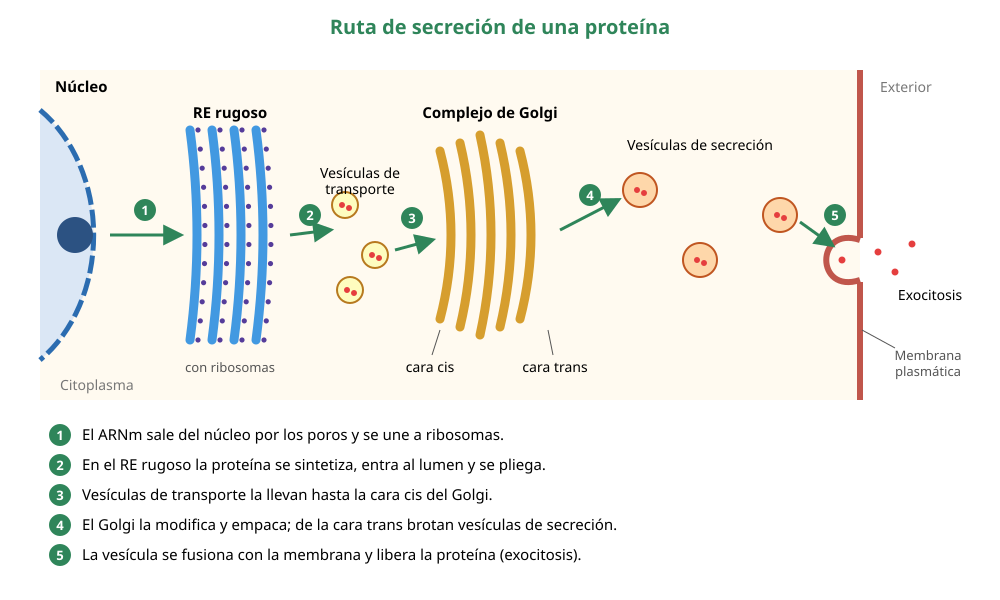

## 5. El sistema de endomembranas

El sistema de endomembranas es un conjunto de organelos que trabajan **conectados**, ya sea directamente o mediante **vesículas** que viajan de uno a otro. Lo forman la envoltura nuclear, el retículo endoplasmático, el complejo de Golgi, los lisosomas, las vacuolas y la membrana plasmática. Juntos fabrican, modifican, empaquetan y distribuyen proteínas y lípidos.

### a. Retículo endoplasmático rugoso (RER)

Es una red de sacos aplanados (cisternas) conectada con la envoltura nuclear, con **ribosomas adheridos** a su cara externa. Por eso se ve «rugoso» al microscopio electrónico.

- **Síntesis de proteínas de secreción, de membrana y de lisosomas:** la proteína recién fabricada entra al interior del retículo, el lumen.
- **Plegamiento y control de calidad:** las proteínas mal plegadas se retienen y se degradan.
- **Inicio de la glicosilación:** se añaden cadenas de azúcares a muchas proteínas, formando glicoproteínas.
- **Envío al Golgi** en vesículas de transporte.

### b. Retículo endoplasmático liso (REL)

Es una red de túbulos **sin ribosomas**, continua con el RER. Sus funciones dependen del tipo celular:

| Función | Dónde destaca |
|---|---|
| **Síntesis de lípidos**: fosfolípidos de membrana, colesterol y **hormonas esteroidales** | Células de las gónadas y de la corteza suprarrenal |
| **Detoxificación** de fármacos, alcohol y otras sustancias, con enzimas que las hacen más solubles para eliminarlas | **Hepatocitos** (células del hígado). El consumo repetido de alcohol o de algunos fármacos aumenta la cantidad de REL |
| **Almacenamiento de calcio (Ca2+)** | Fibras musculares, donde se llama **retículo sarcoplásmico** y libera Ca2+ para la contracción |
| Metabolismo del glicógeno | Hepatocitos |

### c. Complejo de Golgi

Es una pila de cisternas aplanadas, no conectadas entre sí, con dos caras:

- la **cara cis**, orientada hacia el retículo, **recibe** las vesículas que llegan del RER;
- la **cara trans**, orientada hacia la membrana plasmática, **despacha** las vesículas hacia su destino.

Mientras las proteínas avanzan de cis a trans, el Golgi las **modifica**: termina la glicosilación, les agrega otros grupos químicos y las **clasifica** con «etiquetas» según su destino, que puede ser la membrana plasmática, los lisosomas o la secreción. En las células vegetales el Golgi además fabrica polisacáridos de la pared celular.

::: nota
**Una analogía útil:** si la célula fuera una fábrica, el RER sería la línea de producción, el Golgi el centro de empaque y despacho, las vesículas los camiones de reparto y la membrana plasmática la puerta de salida.
:::

### d. Lisosomas, vacuolas y la digestión celular

**Lisosomas.** Son vesículas rodeadas de membrana que contienen **enzimas hidrolíticas**, capaces de digerir proteínas, lípidos, polisacáridos y ácidos nucleicos. Estas enzimas funcionan mejor a **pH ácido, cercano a 5**, que el lisosoma mantiene bombeando protones (H+) hacia su interior. El citosol tiene pH cercano a 7,2, así que si una enzima escapa pierde casi toda su actividad: es una protección para la célula. Los lisosomas se forman a partir del Golgi y cumplen varias funciones:

- **Digestión de partículas ingeridas (heterofagia):** una vesícula formada por fagocitosis se fusiona con un lisosoma. Así destruyen bacterias los **macrófagos** y los neutrófilos.
- **Autofagia:** digieren organelos dañados o viejos de la propia célula y reciclan sus componentes.
- **Autólisis:** en ciertos procesos del desarrollo, liberan sus enzimas y la célula se autodestruye. Por ejemplo, en la reabsorción de la cola del renacuajo.

::: tip
**Enfermedades lisosomales.** Si falta una sola enzima lisosomal, su sustrato se acumula dentro de los lisosomas y daña la célula. En la **enfermedad de Tay-Sachs** se acumula un lípido en las neuronas por falta de una enzima, lo que provoca un daño neurológico grave. Es un buen ejemplo de relación entre estructura, función y enfermedad.
:::

**Vacuolas.** Son sacos membranosos con funciones variadas:

- la **vacuola central** de las células vegetales puede ocupar hasta el 80 % del volumen celular. Almacena agua, iones, pigmentos y desechos, y su presión contra la pared (**turgencia**) mantiene firme a la planta;
- las **vacuolas contráctiles** de protistas de agua dulce, como el paramecio, expulsan el exceso de agua que entra por ósmosis;
- las **vacuolas alimenticias** se forman por fagocitosis.

### e. La ruta de secreción: el experimento de pulso y caza

¿Cómo se supo que las proteínas de secreción recorren el camino RER → Golgi → vesículas → membrana? Lo demostraron **James Jamieson y George Palade** con un experimento clásico publicado en 1967. Por estos trabajos Palade recibió el Premio Nobel de Medicina en 1974.

**Modelo experimental.** Usaron cortes de páncreas de cobayo, formados principalmente por células **acinares**, que fabrican grandes cantidades de enzimas digestivas y las secretan. Así casi todas las proteínas que sintetizan siguen la ruta de secreción.

**Procedimiento:**

1. **Pulso.** Durante **3 minutos** entregaron a las células un **aminoácido radiactivo** (leucina marcada con tritio). Solo las proteínas fabricadas en ese breve lapso quedaron marcadas.
2. **Caza.** Luego reemplazaron el medio por uno con leucina **no radiactiva** en exceso. Las proteínas nuevas ya no se marcaban, así que se podía «perseguir» el grupo marcado.
3. A distintos tiempos fijaron muestras y localizaron la radiactividad con **autorradiografía** al microscopio electrónico.

**Resultados, en forma simplificada:**

| Tiempo después del pulso | Dónde estaba la mayor parte de la radiactividad |
|---|---|
| 3 minutos | Retículo endoplasmático rugoso |
| ≈ 20 minutos | Complejo de Golgi |
| ≈ 40 minutos | Vacuolas de condensación, en la cara trans del Golgi |
| ≈ 2 horas | Gránulos de secreción (gránulos de zimógeno), cerca de la membrana apical |

**Conclusión.** Las proteínas de secreción se sintetizan en el RER, pasan al Golgi y se empaquetan en vesículas que se fusionan con la membrana plasmática para liberar su contenido por **exocitosis**.

<figure><figcaption>Figura 3. Ruta de secreción de proteínas, del RER a la membrana plasmática. Diagrama propio.</figcaption></figure>

::: ejemplo
**Razonar con datos de pulso y caza**

Supón que repites el experimento, pero agregas una droga que impide la salida de vesículas desde el RER. ¿Dónde estará la radiactividad después de 2 horas?

**Respuesta:** seguirá en el **RER**, porque las proteínas marcadas no pueden avanzar al Golgi. Es exactamente el efecto de la brefeldina A. En la prueba PAES de invierno de 2027 apareció una tabla con este tipo de resultados, en la que además la baja temperatura dejaba las proteínas detenidas en el Golgi.
:::
