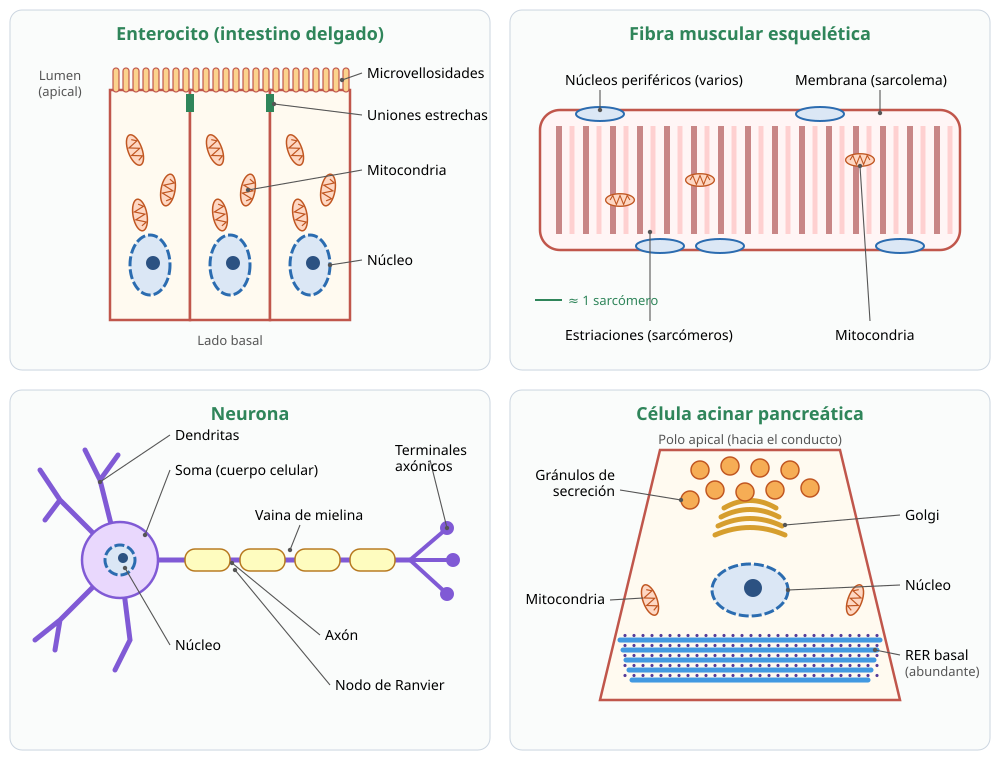

## 10. Relación entre estructura y función: cuatro tipos celulares

En un organismo pluricelular todas las células tienen el mismo ADN, pero se **especializan**: cada tipo celular expresa genes distintos y desarrolla la forma y los organelos que su función necesita. El temario DEMRE 2027 pide analizar cuatro casos. La regla general es simple: **la célula tiene más de aquello que más usa**.

<figure><figcaption>Figura 4. Cuatro tipos celulares especializados. Diagrama propio, sin escala.</figcaption></figure>

### a. Enterocito: especialista en absorber

Los enterocitos son las células que recubren las **vellosidades del intestino delgado**. Su función es **absorber los nutrientes** ya digeridos y pasarlos a la sangre.

| Estructura | Relación con la función |
|---|---|
| **Microvellosidades** en la cara que da al intestino (el «borde en cepillo»), sostenidas por microfilamentos de actina | **Aumentan enormemente la superficie** de absorción. Pliegues del intestino, vellosidades y microvellosidades se suman y multiplican la superficie cientos de veces |
| **Enzimas en la membrana** del borde en cepillo (lactasa, sacarasa, peptidasas) | Terminan la digestión justo donde se absorbe |
| **Proteínas transportadoras**, distintas en la cara apical y en la basal | La célula está **polarizada**: por arriba entran los nutrientes y por abajo salen hacia la sangre |
| **Abundantes mitocondrias** | Aportan el ATP de la bomba Na+/K+, que mantiene el gradiente usado para ingresar glucosa y aminoácidos por cotransporte |
| **Uniones estrechas** entre células vecinas | Sellan el espacio entre enterocitos: todo lo absorbido debe pasar **a través** de las células, lo que permite controlarlo |
| **REL** desarrollado | Rearma los triglicéridos a partir de los ácidos grasos absorbidos |

::: tip
**Dato conectado:** la **intolerancia a la lactosa** se produce cuando los enterocitos del adulto fabrican poca **lactasa**, la enzima del borde en cepillo que digiere el azúcar de la leche. La lactosa no digerida llega al intestino grueso, donde la fermentan las bacterias.
:::

### b. Fibra muscular esquelética: especialista en contraerse

Una célula muscular esquelética, o **fibra muscular**, es alargada, puede medir varios centímetros y es **multinucleada**, porque se forma por la fusión de muchas células precursoras.

| Estructura | Relación con la función |
|---|---|
| **Miofibrillas** llenas de filamentos de **actina** (delgados) y **miosina** (gruesos), ordenados en unidades repetidas llamadas **sarcómeros** | Al deslizarse la actina sobre la miosina, los sarcómeros se acortan y la fibra se contrae. Este orden le da el aspecto **estriado** |
| **Retículo sarcoplásmico**, un REL especializado | Almacena **Ca2+** y lo libera cuando llega el estímulo nervioso: el calcio es la señal que inicia la contracción |
| **Túbulos T**, invaginaciones de la membrana | Llevan el estímulo eléctrico al interior de la fibra, para que toda ella se contraiga a la vez |
| **Abundantes mitocondrias** | La contracción consume grandes cantidades de ATP |
| **Muchos núcleos** | Permiten fabricar las proteínas que necesita una célula tan grande |
| **Mioglobina** y reservas de glicógeno | Guardan O2 y glucosa para producir energía |

::: nota
**Fibras lentas y rápidas.** Las fibras **lentas (oxidativas)** tienen más mitocondrias y mioglobina, por lo que son rojizas y resisten la fatiga: son las que predominan en los maratonistas. Las fibras **rápidas (glucolíticas)** tienen menos mitocondrias y más glicógeno, y se contraen con fuerza, pero se fatigan pronto: predominan en los velocistas y los halterófilos. Es un buen ejemplo de cómo la **cantidad de un organelo** revela la función.
:::

### c. Neurona: especialista en comunicar

Las neuronas reciben estímulos, los integran y transmiten **impulsos nerviosos** a otras células (capítulo 11).

| Estructura | Relación con la función |
|---|---|
| **Dendritas**, prolongaciones cortas y ramificadas | Ofrecen una gran superficie para **recibir** señales de muchas neuronas |
| **Soma** o cuerpo celular, con el núcleo | **Integra** las señales; tiene un **RER muy abundante** (los «cuerpos de Nissl») y un Golgi desarrollado, porque fabrica muchas proteínas, entre ellas las enzimas que producen neurotransmisores |
| **Axón**, una prolongación larga que puede medir más de un metro | **Conduce** el impulso a distancia |
| **Vaina de mielina** formada por otras células, las células gliales | Aísla el axón y **acelera** la conducción del impulso |
| **Microtúbulos** a lo largo del axón | Rieles para el **transporte axonal**: llevan vesículas y proteínas desde el soma hasta los terminales |
| **Terminales axónicos** con muchas **vesículas** y **mitocondrias** | Liberan los neurotransmisores por **exocitosis** en la sinapsis. Las mitocondrias aportan la energía |

### d. Célula secretora pancreática: especialista en fabricar y exportar proteínas

Las células **acinares** del páncreas producen las **enzimas digestivas** del jugo pancreático: amilasa, lipasa y precursores de proteasas como el tripsinógeno. Son el modelo del experimento de Palade (sección 5.e).

| Estructura | Relación con la función |
|---|---|
| **RER muy abundante**, ocupando gran parte de la base de la célula | Síntesis masiva de enzimas de secreción |
| **Nucléolo prominente** | Produce los numerosos ribosomas que se necesitan |
| **Complejo de Golgi desarrollado** | Procesa y empaqueta las enzimas |
| **Gránulos de secreción (de zimógeno)** en la zona apical | Almacenan las enzimas **inactivas** hasta la señal de liberarlas; así no digieren a la propia célula |
| **Polaridad**: la síntesis ocurre en la base y la secreción, en el ápice | La exocitosis se dirige hacia el conducto que lleva el jugo al intestino |

Algo similar ocurre en las **células beta** de los islotes pancreáticos, que producen y secretan **insulina** por la misma ruta: RER, Golgi, vesículas y exocitosis.

::: tip
**Método para cualquier tipo celular:** pregúntate *¿qué hace esta célula?* y deduce el organelo.

| Si la célula… | …tendrá abundante |
|---|---|
| Secreta proteínas | RER y Golgi |
| Fabrica lípidos o esteroides, o detoxifica | REL |
| Gasta mucha energía | Mitocondrias |
| Fagocita y digiere | Lisosomas |
| Absorbe | Microvellosidades (superficie) |
| Se desplaza | Citoesqueleto: cilios, flagelos o microfilamentos |

Con esta tabla se resuelven muchas preguntas PAES aunque el tipo celular no aparezca en el temario, por ejemplo los macrófagos, los espermatozoides o las células de Leydig.
:::
