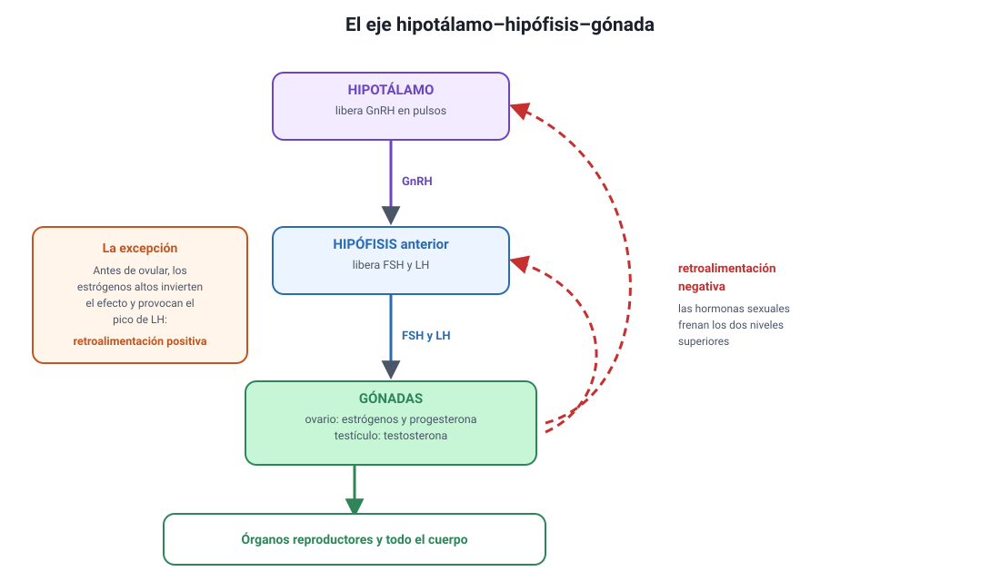

## 2. El sistema endocrino: hormonas y regulación

Esta sección es la base de todo el capítulo. El temario no la lista como un conocimiento aparte, pero sin ella no se entiende el ciclo ovárico ni cómo funcionan los anticonceptivos hormonales.

<figure><figcaption>Figura 1. El eje hipotálamo-hipófisis-gónada y su retroalimentación negativa. Diagrama propio.</figcaption></figure>

### a. Qué es una hormona

Una **hormona** es un mensajero químico que una glándula endocrina libera **a la sangre** y que actúa sobre células situadas lejos del lugar donde se produjo. Tres rasgos la definen:

1. **Viaja por la sangre**, de modo que alcanza a todo el cuerpo.
2. **Actúa solo sobre las células que tienen su receptor**, llamadas **células blanco**. Esa especificidad es la que explica por qué una hormona que circula por todo el organismo produce efectos solo en algunos órganos.
3. **Actúa en concentraciones muy bajas**, del orden de nanogramos por mililitro.

::: tip
**La comparación con el sistema nervioso** aparece con frecuencia. El sistema nervioso envía señales **rápidas, breves y dirigidas** a un blanco preciso; el endocrino envía señales **lentas, duraderas y difundidas** por la sangre. Los dos se coordinan justamente en el hipotálamo.
:::

### b. Dos tipos de hormona y dos tipos de receptor

Dónde está el receptor depende de si la hormona puede atravesar la membrana:

| Tipo | Ejemplos | ¿Atraviesa la membrana? | Dónde está su receptor | Velocidad del efecto |
|---|---|---|---|---|
| **Esteroidales** (derivadas del colesterol) | Estrógenos, progesterona, testosterona, cortisol | **Sí**, por ser liposolubles | **Dentro** de la célula; actúan sobre la expresión de genes | Lento y duradero |
| **Peptídicas y proteicas** | FSH, LH, insulina, hormona del crecimiento | **No**, por ser hidrosolubles | **En la membrana**; activan segundos mensajeros | Rápido y transitorio |

::: nota
**Por qué esto importa.** Las hormonas sexuales son esteroidales, y por eso pueden administrarse por vía oral y actúan modificando la expresión génica de sus células blanco. La FSH y la LH son peptídicas: se degradarían en el estómago, así que se administran inyectadas en los tratamientos de fertilidad.
:::

### c. La retroalimentación negativa

Es el mecanismo de control más importante del sistema endocrino y el que explica la mayoría de los ítems de esta unidad: **el producto final inhibe su propio estímulo**.

Piensa en un termostato. Cuando la temperatura baja, se enciende la calefacción; cuando sube lo suficiente, la calefacción se apaga. El resultado es una variable que se mantiene estable oscilando alrededor de un valor.

En el sistema endocrino ocurre igual: si la concentración de una hormona periférica sube, esa hormona **frena** al hipotálamo y a la hipófisis; si baja, el freno se libera y la producción vuelve a aumentar.

::: tip
**Cómo se pregunta.** «Se administra una hormona externa. ¿Qué ocurre con la producción propia?» La respuesta casi siempre es que **disminuye**, porque la hormona externa ejerce la misma retroalimentación negativa que la propia. Ese es exactamente el mecanismo de los anticonceptivos hormonales, que verás en la sección 8.
:::

### d. El eje hipotálamo-hipófisis-gónada

El circuito que controla la reproducción tiene tres niveles:

| Nivel | Qué produce | Sobre quién actúa |
|---|---|---|
| **Hipotálamo** | **GnRH** (hormona liberadora de gonadotropinas), en pulsos | Hipófisis anterior |
| **Hipófisis anterior** | **FSH** y **LH**, llamadas gonadotropinas | Gónadas: ovario y testículo |
| **Gónadas** | **Estrógenos y progesterona** en el ovario; **testosterona** en el testículo | Órganos reproductores y todo el cuerpo |

Y las hormonas de las gónadas vuelven a los dos niveles superiores para frenarlos: eso es la retroalimentación negativa.

El hipotálamo es, además, el punto donde el sistema nervioso y el endocrino se conectan: recibe información del encéfalo sobre el estrés, la nutrición y los ritmos de luz, y la traduce en señales hormonales. Por eso una pérdida de peso importante, un entrenamiento extremo o un estrés sostenido pueden alterar los ciclos.

### e. La excepción: la retroalimentación positiva

Existe un caso en que el producto **estimula** en vez de frenar, y no es un detalle menor: es el que desencadena la **ovulación**. Cuando el folículo maduro alcanza una concentración alta y sostenida de estrógenos, el efecto sobre la hipófisis se invierte y provoca un **pico de LH**. Ese pico es el que libera el ovocito.

Por eso en el ciclo ovárico conviven los dos mecanismos: la retroalimentación negativa durante casi todo el ciclo y una ventana breve de retroalimentación positiva justo antes de la ovulación.
