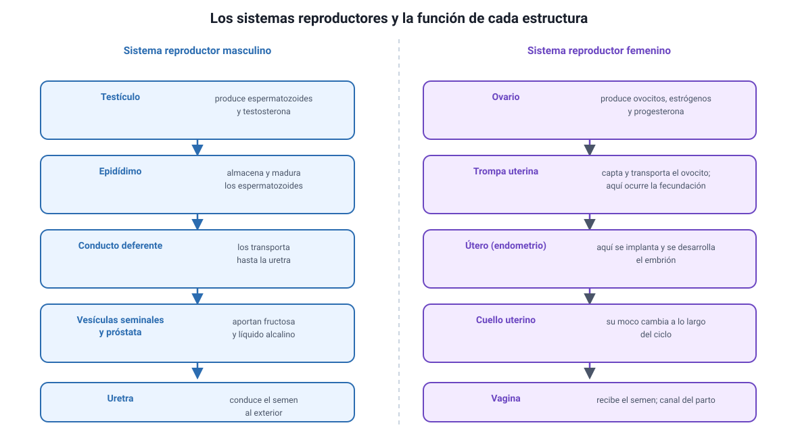

## 3. Los sistemas reproductores

Es parte del conocimiento **2.6** del temario DEMRE 2027. La prueba no pide memorizar listas de estructuras: pide saber **qué hace cada una**, porque los ítems suelen describir una falla y preguntar dónde está el problema.

<figure><figcaption>Figura 2. Estructuras de los sistemas reproductores y su función. Diagrama propio.</figcaption></figure>

### a. Sistema reproductor masculino

| Estructura | Función |
|---|---|
| **Testículos** | Producen espermatozoides en los **túbulos seminíferos** y testosterona en las **células de Leydig** |
| **Epidídimo** | Almacena los espermatozoides y allí terminan de **madurar** y adquieren movilidad |
| **Conducto deferente** | Transporta los espermatozoides desde el epidídimo hasta la uretra |
| **Vesículas seminales** | Aportan un líquido rico en **fructosa**, que es el combustible del espermatozoide |
| **Próstata** | Aporta un líquido **alcalino** que neutraliza la acidez de la vagina |
| **Uretra** | Conduce al exterior tanto la orina como el semen, en momentos distintos |

El **semen** es la suma de espermatozoides y de los líquidos de las glándulas. Los espermatozoides son apenas un pequeño porcentaje de su volumen.

::: nota
**Por qué los testículos están fuera del cuerpo.** La espermatogénesis requiere una temperatura de unos 2 a 3 °C bajo la corporal. El escroto regula esa temperatura acercando o alejando los testículos del cuerpo. Es un ejemplo claro de relación entre estructura y función, y explica por qué la fiebre prolongada o el calor excesivo afectan de forma transitoria la producción de espermatozoides.
:::

### b. Sistema reproductor femenino

| Estructura | Función |
|---|---|
| **Ovarios** | Contienen los folículos, producen ovocitos y secretan **estrógenos y progesterona** |
| **Trompas uterinas** (oviductos) | Captan el ovocito liberado y lo transportan; **aquí ocurre la fecundación** |
| **Útero** | Órgano muscular donde se implanta y se desarrolla el embrión; su capa interna es el **endometrio** |
| **Cuello uterino** (cérvix) | Comunica el útero con la vagina; su **moco** cambia de consistencia a lo largo del ciclo |
| **Vagina** | Conducto que recibe el semen y forma el canal del parto |

::: tip
**La estructura que más se pregunta es la trompa uterina.** La fecundación no ocurre en el útero ni en el ovario: ocurre en el tercio externo de la trompa, cerca del ovario. El embrión recorre luego la trompa hasta el útero, donde se implanta unos seis o siete días después. Si una alternativa sitúa la fecundación en el útero, es incorrecta.
:::

### c. Cómo se pregunta esto: razonar desde la falla

Los ítems de esta sección suelen describir una alteración y pedir localizarla. Conviene tener a mano estas asociaciones:

| Hallazgo | Dónde buscar el problema |
|---|---|
| No hay espermatozoides en el semen, pero sí testosterona normal | Obstrucción del conducto deferente, como en una **vasectomía** |
| Los espermatozoides existen pero no se mueven | Maduración en el **epidídimo** o pieza media del espermatozoide |
| Hay ovulación pero no se logra la implantación | **Endometrio** o fase lútea |
| No hay ovulación | Eje **hipotálamo-hipófisis** o el propio folículo |
| Trompas obstruidas | El ovocito y el espermatozoide **no pueden encontrarse** |

La prueba oficial de Invierno 2027 lo hizo de dos maneras: preguntó cómo comprobar que la reversión de una vasectomía fue exitosa —la respuesta es examinar el semen al microscopio, porque es donde se verifica que los espermatozoides volvieron a circular— y planteó un síndrome con adherencias en la cavidad uterina que altera la fertilidad, donde lo comprometido es el **endometrio**.
