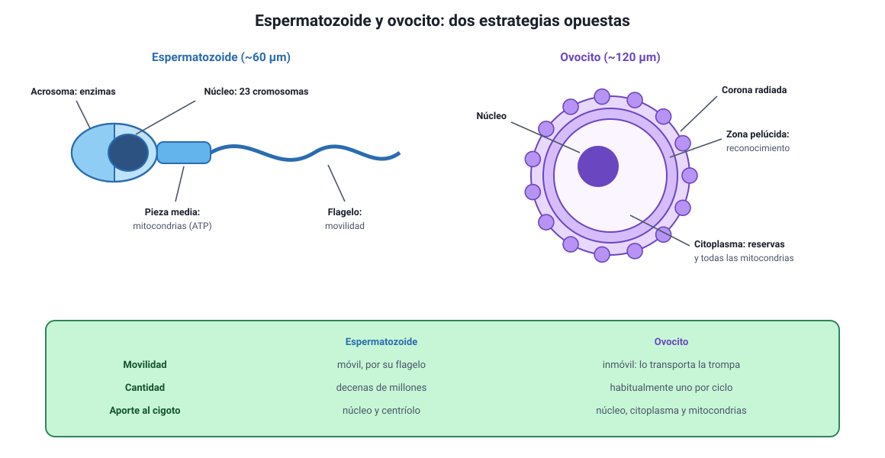

## 4. Los gametos: espermatozoide y ovocito

Es el conocimiento **2.2** del temario DEMRE 2027, en su parte de estructura y función. La fecundación viene en la sección 6.

<figure><figcaption>Figura 3. Estructura del espermatozoide y del ovocito. Diagrama propio.</figcaption></figure>

### a. Dos células haploides con estrategias opuestas

Ambos gametos tienen **23 cromosomas**, la mitad que una célula somática, y ambos se forman por meiosis. Pero todo lo demás en ellos es distinto, y esa diferencia tiene una lógica.

| | Espermatozoide | Ovocito |
|---|---|---|
| **Tamaño** | Unos 60 µm de largo, casi todo flagelo | Unos 100 a 150 µm de diámetro: la célula más grande del cuerpo humano |
| **Movilidad** | Móvil, gracias al flagelo | Inmóvil: lo transporta la trompa |
| **Citoplasma** | Muy escaso | Abundante, con reservas para los primeros días del embrión |
| **Cantidad** | Decenas de millones por eyaculación | Habitualmente **uno** por ciclo |
| **Producción** | Continua desde la pubertad | Se inicia antes de nacer y se detiene hasta la pubertad |
| **Aporte a la célula hija** | Núcleo y centríolo | Núcleo, citoplasma, organelos y **todas las mitocondrias** |

::: nota
**La herencia mitocondrial es materna.** Las pocas mitocondrias que el espermatozoide lleva en su pieza media se degradan tras la fecundación. Por eso el ADN mitocondrial se hereda solo por vía materna, un dato que aparece tanto aquí como en el capítulo 9, al usar el ADN mitocondrial para reconstruir parentescos.
:::

### b. El espermatozoide, parte por parte

| Parte | Qué contiene | Para qué sirve |
|---|---|---|
| **Acrosoma** | Vesícula con **enzimas hidrolíticas** | Digiere la corona radiada y la zona pelúcida del ovocito |
| **Núcleo** | 23 cromosomas muy compactados | Aporta la mitad del material genético |
| **Pieza media** | **Mitocondrias** enrolladas | Produce el ATP que mueve el flagelo |
| **Flagelo** | Microtúbulos | Da la movilidad |

::: tip
**Un ítem oficial de 2027.** Se describían espermatozoides con acrosomas de apariencia y volumen normales, pero con **enzimas de actividad reducida**, y se pedía predecir la consecuencia. La clave está en la función del acrosoma: sin enzimas activas, el espermatozoide **no puede degradar las cubiertas del ovocito**, aunque nade perfectamente. Fíjate en el método: se altera una estructura y se pregunta por la función que depende de ella.
:::

### c. El ovocito y sus cubiertas

Alrededor del ovocito hay dos capas que cumplen funciones distintas y que la prueba distingue:

- **Corona radiada:** capa externa de células foliculares que acompañan al ovocito al salir del ovario. El espermatozoide debe atravesarla primero.
- **Zona pelúcida:** cubierta de glicoproteínas pegada al ovocito. Aquí ocurre el **reconocimiento específico** entre gametos, que impide que un espermatozoide de otra especie fecunde al ovocito, y aquí se produce después el bloqueo de la poliespermia.

### d. Espermatogénesis y ovogénesis

| | Espermatogénesis | Ovogénesis |
|---|---|---|
| **Dónde** | Túbulos seminíferos del testículo | Ovario |
| **Cuándo comienza** | En la pubertad | Antes del nacimiento |
| **Duración de un ciclo completo** | Unos 70 días | Décadas: se detiene en profase I hasta la pubertad |
| **Producto de una meiosis** | **Cuatro** espermatozoides funcionales | **Un** ovocito y cuerpos polares que degeneran |
| **Hasta cuándo** | Se mantiene, con declive gradual, toda la vida adulta | Termina en la menopausia |
| **Control hormonal** | FSH sobre las células de Sertoli; LH sobre las de Leydig | FSH sobre el folículo; LH desencadena la ovulación |

::: nota
**Por qué una meiosis rinde un solo ovocito.** La división es **desigual**: casi todo el citoplasma queda en una sola célula y las otras, los cuerpos polares, reciben solo cromosomas y degeneran. Así el ovocito conserva las reservas que el embrión necesitará antes de implantarse. En el espermatozoide ocurre lo contrario: se descarta casi todo el citoplasma para ganar velocidad.
:::

Otro punto que conviene tener claro: en la ovogénesis la meiosis **se completa solo si hay fecundación**. Lo que se libera en la ovulación es un ovocito detenido en metafase II, y la segunda división meiótica termina recién cuando entra el espermatozoide.
