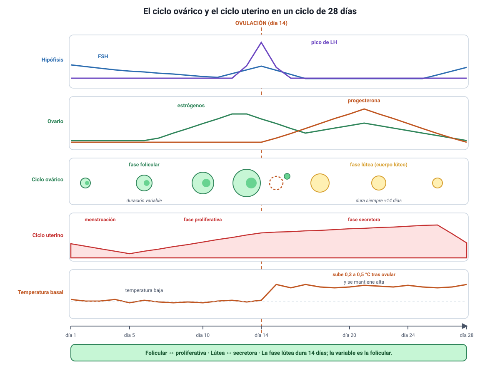

## 5. El ciclo ovárico y el ciclo uterino

Es el conocimiento **2.3** del temario DEMRE 2027 y el contenido con más preguntas del capítulo. Son **dos ciclos que ocurren a la vez**, en órganos distintos, coordinados por las mismas hormonas.

<figure><figcaption>Figura 4. Los dos ciclos, sus hormonas y la temperatura basal, en un ciclo de 28 días. Diagrama propio.</figcaption></figure>

### a. Cómo leer el esquema

Todo se cuenta desde el **día 1, que es el primer día de la menstruación**. En un ciclo de 28 días, la ovulación ocurre alrededor del día 14. Las cuatro bandas de la figura están alineadas en el tiempo, así que cada momento puede leerse en los cuatro niveles a la vez.

### b. El ciclo ovárico: lo que pasa en el ovario

| Fase | Días (ciclo de 28) | Qué ocurre | Hormona protagonista |
|---|---|---|---|
| **Folicular** | 1 a 13 | La **FSH** estimula el crecimiento de varios folículos; uno se hace dominante y el resto degenera. El folículo secreta **estrógenos** en cantidad creciente | FSH y estrógenos |
| **Ovulación** | ≈ 14 | El **pico de LH** rompe el folículo y libera el ovocito hacia la trompa | LH |
| **Lútea** | 15 a 28 | El folículo roto se transforma en **cuerpo lúteo** y secreta **progesterona**. Si no hay embarazo, degenera hacia el día 26 y las hormonas caen | Progesterona |

::: tip
**El dato que más se pregunta: cuál fase es variable.** La **fase lútea dura casi siempre 14 días**, porque ese es el tiempo de vida del cuerpo lúteo. Lo que varía entre personas y entre ciclos es la **fase folicular**. Por eso, en un ciclo de 32 días la ovulación no ocurre el día 16, sino alrededor del **día 18**: se cuentan 14 días hacia atrás desde el final. Un ítem oficial de 2027 usó exactamente ese cálculo con un ciclo de 32 días.
:::

### c. El ciclo uterino: lo que pasa en el endometrio

| Fase | Días (ciclo de 28) | Qué ocurre | Hormona que la dirige |
|---|---|---|---|
| **Menstrual** | 1 a 5 | El endometrio se descama y se elimina, porque cayeron los estrógenos y la progesterona | Ninguna: es consecuencia de la caída |
| **Proliferativa** | 6 a 13 | El endometrio **se regenera y se engrosa** | Estrógenos del folículo |
| **Secretora** | 15 a 28 | El endometrio se vuelve **glandular y vascularizado**, listo para recibir un embrión | Progesterona del cuerpo lúteo |

La correspondencia entre ambos ciclos es directa: la fase **folicular** del ovario coincide con la **proliferativa** del útero, y la fase **lútea** con la **secretora**.

::: nota
**Por qué llega la menstruación.** Si no hay implantación, el cuerpo lúteo degenera y la progesterona cae. El endometrio, que dependía de ella para mantenerse, se descama: eso es la menstruación, y marca el día 1 del ciclo siguiente. Si en cambio hay implantación, el embrión produce **hCG**, que mantiene vivo al cuerpo lúteo y, con él, la progesterona. Esa misma hCG es la que detectan los test de embarazo.
:::

### d. Dos señales corporales del ciclo

Ambas se usan en los métodos naturales de la sección 8 y aparecen con frecuencia en los ítems con gráficos.

**Temperatura corporal basal.** Es la temperatura medida al despertar, antes de cualquier actividad. Durante la fase folicular se mantiene baja; **después de la ovulación sube entre 0,3 y 0,5 °C** por efecto de la progesterona y se mantiene alta durante toda la fase lútea.

::: tip
**La limitación que la prueba explota.** El alza de temperatura confirma que la ovulación **ya ocurrió**: no la anticipa. Por eso, por sí sola, no sirve para predecir el día fértil, aunque sí para reconocer el patrón del propio ciclo a lo largo de varios meses.
:::

**Moco cervical.** Cambia de consistencia a lo largo del ciclo. Cerca de la ovulación, los estrógenos lo vuelven **abundante, transparente y elástico**, parecido a la clara de huevo, lo que facilita el paso de los espermatozoides. Después de la ovulación, la progesterona lo vuelve espeso y escaso, y forma una barrera. Ese cambio es la base del método de Billings.

### e. Qué altera los ciclos

Como todo el eje depende del hipotálamo, cualquier cosa que lo afecte puede alterar el ciclo: estrés sostenido, pérdida o ganancia importante de peso, ejercicio de alta intensidad, enfermedades y algunos fármacos.

La prueba oficial de Invierno 2027 presentó dos casos de este tipo: un estudio sobre **tabaquismo** que encontró niveles disminuidos de un factor de crecimiento vascular en el tejido uterino —lo que compromete la vascularización del endometrio y, por lo tanto, la **implantación**—, y otro que relacionaba el **índice de masa corporal** con el desarrollo de los caracteres sexuales. En ambos, la clave estaba en seguir la cadena desde la variable alterada hasta la función que depende de ella.
