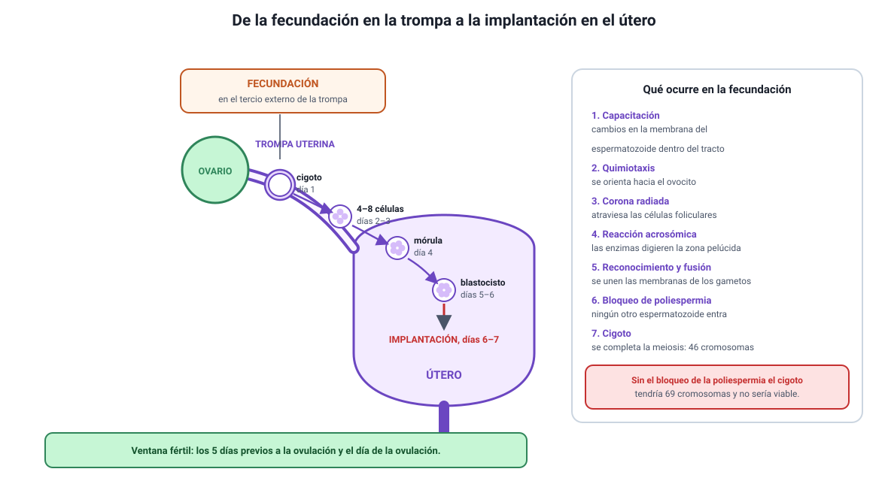

## 6. La fecundación y los primeros días

Completa el conocimiento **2.2** del temario DEMRE 2027: la **función de los gametos en la fecundación**.

<figure><figcaption>Figura 5. De la fecundación en la trompa a la implantación en el útero. Diagrama propio.</figcaption></figure>

### a. Dónde y cuándo

La fecundación ocurre en el **tercio externo de la trompa uterina**, el extremo cercano al ovario, y debe ocurrir dentro de un plazo acotado:

- El **ovocito** sobrevive entre 12 y 24 horas tras la ovulación.
- Los **espermatozoides** sobreviven en el tracto femenino hasta unos 5 días, según las condiciones del moco cervical.

De ahí sale el concepto de **ventana fértil**: los días en que una relación sexual puede terminar en embarazo son aproximadamente los cinco previos a la ovulación y el día de la ovulación misma. No es un día, sino un intervalo, y esa es la razón de que los métodos basados en el calendario sean poco confiables.

### b. El recorrido del espermatozoide

De las decenas de millones que entran, solo unos pocos cientos llegan hasta el ovocito.

1. **Capacitación.** En el tracto femenino, el espermatozoide sufre cambios en su membrana que lo habilitan para fecundar. Sin capacitación no puede producirse la reacción acrosómica. Por eso, en la fecundación *in vitro*, el laboratorio debe reproducir este paso.
2. **Quimiotaxis.** El espermatozoide orienta su movimiento siguiendo sustancias atrayentes liberadas cerca del ovocito. La prueba oficial de Invierno 2027 presentó datos de migración de espermatozoides frente a concentraciones crecientes de un quimioatrayente y pidió predecir el efecto sobre la fecundación asistida.
3. **Paso por la corona radiada.** El espermatozoide se abre camino entre las células foliculares.
4. **Reacción acrosómica.** Al contactar la zona pelúcida, el acrosoma libera sus **enzimas**, que digieren localmente esa cubierta.
5. **Reconocimiento y fusión.** Proteínas de la zona pelúcida y de la membrana del espermatozoide se reconocen de forma específica, y las membranas de los dos gametos se fusionan.
6. **Bloqueo de la poliespermia.** El ovocito responde de inmediato modificando su membrana y endureciendo la zona pelúcida, de modo que **ningún otro espermatozoide puede entrar**.
7. **Fin de la meiosis y formación del cigoto.** El ovocito completa su segunda división meiótica y los dos núcleos haploides se unen: queda una célula diploide, el **cigoto**.

::: tip
**Por qué el bloqueo de la poliespermia es decisivo.** Si entraran dos espermatozoides, el cigoto quedaría con 69 cromosomas en lugar de 46 y no sería viable. Cuando un ítem pregunta qué evita ese bloqueo, la respuesta correcta se refiere al **número de cromosomas**, no a la velocidad del desarrollo ni a la energía disponible.
:::

### c. De cigoto a blastocisto

Mientras avanza por la trompa hacia el útero, el cigoto se divide sin crecer: las células se hacen cada vez más pequeñas, porque viven de las reservas que aportó el ovocito.

| Momento aproximado | Estructura |
|---|---|
| Día 1 | Cigoto |
| Días 2 a 3 | 4 a 8 células, en la trompa |
| Día 4 | Mórula, que llega al útero |
| Días 5 a 6 | **Blastocisto**, con una cavidad interna |
| Días 6 a 7 | **Implantación** en el endometrio |

La implantación exige que el endometrio esté en fase secretora, es decir, engrosado y vascularizado por acción de la progesterona. Si ese endometrio está dañado o mal vascularizado, la implantación falla aunque la fecundación haya ocurrido: esa es la lógica de los dos ítems oficiales que mencionamos en la sección anterior.

::: nota
**Fecundación no es lo mismo que embarazo.** Entre la unión de los gametos y el embarazo establecido median unos siete días y un paso que puede fallar: la implantación. Distinguir ambos momentos es necesario para entender cómo actúa cada método anticonceptivo de la sección 8.
:::

### d. Cuando algo falla: la reproducción asistida

Los ítems sobre técnicas de reproducción asistida se resuelven identificando **qué paso del proceso reemplaza la técnica**.

| Técnica | Qué paso reemplaza | Cuándo no sirve |
|---|---|---|
| **Inseminación intrauterina** | El recorrido inicial del espermatozoide | Si las trompas están obstruidas |
| **Fecundación _in vitro_** | El encuentro de los gametos fuera del cuerpo | Si el espermatozoide no logra penetrar el ovocito |
| **Inyección de un espermatozoide en el ovocito** | El recorrido, la reacción acrosómica y el reconocimiento | Si el problema está en la **meiosis** y los gametos son cromosómicamente anómalos |

Ese último caso fue justamente un ítem oficial de 2027: entre cuatro personas con distintas causas de infertilidad, la técnica de inyección directa resultaba inefectiva para quien tenía **anomalías en el proceso meiótico**, porque esa técnica sortea las barreras físicas pero no corrige el contenido genético del gameto.
