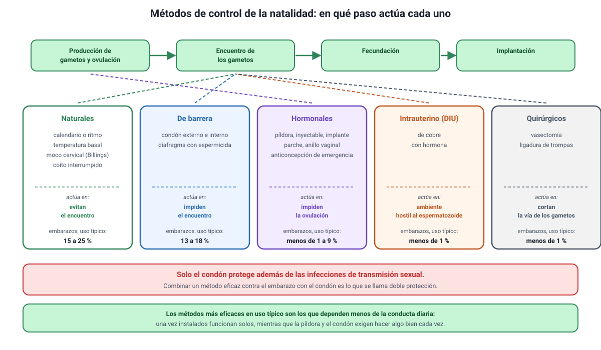

## 8. Métodos de control de la natalidad

Es el conocimiento **2.4** del temario DEMRE 2027, que pide expresamente distinguir los métodos **naturales**, los **artificiales reversibles** —hormonales y de barrera— y los **parcialmente reversibles**, es decir, los quirúrgicos.

<figure><figcaption>Figura 6. Clasificación de los métodos y paso en que actúa cada uno. Diagrama propio.</figcaption></figure>

### a. La pregunta que ordena la clasificación: ¿en qué paso actúa?

Todos los métodos hacen lo mismo en el fondo: **interrumpen alguno de los pasos** que van desde la producción de gametos hasta la implantación. Saber cuál interrumpe cada uno permite responder la mayoría de los ítems sin memorizar listas.

| Paso del proceso | Métodos que lo interrumpen |
|---|---|
| **Producción u ovulación** | Anticonceptivos hormonales; anticoncepción de emergencia |
| **Encuentro de los gametos** | Condón, diafragma; ligadura de trompas; vasectomía; métodos naturales |
| **Entorno uterino y movilidad de los espermatozoides** | Dispositivo intrauterino |

### b. Métodos naturales

Se basan en identificar la ventana fértil y evitar relaciones sexuales en esos días. No usan dispositivos ni fármacos.

| Método | En qué se basa | Limitación principal |
|---|---|---|
| **Calendario (ritmo)** | Estimar la ovulación a partir de la duración de ciclos anteriores | Supone ciclos regulares; falla si el ciclo varía |
| **Temperatura basal** | El alza de 0,3 a 0,5 °C que sigue a la ovulación | **Confirma** la ovulación una vez ocurrida; no la anticipa |
| **Billings (moco cervical)** | El moco se vuelve abundante, transparente y elástico cerca de la ovulación | Requiere observación diaria y se altera con infecciones o fármacos |
| **Coito interrumpido** | Retirar el pene antes de la eyaculación | Poco confiable: hay espermatozoides antes de la eyaculación |

::: tip
**Lo que los hace poco confiables no es el principio, sino la variabilidad.** El ciclo cambia con el estrés, una enfermedad, un viaje o un cambio de peso, y la ventana fértil se desplaza con él. Por eso su eficacia en uso típico es muy inferior a la de los métodos hormonales o de barrera. Si un ítem afirma que el método del calendario es confiable en una persona con ciclos irregulares, es incorrecto.
:::

### c. Métodos de barrera

Impiden físicamente que los espermatozoides lleguen al ovocito.

- **Condón externo (masculino) e interno (femenino):** son los únicos métodos que, además de evitar el embarazo, **reducen el riesgo de infecciones de transmisión sexual**. Ese doble papel es lo que más se pregunta.
- **Diafragma y capuchón cervical:** cubren el cuello uterino y se usan con espermicida. No protegen de las ITS.

### d. Métodos hormonales

Aportan estrógenos y progestágenos, o solo progestágeno, en presentaciones diversas: píldora, inyectable, implante subdérmico, parche y anillo vaginal.

**Cómo funcionan.** Aquí se aplica directamente la retroalimentación negativa de la sección 2: las hormonas externas frenan la secreción de FSH y LH, de modo que **no hay pico de LH y no hay ovulación**. Además espesan el moco cervical y modifican el endometrio.

::: nota
**El razonamiento completo.** Hormonas externas → el hipotálamo y la hipófisis detectan concentraciones altas → baja la GnRH y bajan la FSH y la LH → el folículo no madura y no hay pico de LH → **no hay ovulación**. Esa cadena resuelve cualquier ítem sobre anticonceptivos hormonales, incluidos los que presentan gráficos de concentraciones.
:::

La **anticoncepción de emergencia** es un caso aparte: es una dosis alta de progestágeno que se toma después de una relación sexual sin protección y actúa **retrasando o impidiendo la ovulación**. Es menos eficaz que un método de uso regular y, como su nombre indica, no está pensada para usarse como tal.

### e. Dispositivo intrauterino

El **DIU** se instala en el útero y puede ser de cobre o con hormona. El de cobre crea un ambiente hostil para los espermatozoides y dificulta la fecundación; el hormonal, además, espesa el moco cervical y adelgaza el endometrio. Es reversible al retirarlo y dura varios años.

### f. Métodos quirúrgicos

El temario los llama **parcialmente reversibles**, y la palabra importa.

- **Vasectomía:** se seccionan los conductos deferentes. El testículo **sigue produciendo testosterona y espermatozoides**, pero estos ya no llegan al semen.
- **Ligadura de trompas:** se interrumpen las trompas uterinas, de modo que el ovocito y el espermatozoide no pueden encontrarse. El ciclo ovárico continúa igual.

::: tip
**Dos ítems oficiales de 2027 salieron de aquí.** Uno preguntaba cómo comprobar que la reversión de una vasectomía fue exitosa: la respuesta es **examinar una muestra de semen al microscopio**, porque el problema era el paso de los espermatozoides y no su producción. El otro planteaba un ensayo de un anticonceptivo masculino inyectable comparado con el condón, y pedía la pregunta de investigación que lo originó: la que compara la **eficacia de ambos métodos para prevenir embarazos**, y no la que indaga preferencias o niveles hormonales.
:::

### g. Eficacia: uso perfecto y uso típico

La eficacia se expresa como el porcentaje de embarazos durante el primer año de uso, y siempre se informa de dos maneras:

- **Uso perfecto:** el método se usa exactamente como corresponde, siempre.
- **Uso típico:** el uso real de la población, con olvidos y errores.

| Método | Embarazos en el primer año, uso típico (orden de magnitud) |
|---|---|
| Implante y DIU | Menos del 1 % |
| Píldora, parche, anillo, inyectable | Alrededor del 7 al 9 % |
| Condón externo | Alrededor del 13 al 18 % |
| Métodos naturales | Entre un 15 y un 25 %, según el método |
| Coito interrumpido | Alrededor del 20 % o más |
| Sin método | Más del 80 % |

::: nota
**La lección que dejan estas cifras.** Los métodos más eficaces en uso típico son los que **dependen menos de la conducta diaria** de la persona: una vez instalados, funcionan solos. Los que exigen recordar algo todos los días, o hacer algo correctamente en cada relación, pierden eficacia en el uso real. Por eso la diferencia entre uso perfecto y uso típico es enorme en la píldora y casi nula en el implante.
:::

Por último, algo que la prueba distingue con cuidado: la **doble protección**, es decir, combinar un método eficaz para evitar el embarazo con el condón, que es el único que reduce además el riesgo de infecciones.
