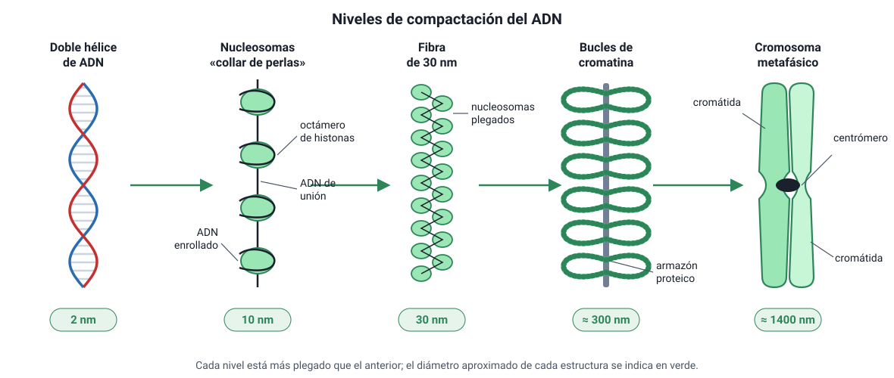

## 2. Cromatina y cromosomas

### a. Un problema de empaque

Si se estirara el ADN de una sola célula humana, mediría unos **2 metros**. Ese ADN cabe en un núcleo de apenas **5 a 10 µm** de diámetro. Para lograrlo, se empaqueta asociado a proteínas, formando la **cromatina**. El empaque cumple dos funciones:

1. **Ordena y protege** el ADN dentro del núcleo.
2. **Regula qué genes se leen:** las zonas más compactas se leen poco y las más sueltas, mucho.

### b. Grados de compactación

<figure><figcaption>Figura 1. Niveles de compactación del ADN, desde la doble hélice hasta el cromosoma metafásico. Diagrama propio, sin escala.</figcaption></figure>

| Nivel | Diámetro aproximado | Descripción |
|---|---|---|
| **Doble hélice de ADN** | 2 nm | La molécula desnuda |
| **Nucleosomas («collar de perlas»)** | 10 nm | El ADN da casi dos vueltas alrededor de un octámero de **histonas** (ocho proteínas). Entre un nucleosoma y otro queda un tramo de ADN de unión |
| **Fibra de 30 nm** | 30 nm | Los nucleosomas se pliegan y se acercan entre sí, con ayuda de otra histona (H1) |
| **Bucles de cromatina** | ≈ 300 nm | La fibra forma lazos anclados a un armazón de proteínas |
| **Cromosoma metafásico** | ≈ 1400 nm (1,4 µm) | Máxima condensación, alcanzada durante la mitosis. Cada cromátida es un cilindro muy compacto de bucles |

Según su grado de condensación en interfase, la cromatina puede ser:

- **Eucromatina:** poco condensada, con genes activos que se transcriben.
- **Heterocromatina:** muy condensada, con genes poco o nada activos. Se tiñe más intensamente.

::: tip
**¿Por qué los cromosomas se condensan antes de dividirse?** Un ADN extendido de 2 metros se enredaría y se cortaría al repartirse entre dos células. Condensado en cromosomas compactos, se puede separar ordenadamente. El costo es que, mientras está tan compacto, casi no se puede leer: la célula **transcribe muy poco durante la mitosis**.
:::

### c. La estructura de un cromosoma

Después de la replicación, en la fase S, cada cromosoma está formado por **dos cromátidas hermanas** idénticas, unidas en el **centrómero** por proteínas llamadas **cohesinas**. En el centrómero se forma el **cinetocoro**, donde se enganchan los microtúbulos del huso.

::: nota
**Cómo contar cromosomas y cromátidas**

- Se cuentan **cromosomas** contando **centrómeros**.
- Un cromosoma **no replicado** tiene **1 cromátida**; uno **replicado** tiene **2 cromátidas**, pero sigue siendo **un** cromosoma.
- Una célula humana en G1 tiene 46 cromosomas y 46 cromátidas. En G2 sigue teniendo **46 cromosomas**, pero ahora con **92 cromátidas**.
:::

### d. Cromosomas homólogos, cariotipo y ploidía

Las células del cuerpo humano (**células somáticas**) tienen **46 cromosomas**, organizados en **23 pares de homólogos**. De cada par, un cromosoma viene de la madre y el otro del padre:

- **22 pares de autosomas**, iguales en hombres y mujeres;
- **1 par de cromosomas sexuales:** XX en la mujer y XY en el hombre.

Los homólogos llevan **los mismos genes** en las mismas posiciones, pero pueden tener **versiones distintas** (alelos). Por ejemplo, uno puede llevar el alelo para ojos cafés y el otro, el alelo para ojos azules.

El **cariotipo** es el ordenamiento de los cromosomas de una célula por tamaño y forma, fotografiados en metafase, cuando están más condensados. Sirve para detectar alteraciones en el número o la estructura de los cromosomas.

| Término | Significado | En humanos |
|---|---|---|
| **2n (diploide)** | Dos juegos de cromosomas | Células somáticas: 2n = 46 |
| **n (haploide)** | Un juego de cromosomas | Gametos: n = 23 |

::: tip
**No confundas cromátidas hermanas con cromosomas homólogos.**

- Las **cromátidas hermanas** son **copias idénticas**, producto de la replicación.
- Los **homólogos** son **dos cromosomas distintos**, uno materno y otro paterno, con los mismos genes, pero posiblemente con alelos diferentes.

La mitosis separa cromátidas hermanas. La meiosis I separa homólogos.
:::
