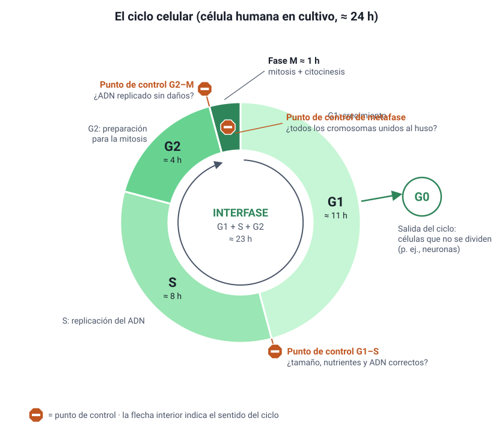
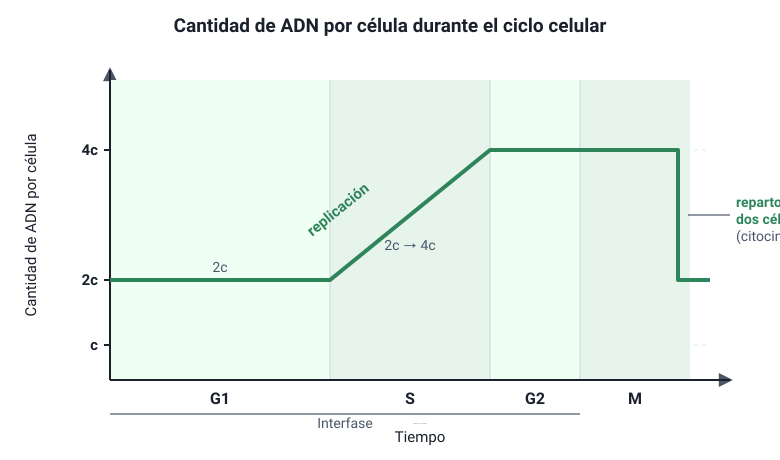

## 3. El ciclo celular

El ciclo celular es la secuencia ordenada de eventos por la que una célula **crece, duplica su contenido y se divide** en dos células hijas. Tiene dos grandes etapas: la **interfase** y la **fase M** (mitosis más citocinesis).

<figure><figcaption>Figura 2. Ciclo celular con sus fases y puntos de control. Diagrama propio.</figcaption></figure>

### a. La interfase

Aunque al microscopio la célula en interfase parece «quieta», es la etapa más activa y larga del ciclo: en una célula humana típica en cultivo, que se divide cada 24 horas, ocupa más del 90 % del tiempo.

| Fase | Qué ocurre |
|---|---|
| **G1** (del inglés *gap*, intervalo) | La célula **crece**, sintetiza proteínas y organelos y cumple sus funciones. Es la fase más variable en duración. |
| **S** (síntesis) | Se **replica el ADN**: cada cromosoma pasa a tener dos cromátidas hermanas. En células animales también se **duplican los centriolos**. |
| **G2** | La célula sigue creciendo, fabrica las proteínas necesarias para la división, como la tubulina del huso, y **revisa** que el ADN se haya copiado sin errores. |

**La fase G0.** Muchas células salen del ciclo desde G1 y entran en un estado de **no división**, llamado G0, en el que cumplen su función especializada.

- Algunas quedan en G0 de forma casi permanente, como la mayoría de las **neuronas** y las fibras musculares cardíacas.
- Otras pueden volver al ciclo si reciben una señal. Por ejemplo, los **hepatocitos** se dividen para regenerar el hígado cuando se extirpa una parte.
- Otras nunca entran en G0 y se dividen constantemente, como las células madre de la piel, de la médula ósea o del epitelio intestinal.

### b. La cantidad de ADN a lo largo del ciclo

Se suele llamar **c** a la cantidad de ADN de un juego de cromosomas sin replicar. Una célula diploide en G1 tiene **2c**.

| Etapa | Cromosomas (humano) | Cromátidas por cromosoma | Cantidad de ADN |
|---|---|---|---|
| G1 | 46 | 1 | 2c |
| S | 46 | Pasa de 1 a 2 | Aumenta de 2c a 4c |
| G2 | 46 | 2 | 4c |
| Mitosis (hasta la metafase) | 46 | 2 | 4c |
| Cada célula hija, después de la citocinesis | 46 | 1 | 2c |

<figure><figcaption>Figura 3. Cantidad de ADN por célula a lo largo de un ciclo celular. Diagrama propio.</figcaption></figure>

::: tip
**Gráficos de ADN en la PAES:** el tramo en que el ADN **sube de 2c a 4c** es la **fase S**. El tramo en que **baja de 4c a 2c** corresponde al final de la división, cuando el material se reparte entre dos células. Si el gráfico baja **dos veces**, primero de 4c a 2c y luego de 2c a c, se trata de una **meiosis** (sección 7).
:::

### c. Otra forma de estudiar el ciclo: contar células

En un cultivo en el que las células se dividen sin sincronizar, la **proporción de células en cada fase** es aproximadamente igual a la **fracción del ciclo que ocupa esa fase**. Si de 200 células observadas al microscopio, 10 están en mitosis, entonces la mitosis ocupa cerca del 10/200 = **5 %** del ciclo. Si el ciclo dura 24 horas, la mitosis dura unos 0,05 × 24 ≈ **1,2 horas**.

Este razonamiento aparece en preguntas con datos: se entrega el número de células en cada fase y se pide estimar su duración.
