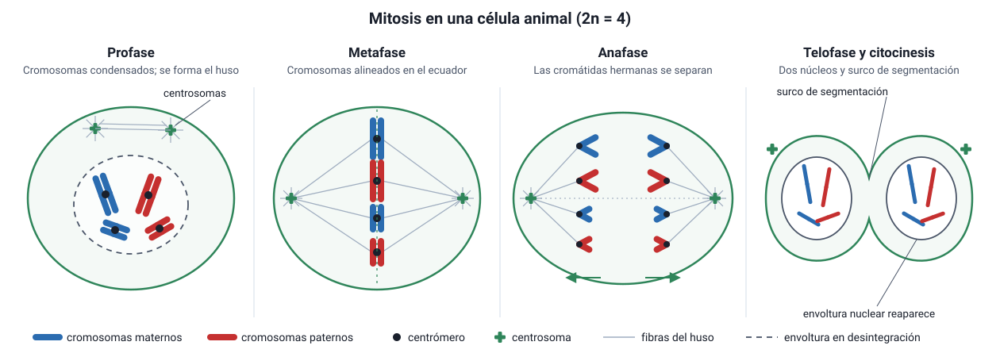

## 4. Mitosis y citocinesis

La mitosis reparte el ADN replicado en **dos núcleos idénticos**, cada uno con el mismo número de cromosomas que la célula original. Es un proceso continuo, pero para estudiarlo se divide en cuatro etapas, que se reconocen por lo que se **ve** al microscopio.

<figure><figcaption>Figura 4. Etapas de la mitosis en una célula animal con 2n = 4. Diagrama propio.</figcaption></figure>

### a. Las etapas de la mitosis

| Etapa | Qué ocurre | Cómo reconocerla al microscopio |
|---|---|---|
| **Profase** | La cromatina se **condensa** en cromosomas visibles, cada uno con dos cromátidas. Los centrosomas se separan hacia los polos y empieza a formarse el **huso mitótico** de microtúbulos. Al final se **desintegra la envoltura nuclear** (carioteca) y desaparece el nucléolo. En algunos textos esta última parte se llama *prometafase*: los microtúbulos se unen a los **cinetocoros** | Cromosomas visibles como filamentos; el núcleo pierde su borde |
| **Metafase** | Los cromosomas se alinean en el **plano ecuatorial** de la célula (placa metafásica), cada uno con los cinetocoros de sus dos cromátidas unidos a microtúbulos de polos opuestos | Cromosomas **alineados en el centro**. Es la etapa en que mejor se ven y se cuentan, por eso se usa para el cariotipo |
| **Anafase** | Se degradan las **cohesinas** que unían las cromátidas hermanas, que se **separan** y son arrastradas hacia **polos opuestos** al acortarse los microtúbulos del cinetocoro. Desde ese momento, cada cromátida es un cromosoma independiente | Dos grupos de cromosomas **en forma de V** moviéndose hacia los polos |
| **Telofase** | Los cromosomas llegan a los polos y se **descondensan**. Se **forman dos envolturas nucleares** y reaparecen los nucléolos. El huso se desarma | **Dos núcleos** en formación en los extremos de la célula, que suele empezar a estrangularse |

::: tip
**Cuántos cromosomas hay en la anafase.** En la anafase de una célula humana hay momentáneamente **92 cromosomas** en la célula: las 92 cromátidas separadas cuentan como cromosomas independientes, 46 hacia cada polo. La cantidad de ADN sigue siendo 4c hasta que se completa la citocinesis.
:::

### b. El huso mitótico

El huso está formado por **microtúbulos** que se organizan desde los centrosomas. Hay de varios tipos:

- **Microtúbulos del cinetocoro:** se unen a los cromosomas y los arrastran hacia los polos.
- **Microtúbulos polares:** se superponen en el centro y empujan los polos hacia afuera, alargando la célula.
- **Ásteres:** irradian hacia la membrana y orientan el huso.

::: nota
**Fármacos que atacan el huso.** Como la mitosis depende de los microtúbulos, algunos fármacos contra el cáncer actúan sobre ellos. La **vinblastina** y la **vincristina**, obtenidas de la planta vinca, impiden que los microtúbulos se formen, igual que la **colchicina**. El **taxol** (paclitaxel), obtenido del tejo, hace lo contrario: los estabiliza e impide que se desarmen. En ambos casos las células quedan **detenidas en metafase**, porque el huso no funciona, y terminan muriendo. Las células que se dividen rápido son las más afectadas. Por eso estos fármacos atacan a los tumores, pero también a las células del pelo y de la médula ósea.
:::

### c. Citocinesis

La citocinesis divide el citoplasma. Suele empezar durante la anafase o la telofase y es distinta en las células animales y vegetales:

| Célula animal | Célula vegetal |
|---|---|
| Un **anillo contráctil** de **actina y miosina** estrangula la célula desde afuera hacia adentro y forma un **surco de segmentación** | La pared rígida impide estrangularla. Vesículas del **Golgi** con materiales de pared se acumulan en el centro y se fusionan, formando una **placa celular** que crece desde el centro hacia afuera y se convierte en la nueva pared |

::: tip
**Pistas para reconocer el tipo de célula:** si en una célula en división no hay centriolos y la citocinesis ocurre con placa celular, es vegetal. Un fármaco que bloquea la **actina**, como la citocalasina, impide la citocinesis animal, pero no la mitosis: el resultado es una célula con **dos núcleos**.
:::

### d. Resultado de la mitosis

Una célula diploide (2n) produce **dos células diploides (2n)**, **genéticamente idénticas** entre sí y a la célula madre, salvo que ocurran mutaciones. La mitosis **conserva** la información genética.

Los procariontes no hacen mitosis: se dividen por **fisión binaria**. Replican su cromosoma circular, las dos copias se separan a medida que la célula se alarga y la célula se divide en dos.
