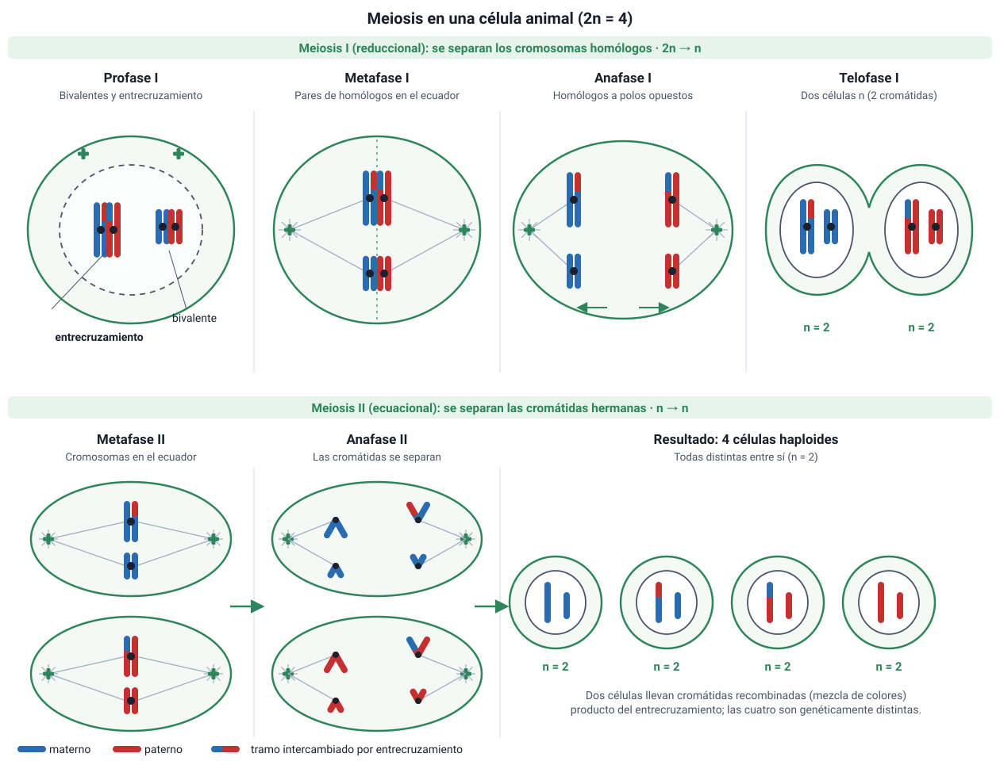

## 7. La meiosis

### a. ¿Por qué se necesita la meiosis?

En la reproducción sexual, dos gametos se unen en la **fecundación**. Si cada gameto tuviera 46 cromosomas, el cigoto tendría 92, y el número se duplicaría en cada generación. La meiosis resuelve el problema: **reduce a la mitad** el número de cromosomas, de 2n a n. Así, al unirse dos gametos haploides (n = 23), se restablece el número diploide (2n = 46).

La meiosis ocurre en las **células germinales** de las gónadas: los testículos y los ovarios. Consiste en **dos divisiones sucesivas**, meiosis I y meiosis II, precedidas por **una sola replicación** del ADN, en la fase S de la interfase previa.

<figure><figcaption>Figura 5. Meiosis en una célula con 2n = 4. Los colores distinguen los cromosomas de origen materno y paterno. Diagrama propio.</figcaption></figure>

### b. Meiosis I: la división reduccional

Se separan los **cromosomas homólogos**.

| Etapa | Qué ocurre |
|---|---|
| **Profase I** | Es la etapa más larga y compleja. Los cromosomas se condensan y los **homólogos se aparean** a lo largo de toda su longitud (**sinapsis**), unidos por una estructura de proteínas llamada **complejo sinaptonémico**. Cada par apareado se llama **bivalente** o **tétrada** (2 cromosomas, 4 cromátidas). Entre cromátidas de homólogos ocurre el **entrecruzamiento**, que intercambia segmentos de ADN. Los puntos de intercambio se ven como **quiasmas**, que mantienen unidos a los homólogos hasta la anafase I. Al final se desintegra la envoltura nuclear |
| **Metafase I** | Los **pares de homólogos** se alinean en el plano ecuatorial. La orientación de cada par, con el cromosoma materno hacia uno u otro polo, es **al azar** |
| **Anafase I** | Los **homólogos se separan** y van a polos opuestos. Las **cromátidas hermanas siguen unidas** por el centrómero |
| **Telofase I y citocinesis** | Se forman **dos células haploides** (n). Cada cromosoma todavía tiene **dos cromátidas**, que ya no son idénticas si hubo entrecruzamiento |

### c. Meiosis II: la división ecuacional

Es muy parecida a una mitosis, pero en células haploides, y **no hay replicación previa**.

| Etapa | Qué ocurre |
|---|---|
| **Profase II** | Se forma un nuevo huso en cada célula |
| **Metafase II** | Los cromosomas, cada uno con dos cromátidas, se alinean en el ecuador |
| **Anafase II** | Se separan las **cromátidas hermanas** |
| **Telofase II y citocinesis** | Se forman en total **cuatro células haploides** (n), genéticamente **distintas** entre sí y distintas de la célula original |

### d. El ADN y los cromosomas a lo largo de la meiosis

| Momento (humano) | Cromosomas | Cromátidas por cromosoma | ADN |
|---|---|---|---|
| Célula germinal en G1 | 46 (2n) | 1 | 2c |
| Después de la fase S y en la profase I | 46 (2n) | 2 | 4c |
| Cada célula tras la meiosis I | 23 (n) | 2 | 2c |
| Cada célula tras la meiosis II | 23 (n) | 1 | c |

::: tip
**Dónde se reduce el número de cromosomas.** La **ploidía** se reduce en la **meiosis I**, porque se separan los homólogos y cada célula queda con un solo juego. La meiosis II no cambia el número de cromosomas (sigue siendo n): solo separa cromátidas y reduce el ADN de 2c a c. Por eso se dice que la meiosis I es **reduccional** y la meiosis II, **ecuacional**.
:::
