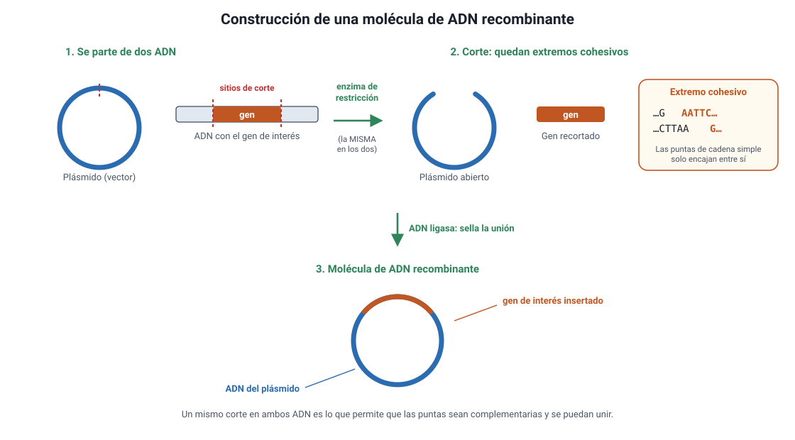
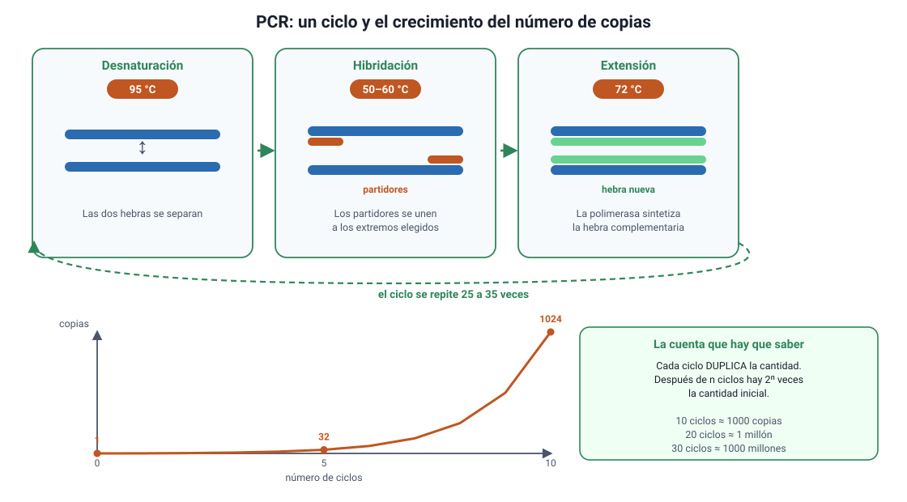
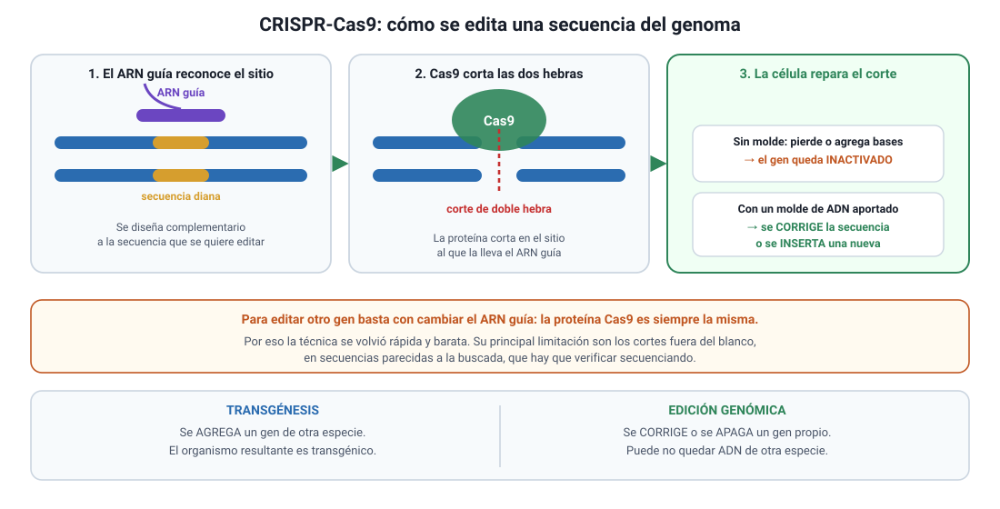

## 4. Las herramientas: cortar, pegar, copiar y leer el ADN

Toda la manipulación genética se apoya en un puñado de herramientas. Conviene aprenderlas por **lo que hacen**, porque así se responde cualquier pregunta que las combine.

### a. Enzimas de restricción: las tijeras

Son enzimas bacterianas que cortan el ADN **solo donde encuentran una secuencia determinada**, llamada sitio de reconocimiento, de cuatro a ocho pares de bases. Cada enzima tiene el suyo.

Por ejemplo, la enzima **EcoRI** reconoce la secuencia GAATTC y corta entre la G y la A en ambas hebras, de forma desplazada:

```
5'  ...G     A A T T C...  3'
3'  ...C T T A A     G...  5'
```

El corte desplazado deja **extremos cohesivos**: puntas de cadena simple que pueden aparearse con cualquier otro fragmento cortado por la misma enzima, venga de donde venga.

<figure><figcaption>Figura 1. Construcción de una molécula de ADN recombinante. Diagrama propio.</figcaption></figure>

::: tip
**Por qué importa que sea la misma enzima.** Si el plásmido y el gen se cortan con enzimas distintas, sus extremos cohesivos no son complementarios y no se pueden unir. Cuando un ítem pregunta qué enzima usar, la respuesta correcta casi siempre es **la misma en ambos ADN**, justamente para que las puntas encajen.
:::

### b. ADN ligasa: el pegamento

Los extremos cohesivos se aparean por puentes de hidrógeno, que son débiles. La **ADN ligasa** forma el enlace covalente que une definitivamente las hebras. Es la misma enzima que sella los fragmentos durante la replicación del ADN.

### c. Vectores: el vehículo

Un **vector** es una molécula de ADN capaz de entrar en una célula y replicarse allí. El más usado es el **plásmido** bacteriano, que aporta tres cosas:

1. Un **origen de replicación**, para que la célula lo copie.
2. Un **sitio de corte** donde insertar el gen.
3. Un **gen marcador**, normalmente de resistencia a un antibiótico, que permite identificar después a las bacterias que sí recibieron el plásmido.

::: nota
**Para qué sirve el marcador.** La transformación es ineficiente: solo una fracción de las bacterias incorpora el plásmido. Si después se las cultiva en un medio **con el antibiótico**, mueren todas las que no lo recibieron y crecen únicamente las que sí. El antibiótico no modifica nada: actúa como un filtro. Es un ejemplo de selección aplicada en el laboratorio.
:::

Otros vectores: **virus modificados** (muy usados en terapia génica, porque son eficientes para entrar en células animales), la bacteria ***Agrobacterium tumefaciens*** (que transfiere ADN a células vegetales de forma natural) y métodos físicos como la **biobalística**, que dispara micropartículas recubiertas de ADN.

### d. PCR: la fotocopiadora

La **reacción en cadena de la polimerasa** produce millones de copias de un fragmento de ADN en pocas horas. Necesita cuatro ingredientes: el ADN molde, dos **partidores** que delimitan la región a copiar, nucleótidos libres y una **ADN polimerasa resistente al calor** (la clásica proviene de una bacteria de aguas termales).

<figure><figcaption>Figura 2. Un ciclo de PCR y el crecimiento exponencial del número de copias. Diagrama propio.</figcaption></figure>

Cada ciclo tiene tres pasos y **duplica** la cantidad de fragmento:

| Paso | Temperatura aproximada | Qué ocurre |
|---|---|---|
| **Desnaturación** | 95 °C | Las dos hebras se separan |
| **Hibridación** | 50–60 °C | Los partidores se unen a los extremos de la región elegida |
| **Extensión** | 72 °C | La polimerasa sintetiza la hebra complementaria |

::: tip
**La cuenta que la PAES sí pide.** Como cada ciclo duplica, después de *n* ciclos hay **2<sup>n</sup>** veces la cantidad inicial. Con 10 ciclos son 2<sup>10</sup> ≈ 1000 copias por molécula inicial; con 20 ciclos, cerca de un millón; con 30, más de mil millones. Si el enunciado da el número de ciclos y pide el número de copias, la respuesta es una potencia de dos, no una multiplicación.
:::

### e. Electroforesis en gel: la regla

Separa fragmentos de ADN **por su tamaño**. Se depositan las muestras en un gel y se aplica un campo eléctrico; como el ADN tiene carga negativa por sus grupos fosfato, **migra hacia el polo positivo**. Los fragmentos pequeños avanzan más rápido y llegan más lejos; los grandes quedan cerca del punto de partida. Comparando con un patrón de tamaños conocidos se estima cuánto mide cada banda.

::: nota
**Para qué se usa en la práctica.** Para comprobar que una PCR funcionó y que amplificó el fragmento del tamaño esperado; para verificar que un plásmido recibió el inserto; y para comparar muestras, que es la base de las pruebas de paternidad y de la identificación forense.
:::

### f. Secuenciación: la lectura

Determina el **orden exacto de los nucleótidos**. Es lo que permite saber si una edición quedó bien hecha, diagnosticar una mutación o comparar especies (capítulo 9). Su costo se ha desplomado: el primer genoma humano tomó unos trece años y miles de millones de dólares, y hoy secuenciar un genoma completo toma días.

### g. CRISPR-Cas9: el corrector

Es un sistema de defensa de las bacterias contra los virus, adaptado como herramienta. Tiene dos componentes:

- Un **ARN guía**, diseñado en el laboratorio, complementario a la secuencia que se quiere modificar.
- La proteína **Cas9**, una nucleasa que corta las dos hebras del ADN en el sitio al que la lleva el ARN guía.

<figure><figcaption>Figura 3. Cómo edita CRISPR-Cas9 una secuencia del genoma. Diagrama propio.</figcaption></figure>

Tras el corte, la célula lo **repara**, y ahí ocurre la modificación:

- Si repara uniendo los extremos, suele perder o agregar algunas bases, y el gen queda **inactivado**.
- Si se le entrega además un molde de ADN, puede usarlo para **corregir** la secuencia o **insertar** una nueva.

::: tip
**Lo que cambió CRISPR.** Antes, dirigir una modificación a un sitio determinado exigía diseñar una proteína a medida para cada blanco, lo que era lento y caro. Con CRISPR basta con **cambiar el ARN guía**, que se sintetiza en días. Por eso la técnica se extendió tan rápido. Su principal limitación son los cortes **fuera del blanco**, en secuencias parecidas a la buscada, que hay que verificar secuenciando.
:::

### h. Resumen: qué herramienta usar para qué

| Objetivo | Herramienta |
|---|---|
| Cortar el ADN en un sitio conocido | Enzima de restricción |
| Unir dos fragmentos | ADN ligasa |
| Llevar un gen al interior de una célula | Vector: plásmido, virus, *Agrobacterium*, biobalística |
| Obtener muchas copias de un fragmento | PCR |
| Comprobar el tamaño de un fragmento | Electroforesis en gel |
| Conocer la secuencia exacta | Secuenciación |
| Corregir o apagar un gen ya presente | CRISPR-Cas9 |
