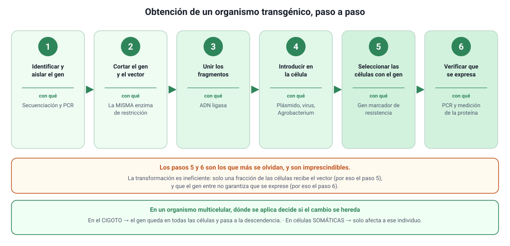

## 5. Cómo se obtiene un organismo transgénico

El procedimiento es siempre el mismo, cambie el organismo y cambie el objetivo. Conviene memorizar los **seis pasos**, porque la PAES suele entregar el procedimiento desordenado y pedir el orden, o preguntar qué ocurre si se omite uno.

<figure><figcaption>Figura 4. Obtención de un organismo transgénico, paso a paso. Diagrama propio.</figcaption></figure>

| Paso | Qué se hace | Con qué herramienta |
|---|---|---|
| **1. Identificar y aislar el gen** | Se localiza el gen responsable de la característica y se obtienen copias | Secuenciación y PCR |
| **2. Cortar el gen y el vector** | Se corta el ADN que contiene el gen y el plásmido, **con la misma enzima**, para que los extremos encajen | Enzima de restricción |
| **3. Unir** | Los extremos cohesivos se aparean y se sellan: queda el ADN recombinante | ADN ligasa |
| **4. Introducir en la célula** | El vector entra en la célula hospedera | Transformación, virus, *Agrobacterium* o biobalística |
| **5. Seleccionar** | Se identifican las células que sí incorporaron el vector y se descartan las demás | Gen marcador (resistencia a antibiótico) |
| **6. Verificar** | Se comprueba que el gen está y que se expresa | PCR, electroforesis, secuenciación, medición de la proteína |

### a. Por qué el paso 5 es imprescindible

La transformación es **ineficiente**: de millones de células tratadas, solo una fracción incorpora el vector. Sin un método de selección habría que revisar una por una. El gen marcador resuelve el problema: al cultivar en un medio con el antibiótico, solo sobreviven las células que recibieron el plásmido, porque solo ellas tienen el gen de resistencia.

::: tip
**Un error frecuente.** El antibiótico no hace que las bacterias incorporen el plásmido ni las vuelve resistentes: solo **elimina a las que no lo tienen**. Es exactamente la lógica de la selección natural del capítulo 9, aplicada a propósito en una placa de cultivo. Si una alternativa dice que el antibiótico «induce» la resistencia o «obliga» a incorporar el vector, es incorrecta.
:::

### b. Por qué el paso 6 no se puede saltar

Que el gen entre no garantiza que funcione. Puede haberse insertado en un lugar del genoma donde no se transcribe, o haberse cortado al insertarse. Por eso se verifica en dos niveles:

- **¿Está el gen?** Se comprueba con PCR y electroforesis: si aparece una banda del tamaño esperado, la secuencia está presente.
- **¿Se expresa?** Se mide la proteína o el ARN mensajero correspondiente. Solo entonces se puede afirmar que el organismo produce lo buscado.

### c. Un caso concreto: la insulina humana

Es el ejemplo más citado y conviene tenerlo completo:

1. Se identifica y se obtiene el **gen humano de la insulina**.
2. Se corta un **plásmido** de *Escherichia coli* con la misma enzima de restricción.
3. La **ligasa** une el gen al plásmido: queda el ADN recombinante.
4. El plásmido se introduce en las bacterias.
5. Se **seleccionan** las bacterias transformadas con el gen marcador.
6. Se cultivan en **biorreactores**; como leen el gen humano, fabrican insulina humana, que después se purifica.

::: nota
**Por qué fue un cambio enorme.** Antes de 1982 la insulina se extraía del páncreas de cerdos y vacas de mataderos. Era escasa, dependía de la industria cárnica, su estructura no era idéntica a la humana y provocaba reacciones alérgicas en parte de los pacientes. La insulina recombinante es **idéntica a la humana**, se produce en la cantidad que se necesite y no depende de animales. Fue el primer fármaco recombinante aprobado, en 1982.
:::

### d. Diferencias según el organismo

| Organismo | Cómo entra el ADN | Particularidad |
|---|---|---|
| **Bacteria** | Transformación con plásmido | La más simple y rápida; no modifica proteínas como lo hacen las células humanas |
| **Levadura** | Plásmido | Es eucarionte, así que procesa mejor las proteínas humanas complejas |
| **Planta** | *Agrobacterium tumefaciens* o biobalística | Desde una sola célula transformada se puede regenerar la planta completa |
| **Animal** | Microinyección en el cigoto, o vectores virales | Debe hacerse en el cigoto para que el gen esté en todas las células y se herede |

::: tip
**Cigoto o célula somática: la distinción que decide la respuesta.** Si la modificación se hace en el **cigoto**, estará en todas las células del organismo y **se heredará**. Si se hace en **células somáticas** de un individuo ya formado, como en la terapia génica, afectará solo a esas células y **no pasará a la descendencia**. Muchos ítems se resuelven identificando en qué célula se aplicó la técnica.
:::
