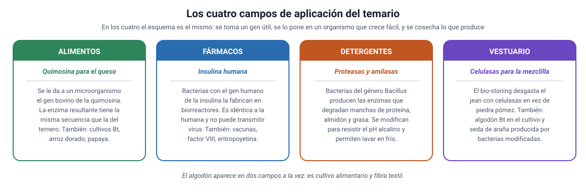

## 6. Aplicaciones en alimentos y agricultura

El temario DEMRE 2027 nombra cuatro campos de aplicación: **alimentos, detergentes, vestuario y fármacos**. Los cuatro aparecen en esta sección y en las dos siguientes.

<figure><figcaption>Figura 5. Los cuatro campos de aplicación del temario, con un ejemplo de cada uno. Diagrama propio.</figcaption></figure>

### a. Cultivos transgénicos: para qué se modifican

Casi toda la superficie transgénica del mundo corresponde a **dos** características, y conviene no confundirlas:

| Característica | Qué se le agregó | Para qué sirve |
|---|---|---|
| **Resistencia a insectos** (Bt) | Un gen de la bacteria *Bacillus thuringiensis* que codifica una proteína tóxica para ciertas larvas | La planta se defiende sola; se reduce la aplicación de insecticidas |
| **Tolerancia a herbicidas** | Una versión de la enzima que el herbicida bloquea, que el herbicida no reconoce | Se puede aplicar el herbicida sin dañar el cultivo |

::: tip
**El error clásico con el maíz Bt.** La planta Bt **no produce insecticida químico**: produce una **proteína** que resulta tóxica solo para las larvas de ciertos insectos, porque actúa sobre receptores de su intestino, que es alcalino. No afecta de igual modo a los mamíferos. Y tampoco es «resistente a todos los insectos»: solo a los que tienen ese receptor.
:::

### b. Cuánto se cultiva

En 2024 la superficie mundial de cultivos genéticamente modificados alcanzó unos **210 millones de hectáreas**, más del 12 % de la superficie cultivable del planeta. Cuatro especies concentran casi todo:

| Cultivo | Superficie aproximada (millones de ha) |
|---|---|
| Soya | 105 |
| Maíz | 68 |
| Algodón | 25 |
| Canola | 10 |

Estados Unidos, Brasil y Argentina son los mayores productores. Nótese que el **algodón** aparece aquí y volverá a aparecer en la sección 8: es un cultivo alimentario y textil a la vez.

### c. Alimentos: más allá del cultivo

- **Quimosina para el queso.** La quimosina es la enzima que coagula la leche. Tradicionalmente se extraía del cuajo del estómago de terneros lactantes. Desde 1990 se produce por **fermentación**, con microorganismos que recibieron el gen bovino: la enzima resultante tiene la **misma secuencia de aminoácidos** que la del ternero. Hoy la mayor parte del queso industrial se hace así, y eso permite además quesos aptos para dietas vegetarianas.
- **Papaya resistente a virus.** En Hawái, la papaya transgénica resistente al virus de la mancha anillada rescató un cultivo que estaba colapsando.
- **Arroz dorado.** Se le insertaron genes que le permiten acumular **betacaroteno**, precursor de la vitamina A, en el grano. Fue diseñado para combatir la deficiencia de vitamina A, causa de ceguera infantil en varias regiones. Es un caso interesante porque el beneficio buscado es **nutricional** y no agronómico.
- **Champiñón sin pardeamiento.** Editado con CRISPR para inactivar un gen propio: no contiene ADN de otra especie. Es el ejemplo típico de la diferencia entre editar y transgénesis.

### d. El caso chileno

Chile ocupa una posición particular, que conviene tener clara:

- **No se cultivan transgénicos para consumo interno.** Lo que sí está permitido, y desde 1992, es la **producción de semilla transgénica para exportación**, bajo medidas estrictas de aislamiento y autorización del **Servicio Agrícola y Ganadero (SAG)**.
- Chile **sí importa** alimentos derivados de cultivos transgénicos, sobre todo maíz y soya destinados a alimentación animal.
- El aprovechamiento del contraestación es lo que explica el negocio: mientras en el hemisferio norte es invierno, aquí se multiplica semilla.

::: nota
**Por qué Chile es buen productor de semilla.** Las mismas barreras geográficas del capítulo 9 —el desierto, la cordillera, el océano— funcionan aquí como **aislamiento sanitario y reproductivo**, que es justo lo que exige un semillero: reduce plagas y reduce el riesgo de que el polen del cultivo llegue a otras plantaciones. Una condición evolutiva se convierte en una ventaja productiva.
:::

### e. Cómo lo pregunta la PAES

Los ítems sobre este contenido rara vez piden recordar un ejemplo. Piden, sobre todo:

1. **Distinguir la característica introducida** de sus consecuencias: qué gen se agregó y qué efecto produce.
2. **Evaluar un diseño experimental** que compare un cultivo modificado con uno convencional: qué variable se controla, cuál es el grupo control.
3. **Analizar datos** de rendimiento, de uso de plaguicidas o de superficie sembrada.
4. **Juzgar una afirmación** sobre riesgos o beneficios según la evidencia entregada.
