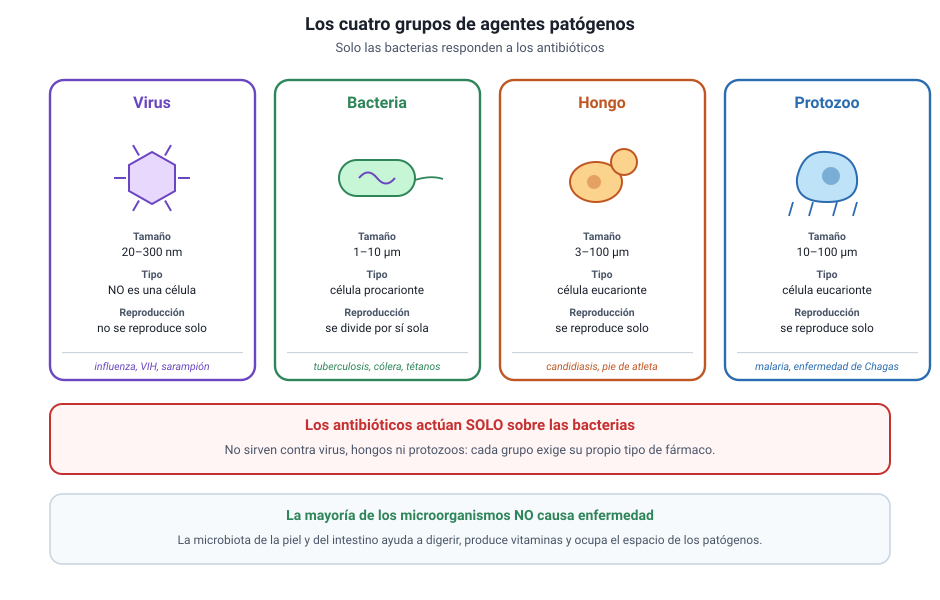

## 3. Los microorganismos

<figure><figcaption>Figura 1. Los cuatro grupos de agentes patógenos comparados. Diagrama propio.</figcaption></figure>

### a. La mayoría no causa daño

Antes de hablar de patógenos conviene fijar una proporción: de los millones de especies microbianas conocidas, solo una minoría produce enfermedad en humanos. En tu intestino, tu piel y tus mucosas vive la **microbiota**, un conjunto enorme de microorganismos que ayudan a digerir, producen vitaminas y ocupan el espacio que de otro modo usarían los patógenos.

::: nota
**La microbiota es una barrera.** Cuando un tratamiento con antibióticos la altera, aparecen infecciones oportunistas que antes no ocurrían. Esa es una de las razones por las que los antibióticos no deben tomarse sin necesidad.
:::

### b. Los cuatro grupos que hay que distinguir

| | **Virus** | **Bacterias** | **Hongos** | **Protozoos** |
|---|---|---|---|---|
| ¿Es una célula? | **No** | Sí, procarionte | Sí, eucarionte | Sí, eucarionte |
| Tamaño típico | 20 a 300 nm | 1 a 10 µm | 3 a 100 µm | 10 a 100 µm |
| Metabolismo propio | No | Sí | Sí | Sí |
| Se reproduce solo | No: necesita una célula hospedera | Sí, por división | Sí | Sí |
| ¿Responden a antibióticos? | **No** | Sí | No (requieren antifúngicos) | No (requieren antiparasitarios) |
| Ejemplos de enfermedad | Influenza, VIH, sarampión, COVID-19 | Tuberculosis, cólera, tétanos | Candidiasis, pie de atleta | Malaria, enfermedad de Chagas |

::: tip
**Cómo se pregunta.** Dos datos deciden la mayoría de los ítems de esta sección: que **el virus no es una célula y no tiene metabolismo propio**, y que **los antibióticos no sirven contra los virus**. Una alternativa que recete antibióticos para un resfrío es siempre incorrecta.
:::

### c. Por qué el virus es un caso aparte

Un virus tiene material genético, ADN o ARN, y una cubierta de proteínas; algunos añaden una envoltura lipídica. No tiene citoplasma con metabolismo, ni ribosomas propios, ni capacidad de dividirse. Fuera de una célula es una partícula inerte.

Para multiplicarse debe entrar en una célula hospedera y usar su maquinaria: sus ribosomas, sus enzimas y su energía. Por eso las enfermedades virales se combaten sobre todo **previniéndolas**, con vacunas, y por eso los pocos antivirales existentes son difíciles de diseñar: hay que golpear al virus sin dañar la célula que lo aloja.

### d. Bacterias: no todas son enemigas

Las bacterias son células procariontes. Algunas causan enfermedades graves, pero muchas otras son indispensables: fijan nitrógeno en el suelo, fermentan alimentos, sintetizan vitamina K en el intestino y participan en el ciclo del carbono, como viste en el capítulo 10.

Las bacterias patógenas dañan de dos maneras: **invadiendo** tejidos y multiplicándose en ellos, o **liberando toxinas**. El tétanos y el botulismo son ejemplos del segundo caso: el daño lo hace la toxina, no la bacteria en sí.
