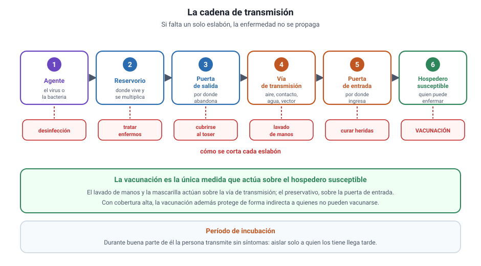

## 4. Transmisión y prevención

<figure><figcaption>Figura 2. La cadena de transmisión y dónde se corta cada eslabón. Diagrama propio.</figcaption></figure>

### a. La cadena de transmisión

Para que una enfermedad infecciosa se propague deben cumplirse seis condiciones encadenadas. Si falta una sola, la transmisión se interrumpe.

| Eslabón | Qué es | Cómo se corta |
|---|---|---|
| **Agente** | El virus, la bacteria u otro patógeno | Desinfección, esterilización, antibióticos |
| **Reservorio** | Donde el agente vive y se multiplica | Tratamiento de enfermos, control de animales |
| **Puerta de salida** | Por donde abandona al hospedero | Cubrirse al toser, aislar secreciones |
| **Vía de transmisión** | El camino de un hospedero a otro | Lavado de manos, mascarilla, agua potable, control de vectores |
| **Puerta de entrada** | Por donde ingresa al nuevo hospedero | Curar heridas, preservativo, no compartir jeringas |
| **Hospedero susceptible** | La persona que puede enfermar | **Vacunación** |

::: tip
**Cómo se pregunta.** La PAES suele describir una medida sanitaria y pedir qué eslabón interrumpe. La vacunación es el único que actúa sobre el **hospedero susceptible**; el lavado de manos y la mascarilla actúan sobre la **vía de transmisión**.
:::

### b. Las vías de transmisión

| Vía | Cómo ocurre | Ejemplos |
|---|---|---|
| **Aérea** | Gotitas o aerosoles al toser, hablar o estornudar | Influenza, tuberculosis, sarampión |
| **Por contacto** | Directo con la piel o las mucosas, o con un objeto contaminado | Herpes, hongos de la piel |
| **Sexual** | Contacto con fluidos durante relaciones sexuales | VIH, gonorrea, clamidia, sífilis |
| **Digestiva** | Agua o alimentos contaminados con heces | Cólera, hepatitis A, fiebre tifoidea |
| **Vertical** | De la madre al hijo en el embarazo, el parto o la lactancia | VIH, sífilis congénita |
| **Por vector** | Un animal transporta el agente | Malaria por mosquito, Chagas por vinchuca |
| **Parenteral** | Por sangre: jeringas, transfusiones, instrumentos | VIH, hepatitis B y C |

Las infecciones de transmisión sexual se desarrollan en detalle en el capítulo 5, que es donde el temario 2027 las ubica.

### c. Período de incubación y por qué complica el control

El **período de incubación** es el tiempo entre la infección y la aparición de los síntomas. Durante buena parte de él la persona puede transmitir el agente **sin saber que está infectada**. Por eso las medidas basadas solo en aislar a quienes tienen síntomas son insuficientes: llegan tarde.

::: ejemplo
**Un caso para razonar.** Dos enfermedades tienen la misma vía de transmisión y la misma probabilidad de contagio por contacto, pero una tiene un período de incubación de un día y la otra de dos semanas. La segunda es **más difícil de controlar**, porque cada persona infectada circula y transmite durante mucho más tiempo antes de ser detectada. La conclusión no depende de cuán grave sea la enfermedad, sino del tiempo disponible para transmitirla.
:::

### d. Prevención: lo que de verdad funciona

1. **Agua potable y alcantarillado.** Es la medida que más muertes por enfermedades infecciosas ha evitado en la historia.
2. **Lavado de manos.** Corta la vía de contacto y la digestiva.
3. **Vacunación.** Actúa sobre el hospedero y, con cobertura alta, protege también a quien no puede vacunarse.
4. **Control de vectores.** Eliminar criaderos de mosquitos o mejorar las viviendas rurales.
5. **Preservativo.** Corta la puerta de entrada en la vía sexual.
6. **Manipulación segura de alimentos.** Cocción, refrigeración y separación de crudos y cocidos.
