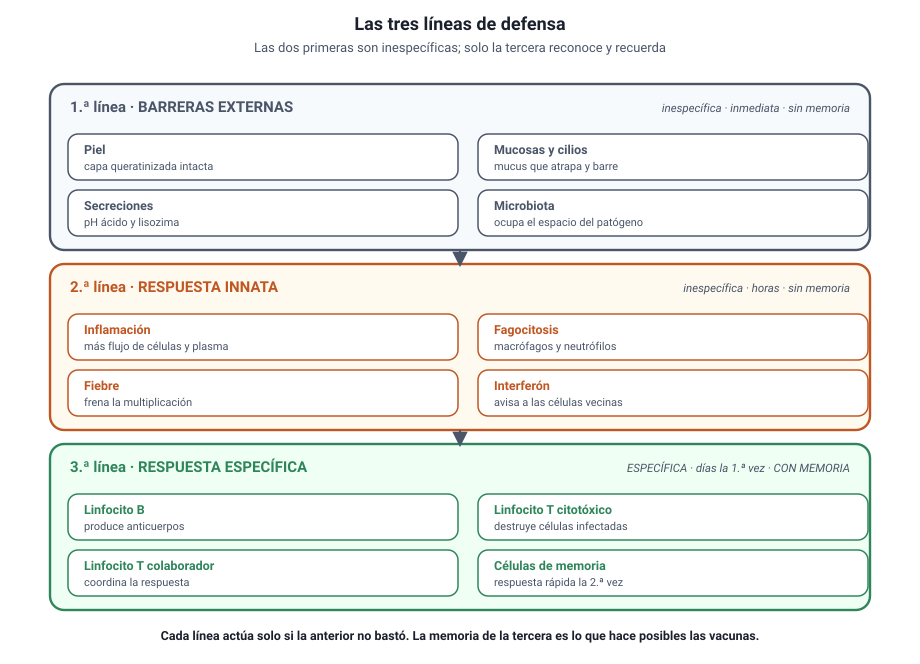

## 5. Las barreras defensivas

<figure><figcaption>Figura 3. Las tres líneas de defensa, de la piel a la memoria inmunológica. Diagrama propio.</figcaption></figure>

### a. Tres líneas, no una

El organismo no tiene una defensa, sino tres, dispuestas en profundidad. Las dos primeras son **inespecíficas**: actúan igual contra cualquier invasor. La tercera es **específica**: reconoce a cada agente en particular y lo recuerda.

| | Primera línea | Segunda línea | Tercera línea |
|---|---|---|---|
| Qué es | Barreras externas | Respuesta innata interna | Respuesta inmune específica |
| ¿Específica? | No | No | **Sí** |
| ¿Hay memoria? | No | No | **Sí** |
| Velocidad | Inmediata | Horas | Días la primera vez |
| Componentes | Piel, mucosas, secreciones, microbiota | Inflamación, fagocitosis, fiebre, interferón | Linfocitos B y T, anticuerpos |

### b. Primera línea: no dejar entrar

- **Piel:** una capa de células muertas y queratinizadas que ningún patógeno común atraviesa si está intacta.
- **Mucosas:** recubren las vías respiratoria, digestiva y urogenital, y producen mucus que atrapa partículas.
- **Cilios:** en las vías respiratorias, barren el mucus con lo atrapado hacia afuera.
- **Secreciones:** el sudor y el sebo tienen pH ácido; las lágrimas y la saliva contienen lisozima, una enzima que destruye la pared de muchas bacterias; el jugo gástrico es fuertemente ácido.
- **Microbiota:** ocupa el espacio y los nutrientes que un patógeno necesitaría.

::: nota
**Una herida es una puerta.** Casi todas las infecciones de piel empiezan con una solución de continuidad: un corte, una quemadura, una picadura. Por eso cubrir y limpiar una herida es una medida de defensa de primera línea, no un detalle estético.
:::

### c. Segunda línea: contener al que entró

Si el patógeno atraviesa la barrera externa, se activa la respuesta innata:

1. **Inflamación.** Los vasos de la zona se dilatan y se vuelven más permeables. De ahí el enrojecimiento, el calor, la hinchazón y el dolor. La dilatación sirve: lleva más células defensivas y más plasma al lugar.
2. **Fagocitosis.** Los macrófagos y los neutrófilos engullen al microorganismo y lo degradan en su interior. El pus es, en buena medida, el resultado de ese trabajo.
3. **Fiebre.** El aumento de la temperatura dificulta la multiplicación de muchos patógenos y acelera las reacciones defensivas.
4. **Interferón.** Proteínas que una célula infectada por un virus libera para avisar a sus vecinas, que se preparan y dificultan la replicación viral.

::: tip
**Cómo se pregunta.** La fiebre y la inflamación son **respuestas del organismo**, no efectos directos del patógeno. Una alternativa que diga que «la bacteria provoca la hinchazón» confunde la causa con la reacción. Y bajar la fiebre alivia, pero no combate la infección.
:::

### d. Tercera línea: reconocer y recordar

La respuesta específica se dirige contra un **antígeno** determinado y deja memoria.

- **Linfocitos B.** Producen **anticuerpos**, proteínas que se unen al antígeno con gran precisión, lo neutralizan y lo marcan para que sea fagocitado.
- **Linfocitos T citotóxicos.** Destruyen las células propias que están infectadas por un virus.
- **Linfocitos T colaboradores.** Coordinan a los demás. Son las células que el VIH destruye, y por eso esa infección desarma toda la respuesta.
- **Linfocitos de memoria.** Quedan tras el primer contacto y permiten una respuesta mucho más rápida en el segundo.

::: nota
**Específica significa específica.** Los anticuerpos contra el sarampión no sirven contra la influenza. Esa es la razón de que existan vacunas distintas para enfermedades distintas, y de que haber tenido una infección no proteja frente a otra.
:::
