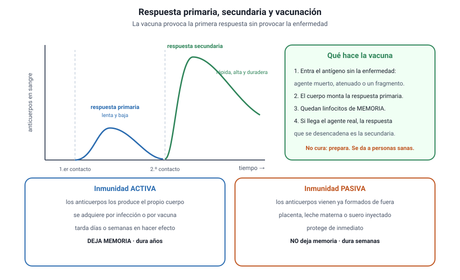

## 6. Vacunas e inmunidad

<figure><figcaption>Figura 4. Respuesta primaria, respuesta secundaria y el principio de la vacunación. Diagrama propio.</figcaption></figure>

### a. Respuesta primaria y respuesta secundaria

La diferencia entre ambas es el fundamento de toda la vacunación.

| | **Respuesta primaria** | **Respuesta secundaria** |
|---|---|---|
| Cuándo ocurre | En el primer contacto con el antígeno | En contactos posteriores |
| Tiempo hasta hacer efecto | Días: hay que seleccionar y multiplicar los linfocitos | Horas o pocos días |
| Cantidad de anticuerpos | Baja | Mucho mayor |
| Duración | Corta | Prolongada |
| Por qué | Se parte desde cero | Existen linfocitos de memoria |

::: tip
**Cómo se pregunta.** Un gráfico muestra dos picos de anticuerpos frente al tiempo: uno pequeño y tardío, otro alto y rápido. Lo que se pide es identificar cuál corresponde al segundo contacto y explicar por qué. La respuesta es la **memoria inmunológica**, no que «el cuerpo se acostumbró» ni que «el patógeno se debilitó».
:::

### b. Qué es una vacuna

Una vacuna introduce el **antígeno sin la enfermedad**: un agente muerto, uno atenuado, un fragmento de él, o la instrucción para que la propia célula fabrique ese fragmento. El sistema inmune monta una respuesta primaria y deja linfocitos de memoria. Cuando después llega el agente real, la respuesta que se desencadena es la secundaria: rápida y potente.

::: nota
**La vacuna no es un antibiótico ni un tratamiento.** No mata al agente ni cura a quien ya está enfermo: prepara al organismo **antes**. Por eso es una medida de prevención primaria, y por eso se administra a personas sanas.
:::

### c. Activa y pasiva

| | **Activa** | **Pasiva** |
|---|---|---|
| Quién produce los anticuerpos | El propio organismo | Otro organismo |
| Cómo se adquiere | Infección natural o vacuna | Placenta, leche materna o suero inyectado |
| Tiempo en hacer efecto | Días o semanas | Inmediato |
| ¿Deja memoria? | **Sí** | **No** |
| Duración | Años o toda la vida | Semanas o meses |

::: ejemplo
**Cuándo se usa cada una.** Ante una mordedura de un animal posiblemente rabioso se administran las dos cosas: un suero con anticuerpos ya formados, que protege de inmediato, y la vacuna, que genera memoria propia. La pasiva cubre el tiempo que la activa necesita para funcionar.
:::

### d. Inmunidad de rebaño

Cuando una proporción alta de la población es inmune, el agente encuentra pocos hospederos disponibles y la cadena de transmisión se interrumpe. Los no inmunes —recién nacidos, personas con inmunidad comprometida, quienes no pueden vacunarse por razones médicas— quedan protegidos **indirectamente**.

El umbral depende de lo contagiosa que sea la enfermedad: para el sarampión, muy transmisible, se requieren coberturas por encima del 95 %; para otras, menos. Por eso una caída pequeña de la cobertura puede reactivar una enfermedad que parecía controlada.

::: nota
**La inmunidad de rebaño protege a terceros, no a uno mismo.** Ese es exactamente el punto: quien se vacuna reduce su propio riesgo y además deja de ser un eslabón en la cadena. Una alternativa que presente la vacunación como una decisión puramente individual pasa por alto ese efecto.
:::
