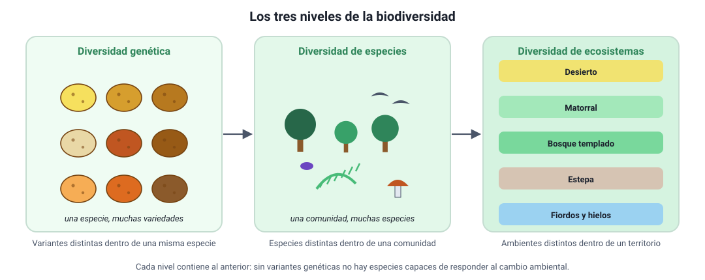

## 2. Biodiversidad

La **biodiversidad** o diversidad biológica es la variedad de la vida. No es solo «cuántas especies hay»: el Convenio sobre la Diversidad Biológica (1992), que Chile ratificó, la define en **tres niveles** que se anidan uno dentro del otro.

<figure><figcaption>Figura 1. Los tres niveles de la biodiversidad. Diagrama propio.</figcaption></figure>

### a. Los tres niveles

| Nivel | Qué varía | Ejemplo chileno |
|---|---|---|
| **Diversidad genética** | Las variantes del ADN **dentro** de una población o especie | Las decenas de variedades de papa cultivadas en Chiloé, todas de la especie *Solanum tuberosum* |
| **Diversidad de especies** | El número y la abundancia de **especies** de una comunidad | El bosque valdiviano, con coihue, ulmo, tepa, helechos, hongos e insectos que no aparecen en el desierto |
| **Diversidad de ecosistemas** | Los **tipos de ambiente** de un territorio, con sus condiciones y sus interacciones | El desierto de Atacama, el matorral mediterráneo, el bosque templado lluvioso, la estepa patagónica y los fiordos, en un mismo país |

::: nota
**Por qué importa el nivel genético.** Es el nivel que sostiene a los otros dos. Una población con poca variabilidad genética puede estar completa y sana hoy, pero no tiene «repuestos»: si aparece un patógeno o cambia el clima, es probable que **ningún** individuo traiga la variante que permite sobrevivir. La variabilidad genética es, literalmente, la materia prima sobre la que puede actuar la selección natural (sección 7).
:::

### b. Cómo se mide la diversidad de especies

Para comparar dos lugares no basta con una impresión. Se usan dos medidas distintas, y confundirlas es un error frecuente:

- **Riqueza de especies**: el **número** de especies distintas presentes.
- **Abundancia relativa**: qué **proporción** del total representa cada especie.

| Sitio | Especies encontradas (n.º de individuos) | Riqueza | Abundancia |
|---|---|---|---|
| A | Especie 1 (97), especie 2 (1), especie 3 (1), especie 4 (1) | 4 | Muy desigual: una especie domina |
| B | Especie 1 (25), especie 2 (25), especie 3 (25), especie 4 (25) | 4 | Repartida de forma pareja |

Los dos sitios tienen la **misma riqueza** (4 especies), pero el sitio B es **más diverso**: si se toma un individuo al azar, es mucho más difícil predecir a qué especie pertenece. Los índices de diversidad (como el de Shannon o el de Simpson) resumen en un número estas dos cosas a la vez.

::: tip
**Error típico en la PAES.** Cuando una tabla entrega el número de individuos por especie, «más individuos» no significa «más diversidad». Revisa siempre dos cosas: **cuántas especies** hay y **cómo se reparten** los individuos entre ellas. Un sitio con 500 individuos de una sola especie tiene riqueza 1.
:::

### c. Especies nativas, endémicas e introducidas

| Categoría | Qué significa | Ejemplo |
|---|---|---|
| **Nativa** | Habita naturalmente en el territorio | El copihue (*Lapageria rosea*), el pudú (*Pudu puda*) |
| **Endémica** | Es nativa y **solo** existe en ese territorio | El picaflor de Juan Fernández (*Sephanoides fernandensis*), la ranita de Darwin (*Rhinoderma darwinii*) |
| **Introducida** (exótica) | Fue traída por el ser humano desde otro lugar | El conejo europeo, el visón americano, la zarzamora |
| **Invasora** | Introducida que se reproduce sin control y desplaza a las nativas | El castor en Tierra del Fuego, que inunda bosques al construir sus diques |

Toda especie endémica es nativa, pero no toda especie nativa es endémica: el copihue es nativo de Chile y también crece en zonas limítrofes de Argentina; la ranita de Darwin, en cambio, es endémica del bosque templado del sur de Chile y Argentina.

### d. Chile: un territorio de islas

Chile tiene unas **33 000 especies nativas** descritas y cerca de un **25 %** de ellas son **endémicas**, una proporción muy alta para un país continental. La razón es geográfica: Chile está rodeado de barreras que aíslan a sus poblaciones, igual que si fueran islas.

- El **desierto de Atacama** por el norte.
- La **cordillera de los Andes** por el este.
- El **océano Pacífico** por el oeste.
- Los **hielos y el mar austral** por el sur.

Una población aislada deja de intercambiar genes con las demás. Con el tiempo, la mutación, la deriva genética y la selección natural hacen que acumule diferencias propias hasta constituir una especie distinta (sección 7). **El aislamiento es, entonces, una fábrica de endemismos**: por eso Chile central, con su clima mediterráneo, está reconocido como uno de los *hotspots* o puntos calientes de biodiversidad del planeta, es decir, un lugar con muchísimas especies endémicas y, al mismo tiempo, con su hábitat original fuertemente reducido.

### e. La biodiversidad es el resultado visible de la evolución

Este es el hilo que une todo el capítulo. La biodiversidad actual no es un catálogo fijo: es la **fotografía de un proceso** que lleva miles de millones de años (sección 3), que dejó huellas comprobables (sección 4), que se puede reconstruir como un árbol de parentescos (sección 5) y que se explica por el mecanismo que propusieron Darwin y Wallace (secciones 6 a 8).

::: nota
**Extinción.** La extinción es tan parte de la historia de la vida como el origen de nuevas especies: más del 99 % de las especies que han existido ya se extinguieron. La diferencia del momento actual es la **velocidad**: las extinciones ocurren hoy a un ritmo mucho mayor que el registrado en el promedio del registro fósil, y la causa es la actividad humana (pérdida de hábitat, especies invasoras, sobreexplotación, contaminación y cambio climático). En Chile, cerca de 950 especies tienen asignada una categoría de conservación por el Ministerio del Medio Ambiente.
:::
