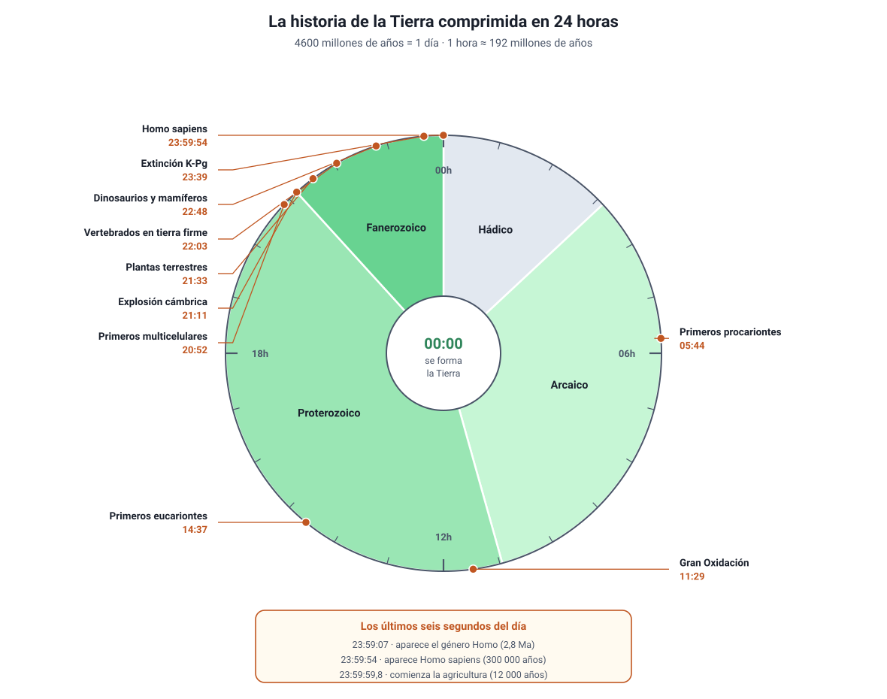

## 3. La historia del planeta y la historia de la vida en 24 horas

La Tierra se formó hace unos **4600 millones de años** (Ma). Ese número es tan grande que no significa nada intuitivamente: por eso conviene comprimirlo en una escala que sí podamos imaginar.

### a. Cómo se sabe la edad de las rocas y los fósiles

Antes de mirar la escala, hay que entender de dónde salen las fechas. Se combinan dos tipos de datación:

| Método | En qué se basa | Qué entrega |
|---|---|---|
| **Datación relativa** (estratigrafía) | **Principio de superposición**: en una secuencia de estratos sin alterar, el estrato de abajo se depositó antes que el de arriba | El **orden** de los sucesos: qué es más antiguo que qué |
| **Fósiles guía** | Especies de vida geológica corta y distribución amplia | Correlacionar estratos de lugares distintos |
| **Datación radiométrica** | Desintegración de isótopos inestables a una tasa constante y conocida (su **vida media**) | Una **edad numérica**, en años |

Cada isótopo sirve en un rango distinto de tiempo, y elegir el adecuado es parte del diseño de la investigación:

| Isótopo | Vida media aproximada | Rango útil |
|---|---|---|
| Carbono-14 | 5730 años | Hasta unos 50 000 años. Sirve para restos **orgánicos** recientes |
| Potasio-40 → argón-40 | 1250 millones de años | Rocas volcánicas de millones de años |
| Uranio-238 → plomo-206 | 4470 millones de años | Las rocas más antiguas del planeta |

::: tip
**Error típico.** El carbono-14 **no** sirve para datar un fósil de dinosaurio: después de unas diez vidas medias (≈ 57 000 años) queda tan poco 14C que no se puede medir. Un hueso de 66 millones de años se data indirectamente, fechando con potasio-argón las **capas volcánicas** que están inmediatamente debajo y encima del fósil.
:::

### b. La escala geológica

El tiempo geológico se divide en **eones**, que se subdividen en **eras** y estas en **períodos**. Los límites no son arbitrarios: casi todos coinciden con un cambio brusco en el registro fósil, muchas veces una extinción masiva.

| Eón | Era | Hito |
|---|---|---|
| **Hádico** (4600–4000 Ma) | — | Formación del planeta; sin registro fósil |
| **Arcaico** (4000–2500 Ma) | — | Primeras células procariontes; primeros estromatolitos |
| **Proterozoico** (2500–541 Ma) | — | Gran Oxidación; primeros eucariontes; primeros multicelulares |
| **Fanerozoico** (541 Ma–hoy) | **Paleozoica** (541–252 Ma) | Explosión cámbrica, plantas y vertebrados terrestres |
| | **Mesozoica** (252–66 Ma) | Dinosaurios, primeras aves, primeras plantas con flor |
| | **Cenozoica** (66 Ma–hoy) | Diversificación de mamíferos y aves; aparición del ser humano |

### c. La historia de la vida en 24 horas

Comprimamos los 4600 Ma en un solo día: la Tierra se forma a las **00:00** y este instante es la **medianoche** siguiente. Cada hora del reloj equivale a unos **192 millones de años**, y cada minuto, a unos 3,2 millones.

<figure><figcaption>Figura 2. La historia de la Tierra comprimida en 24 horas. Diagrama propio, calculado sobre una edad de 4600 Ma.</figcaption></figure>

| Hito | Hace… | Hora del reloj |
|---|---|---|
| Se forma la Tierra | 4600 Ma | 00:00 |
| Primeros océanos líquidos | 4000 Ma | 03:08 |
| Primeros procariontes (estromatolitos de Australia) | 3500 Ma | 05:44 |
| La atmósfera se oxigena (Gran Oxidación) | 2400 Ma | 11:29 |
| Primeros eucariontes | 1800 Ma | 14:37 |
| Primeros organismos multicelulares | 600 Ma | 20:52 |
| Explosión cámbrica: aparecen casi todos los grandes grupos animales | 541 Ma | 21:11 |
| Primeras plantas terrestres | 470 Ma | 21:33 |
| Primeros vertebrados caminan en tierra firme | 375 Ma | 22:03 |
| Primeros dinosaurios y primeros mamíferos | 230 Ma | 22:48 |
| Se extinguen los dinosaurios no avianos (límite K-Pg) | 66 Ma | 23:39 |
| Aparece el género *Homo* | 2,8 Ma | 23:59:07 |
| Aparece *Homo sapiens* | 300 000 años | 23:59:54 |
| Comienza la agricultura | 12 000 años | 23:59:59,8 |

Tres lecturas que este reloj deja a la vista:

1. **La vida es antigua, pero la vida compleja es reciente.** Durante casi dos tercios del día, la Tierra solo tuvo organismos unicelulares. Todo lo que se ve a simple vista cabe en las últimas tres horas.
2. **El oxígeno no estuvo siempre.** La atmósfera se oxigenó recién a media mañana, y fue obra de organismos fotosintéticos. La vida no solo se adaptó al ambiente: lo transformó.
3. **La especie humana es un pestañeo.** *Homo sapiens* aparece en los últimos seis segundos del día, y toda la historia escrita cabe en la última décima de segundo.

::: tip
**Error típico en la PAES.** «Los primeros seres humanos convivieron con los dinosaurios» es falso por un margen enorme: entre la extinción de los dinosaurios no avianos (23:39 en el reloj) y la aparición del género *Homo* (23:59) pasaron unos **63 millones de años**. En cambio, sí es correcto decir que convivimos con dinosaurios **avianos**: las aves son el linaje de dinosaurios que sobrevivió al límite K-Pg.
:::

### d. Las extinciones masivas

El registro fósil muestra cinco episodios en los que desapareció una fracción enorme de las especies en un lapso geológicamente corto:

| Extinción | Hace | Rasgo distintivo |
|---|---|---|
| Fin del Ordovícico | 444 Ma | Glaciación y descenso del nivel del mar |
| Fin del Devónico | 372 Ma | Pérdida masiva de vida marina somera |
| Fin del Pérmico | 252 Ma | La mayor de todas: desaparece cerca del 80 % de las especies marinas |
| Fin del Triásico | 201 Ma | Deja el campo libre a los dinosaurios |
| Fin del Cretácico (K-Pg) | 66 Ma | Impacto de asteroide en Chicxulub y vulcanismo; se extinguen los dinosaurios no avianos |

Cada extinción masiva es también una oportunidad: al quedar ambientes disponibles, los linajes sobrevivientes se diversifican rápidamente. Los mamíferos existían desde hacía más de 130 millones de años, pero recién después del límite K-Pg ocuparon los modos de vida que habían sido de los dinosaurios.

### e. El registro fósil de Chile

Chile aporta piezas propias a esta historia, y son un contexto habitual de las preguntas de la PAES:

- ***Atacamatitan chilensis***: titanosaurio del Cretácico, de hace unos 100 Ma, hallado cerca de Conchi Viejo en la Región de Antofagasta. Fue el primer dinosaurio no aviano descrito para Chile.
- ***Chilesaurus diegosuarezi***: dinosaurio del Jurásico superior (150–146 Ma) de la Región de Aysén, encontrado en 2004 por Diego Suárez cuando tenía siete años. Su interés científico está en que **combina rasgos de tres grandes grupos** de dinosaurios, lo que obliga a revisar cómo se reconstruye su parentesco.
- El **desierto de Atacama** conserva fósiles marinos y de vertebrados en extraordinario estado por la ausencia de humedad, entre ellos el yacimiento de ballenas de Cerro Ballena, en Caldera.

::: nota
**Por qué el registro fósil está incompleto.** Fosilizar es raro: exige que el organismo quede cubierto por sedimento rápidamente, en condiciones de poco oxígeno y sin que los restos sean destruidos. Por eso el registro favorece a los organismos con **partes duras** (conchas, huesos, dientes), a los que vivían en **ambientes sedimentarios** (mares someros, lagos, deltas) y a las especies **abundantes y de amplia distribución**. Un organismo de cuerpo blando que vivió en un bosque de montaña es casi invisible para la paleontología. Esa incompletitud no es un problema para la teoría evolutiva: es una limitación del método que los paleontólogos declaran y cuantifican.
:::
