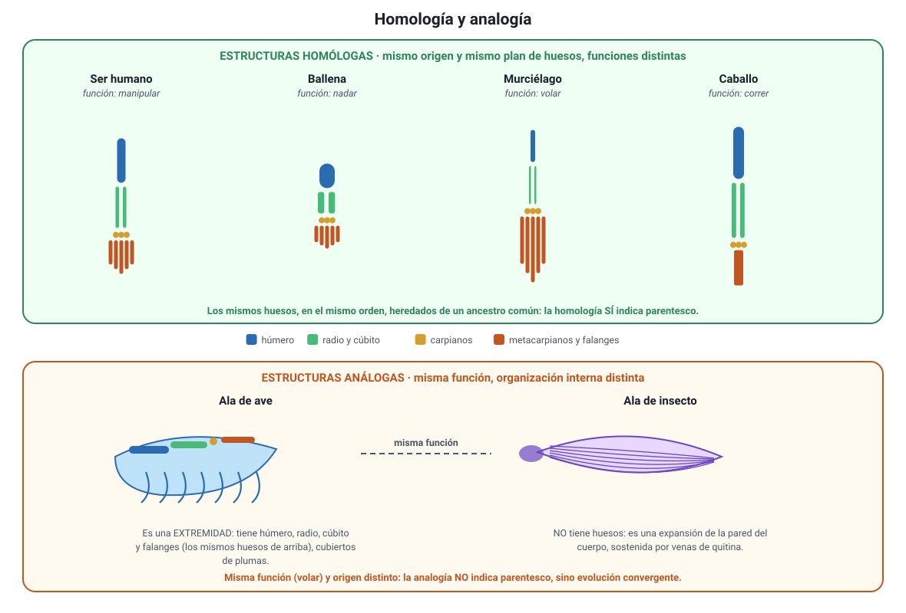

## 4. Evidencias evolutivas

La evolución no se «cree»: se **infiere** a partir de evidencia obtenida por métodos independientes entre sí. Esto es lo que la convierte en una teoría científica robusta: cinco líneas de investigación distintas —paleontología, anatomía, embriología, biología molecular y biogeografía— llegan al mismo árbol de parentescos sin haberse puesto de acuerdo.

Este es el conocimiento **3.4** del temario DEMRE 2027, y suele preguntarse pidiendo decidir **qué evidencia apoya** una hipótesis de parentesco, o **qué dato habría que medir** para ponerla a prueba.

### a. El registro fósil

Los fósiles son la única evidencia **directa** de organismos del pasado. Aportan tres cosas:

1. **Que hubo organismos distintos de los actuales**, y que aparecen y desaparecen en un orden.
2. **Una secuencia coherente con el árbol**: los fósiles de peces aparecen antes que los de anfibios, estos antes que los de reptiles, y los de mamíferos y aves después. Nunca se ha encontrado un mamífero en un estrato del Cámbrico.
3. **Formas transicionales**, que combinan rasgos de dos grupos:

| Fósil | Edad | Rasgos que combina |
|---|---|---|
| *Tiktaalik roseae* | 375 Ma | Aletas con huesos de extremidad, cuello móvil y costillas de tetrápodo, junto con escamas y branquias de pez |
| *Archaeopteryx* | 150 Ma | Plumas y alas de ave, junto con dientes, garras en las alas y cola larga con vértebras, de dinosaurio terópodo |
| *Pakicetus*, *Ambulocetus*, *Basilosaurus* | 50–35 Ma | Serie que documenta el paso de mamíferos con cuatro patas terrestres a cetáceos acuáticos, con reducción progresiva de las extremidades posteriores |

::: tip
**Cuidado con el lenguaje.** Un fósil transicional **no** es «mitad una cosa y mitad otra», ni el antepasado directo de una especie actual. Es una especie que existió por sí misma y que conserva una **combinación de caracteres** informativa sobre el orden en que se originaron esos caracteres. Tampoco existe el «eslabón perdido»: el registro fósil tiene infinitos vacíos, y cada nuevo hallazgo crea dos vacíos nuevos a sus costados.
:::

### b. Anatomía comparada

<figure><figcaption>Figura 3. Homología y analogía. Arriba, el miembro anterior pentadáctilo en cuatro mamíferos: mismos huesos, funciones distintas. Abajo, dos alas con la misma función y organización interna distinta. Diagrama propio.</figcaption></figure>

**Estructuras homólogas.** Comparten **origen embrionario y plan de organización**, aunque cumplan funciones distintas. El caso clásico es el miembro anterior de los tetrápodos: el brazo humano, la aleta de la ballena, el ala del murciélago y la pata del caballo tienen los **mismos huesos** (húmero, radio, cúbito, carpianos, metacarpianos y falanges), en el mismo orden y con las mismas conexiones, aunque sirvan para manipular, nadar, volar y correr. La explicación evolutiva es directa: todos heredaron el mismo plan de un ancestro común y cada linaje lo **modificó**. La homología es evidencia de **parentesco**.

**Estructuras análogas.** Comparten **función**, pero no origen. El ala de un ave y el ala de un insecto sirven las dos para volar, pero el ala del ave es una extremidad con huesos y plumas, y la del insecto es una expansión de la pared del cuerpo, sin huesos. Son producto de **evolución convergente**: dos linajes distintos sometidos a la misma exigencia ambiental llegaron a soluciones parecidas por caminos distintos. La analogía **no** es evidencia de parentesco.

| | Homólogas | Análogas |
|---|---|---|
| **Origen embrionario** | El mismo | Distinto |
| **Plan de organización interna** | El mismo | Distinto |
| **Función** | Puede ser distinta | La misma o parecida |
| **Qué indica** | Ancestro común (divergencia) | Presión ambiental parecida (convergencia) |
| **Ejemplo** | Brazo humano y aleta de ballena | Ala de ave y ala de insecto; aleta de tiburón y aleta de delfín |

**Estructuras vestigiales.** Son estructuras reducidas que perdieron su función original, pero que se mantienen porque se heredaron. Las ballenas no tienen patas traseras, pero conservan **huesos pélvicos y restos de fémur** internos; los humanos conservamos el **cóccix** (vértebras caudales fusionadas), los **músculos auriculares** que en otros mamíferos orientan la oreja y las **muelas del juicio**. En un modelo de organismos diseñados por separado, estas estructuras no tienen explicación; en un modelo de ascendencia común, son lo esperado.

::: tip
**El error que más se cobra en la PAES.** Si dos especies comparten una estructura que cumple **la misma función**, la respuesta correcta **no** es «están emparentadas». Hay que preguntarse por el **plan interno**: si los huesos, tejidos y el origen embrionario coinciden, es homología (parentesco); si la función coincide pero la organización es distinta, es analogía (convergencia). Función parecida, por sí sola, no dice nada sobre parentesco.
:::

### c. Embriología comparada

Los embriones de los vertebrados pasan por etapas tempranas notablemente parecidas: todos presentan **arcos faríngeos**, un tubo neural dorsal, una **cola** y somitos, incluso los que no tendrán nada de eso en el adulto. En el pez, los arcos faríngeos se convierten en branquias; en el humano, en estructuras del oído medio, la mandíbula y la laringe. El desarrollo, entonces, no se rediseña de cero en cada linaje: se **hereda un programa y se modifica su tramo final**. Es el mismo argumento de la homología, visto durante la construcción del organismo.

### d. Biología molecular

Es hoy la evidencia más fina y la que la PAES pregunta con más frecuencia, porque permite **cuantificar** el parentesco.

- **El código genético es prácticamente universal.** El mismo codón especifica el mismo aminoácido en una bacteria, en un roble y en una persona. Esta coincidencia solo tiene sentido si todos los linajes heredaron el código de un ancestro común.
- **Hay proteínas presentes en casi todos los organismos**, porque cumplen funciones básicas. El **citocromo c**, de la cadena respiratoria, tiene 104 aminoácidos en los vertebrados. Su secuencia es **idéntica** entre el ser humano y el chimpancé, difiere en **un** aminoácido respecto del macaco rhesus, y las diferencias aumentan a medida que se compara con linajes más lejanos.
- **Cuantas más diferencias, más antigua la separación.** Esa es la idea del **reloj molecular**: si las mutaciones neutras se acumulan a una tasa aproximadamente constante, el **número de diferencias** entre dos secuencias es una medida del tiempo transcurrido desde su ancestro común.

| Especie comparada con el ser humano | Diferencias en el citocromo c (aminoácidos) |
|---|---|
| Chimpancé | 0 |
| Macaco rhesus | 1 |
| Caballo | 12 |
| Pollo | 13 |
| Atún | 21 |
| Levadura | 44 |

::: nota
**Por eso la respuesta «secuenciar» casi siempre gana.** Cuando una pregunta plantea que un equipo quiere determinar cuál de varias especies conocidas está **más emparentada** con una especie recién descubierta, la variable que responde directamente es la **secuencia** de un gen o de una proteína compartida. Datos como el tamaño, el color, la actividad de una enzima o la cantidad de una reserva alimentaria dependen fuertemente del ambiente y pueden coincidir por convergencia: son el equivalente molecular de una analogía.
:::

### e. Biogeografía

La distribución geográfica de las especies sigue el patrón de la **historia de los continentes y del aislamiento**, no el de la simple disponibilidad de ambientes parecidos.

- Los **marsupiales** dominan en Australia, aislada desde hace decenas de millones de años, y no en África, que tiene ambientes equivalentes.
- Las especies de una **isla oceánica** se parecen sobre todo a las del continente más cercano, aunque el clima de la isla se parezca más al de otro lugar. Los pinzones de Galápagos se parecen a aves sudamericanas (sección 8).
- Los **fósiles** de linajes emparentados aparecen a ambos lados del Atlántico sur, en zonas que estuvieron unidas en el supercontinente Gondwana.

### f. Cómo se combinan las cinco líneas

| Evidencia | Qué se compara | Qué permite concluir |
|---|---|---|
| Registro fósil | Organismos del pasado y su posición en los estratos | El **orden temporal** de la aparición de los grupos y los caracteres |
| Anatomía comparada | Planes de organización de estructuras adultas | Parentesco (homología) o convergencia (analogía) |
| Embriología | Etapas del desarrollo | Herencia de un programa de desarrollo común |
| Biología molecular | Secuencias de ADN y de proteínas | Parentesco **cuantificado** y tiempo de divergencia |
| Biogeografía | Distribución geográfica y su historia | Efecto del aislamiento y de la deriva continental |

Ninguna de estas líneas basta por sí sola, y ahí está la fuerza del conjunto: que cinco métodos con supuestos y fuentes de error completamente distintos reconstruyan el **mismo** árbol es lo que hace que la explicación evolutiva sea la mejor disponible.
