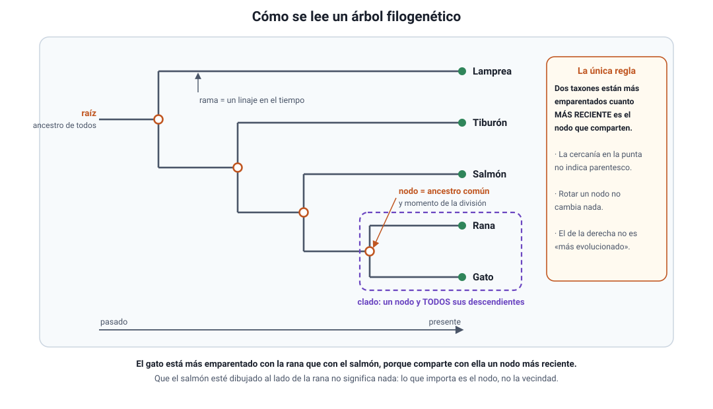

## 5. El árbol filogenético

Un **árbol filogenético** es la hipótesis de parentesco entre un grupo de especies, dibujada como un diagrama ramificado. No es un adorno: es un **modelo** que se construye a partir de datos y que se puede poner a prueba, corregir o descartar cuando aparece evidencia nueva.

### a. Cómo se lee

<figure><figcaption>Figura 4. Partes de un árbol filogenético y cómo se lee. Diagrama propio.</figcaption></figure>

| Parte | Qué representa |
|---|---|
| **Puntas** (taxones terminales) | Las especies o grupos que se están comparando, normalmente actuales |
| **Nodo** (punto de ramificación) | El **ancestro común** de todo lo que sale de él, y el momento en que ese linaje se dividió |
| **Rama** | Un linaje a lo largo del tiempo |
| **Raíz** | El ancestro común de **todos** los taxones del árbol |
| **Clado** | Un nodo y **todos** sus descendientes: el «grupo completo» |
| **Grupo hermano** | El linaje que comparte con otro su nodo más reciente |

La regla de lectura es una sola: **dos taxones están más emparentados entre sí cuanto más reciente es el nodo que comparten**. Todo lo demás del dibujo es convención.

### b. Tres errores de lectura que la PAES sí cobra

::: tip
**1. La cercanía en la punta no significa parentesco.** Dos taxones pueden estar dibujados uno al lado del otro y compartir un nodo muy antiguo. Hay que seguir las ramas hacia atrás hasta el nodo común, no medir la distancia horizontal.

**2. Rotar una rama no cambia la información.** Un árbol es como un móvil colgante: se puede girar cualquier nodo y el árbol sigue diciendo exactamente lo mismo. Si dos dibujos parecen distintos, hay que comparar **qué taxones comparten cada nodo**, no el orden en que aparecen.

**3. El de la derecha no es «el más evolucionado».** No hay un extremo «avanzado». Todos los taxones terminales llevan exactamente el mismo tiempo evolucionando desde la raíz. Una bacteria actual no es «más primitiva» que un ser humano: es el resultado de los mismos 3500 millones de años de evolución.
:::

### c. Con qué datos se construye

Un árbol se construye a partir de **caracteres compartidos que se heredaron de un ancestro común**, es decir, homologías (sección 4). Los caracteres que importan son los **derivados compartidos**: novedades que aparecieron en un ancestro y que sus descendientes heredaron.

Ejemplo con una matriz de caracteres de cinco vertebrados (1 = presente, 0 = ausente):

| Carácter | Lamprea | Tiburón | Salmón | Rana | Gato |
|---|---|---|---|---|---|
| Columna vertebral | 1 | 1 | 1 | 1 | 1 |
| Mandíbulas | 0 | 1 | 1 | 1 | 1 |
| Esqueleto osificado | 0 | 0 | 1 | 1 | 1 |
| Cuatro extremidades | 0 | 0 | 0 | 1 | 1 |
| Pelo y glándulas mamarias | 0 | 0 | 0 | 0 | 1 |

Cada carácter nuevo aparece **una sola vez** y define un grupo mayor que contiene a todos los que lo heredaron: la columna vertebral agrupa a los cinco; las mandíbulas, a cuatro; el esqueleto osificado, a tres; las cuatro extremidades, a dos. El árbol que reproduce ese patrón con el **menor número de cambios** (criterio de **parsimonia**) es el que se propone como hipótesis. Con secuencias de ADN el principio es el mismo, solo que los caracteres son las posiciones de la secuencia y hay miles de ellos, lo que exige métodos estadísticos.

::: nota
**El grupo externo.** Para **enraizar** el árbol se incluye un taxón que se sabe emparentado pero ajeno al grupo de interés (el *outgroup*). Sirve para decidir cuál estado de un carácter es el ancestral y cuál el derivado: si el grupo externo no tiene mandíbulas, entonces «sin mandíbulas» es el estado ancestral y «con mandíbulas» es la novedad. Sin grupo externo se puede saber quién se parece a quién, pero no en qué dirección corrió el tiempo.
:::

### d. Clado, y por qué «los peces» no es un clado

Un **clado** es un ancestro y **todos** sus descendientes. Los grupos que dejan fuera a algunos descendientes no son clados y la clasificación moderna trata de evitarlos.

- **«Mamíferos» sí es un clado**: incluye al ancestro común de los mamíferos y a todos sus descendientes.
- **«Reptiles», en el uso tradicional, no lo es**: excluye a las **aves**, que descienden del mismo ancestro. El clado completo es *Reptilia* incluyendo a las aves.
- **«Peces» tampoco lo es**: el ancestro común de todos los animales que llamamos peces es también el ancestro de los tetrápodos, es decir, de los anfibios, reptiles, aves y mamíferos. Dicho de forma incómoda pero correcta: dentro del clado que contiene a todos los peces, estamos también nosotros.

::: tip
**Cómo se pregunta.** Un ítem típico entrega un árbol y pregunta cuál de dos especies está más emparentada con una tercera, o si un grupo marcado en el dibujo constituye un clado. La respuesta se obtiene siempre igual: **ubicar el nodo común más reciente** y comprobar si el grupo marcado incluye a *todos* los descendientes de su nodo.
:::
