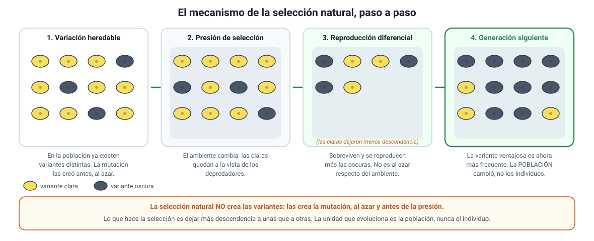

## 7. La teoría de la selección natural de Darwin y Wallace

Este es el conocimiento **3.6** del temario DEMRE 2027 y el contenido más preguntado del capítulo.

### a. Cómo llegaron a la misma idea

**Charles Darwin** viajó a bordo del *Beagle* entre 1831 y 1836. En Chile presenció el terremoto de Concepción de 1835, vio conchas marinas fósiles a miles de metros de altitud en los Andes y encontró bosques petrificados: evidencia directa de que el territorio se levanta, es decir, de que la Tierra cambia. En las islas **Galápagos**, en 1835, observó que cada isla tenía variedades propias de tortugas y de aves, todas parecidas entre sí y parecidas a las del continente sudamericano. Volvió a Inglaterra con el material y pasó **más de veinte años** desarrollando la explicación sin publicarla.

En 1858, **Alfred Russel Wallace**, que llevaba años recolectando en el archipiélago malayo, le envió desde la isla de **Ternate** un ensayo con la misma idea, obtenida de forma independiente. Lyell y Hooker organizaron una **lectura conjunta** de los trabajos de ambos en la Linnean Society de Londres el **1 de julio de 1858**, publicada ese mismo año. Al año siguiente, en **1859**, Darwin publicó *El origen de las especies*, con la evidencia acumulada durante dos décadas.

::: nota
**Por qué se habla de «teoría de Darwin-Wallace».** Los dos formularon el mismo mecanismo por separado y ambos lo presentaron juntos en 1858. Darwin aportó la enorme masa de evidencia y el desarrollo del argumento; Wallace, una formulación independiente que confirmó que el razonamiento no dependía de un solo autor. En la PAES el mecanismo se cita con los dos nombres.
:::

### b. El argumento, paso a paso

La selección natural es una consecuencia lógica de cuatro observaciones. Si las cuatro se cumplen, el resultado **necesariamente** ocurre.

<figure><figcaption>Figura 5. El mecanismo de la selección natural en cuatro pasos. Diagrama propio.</figcaption></figure>

| Paso | Observación | Qué significa |
|---|---|---|
| **1. Variación** | Los individuos de una población **no son idénticos** | Difieren en tamaño, color, resistencia, conducta… |
| **2. Herencia** | Parte de esa variación es **heredable** | Proviene de diferencias en el ADN (mutación y recombinación), no del ambiente |
| **3. Superproducción** | Nacen **más individuos** de los que el ambiente puede sostener | Hay competencia por alimento, espacio, luz y pareja |
| **4. Reproducción diferencial** | La supervivencia y la reproducción **no son al azar** | Los individuos cuya variante les da ventaja en **ese** ambiente dejan, en promedio, más descendencia |

**Consecuencia:** como las variantes ventajosas se heredan, su **frecuencia aumenta** en la población generación tras generación. Eso es evolución por selección natural. La unidad que evoluciona es la **población**; el individuo no evoluciona.

### c. Adaptación y eficacia biológica

Una **adaptación** es una característica heredable que aumenta la probabilidad de sobrevivir y **reproducirse** en un ambiente dado. La medida de esa ventaja es la **eficacia biológica** (*fitness*): el número de descendientes que un individuo deja y que llegan a reproducirse.

::: tip
**La pregunta favorita de la PAES.** Cuando un ítem describe un rasgo (una vocalización de alerta, una conducta de cuidado de las crías, un pelaje, un pico) y pregunta **por qué se consideraría adaptativo**, la respuesta correcta es siempre la que dice que el rasgo **aumenta la oportunidad de sobrevivir y reproducirse**. No basta con que el rasgo sea heredable (todos los rasgos evaluados lo son), ni con que resulte útil en un ambiente, ni con que aporte variabilidad: lo que define una adaptación es su **efecto sobre el éxito reproductivo**.
:::

### d. Cuatro malentendidos que hay que desarmar

::: nota
**1. La selección natural no crea las variantes.** Las crea la **mutación**, al azar y antes de que exista la presión. La selección solo actúa sobre lo que ya está. Un antibiótico no genera bacterias resistentes: **selecciona** las que ya lo eran.

**2. No tiene una meta ni «busca» mejorar.** No existe un rasgo «más evolucionado» en abstracto: una variante ventajosa en un ambiente puede ser desventajosa en otro. Si el ambiente cambia, la dirección de la selección cambia (y hasta se invierte, como se verá en la sección 8).

**3. No es «la supervivencia del más fuerte».** Es la reproducción del **más apto en ese ambiente**, que puede ser el más pequeño, el mejor camuflado, el que tolera la sequía o el que cuida mejor a sus crías. Sobrevivir sin reproducirse no aporta nada a la generación siguiente.

**4. El individuo no se adapta.** Un individuo puede aclimatarse fisiológicamente (broncearse, ganar masa muscular, producir más glóbulos rojos en altura), pero eso **no se hereda** y no es evolución. La adaptación evolutiva ocurre en la población, entre generaciones.
:::

### e. Selección natural observable hoy

La selección natural no es un relato del pasado: se mide en poblaciones actuales.

| Caso | Presión de selección | Qué se observó |
|---|---|---|
| **Polilla del abedul** (*Biston betularia*) | Depredación por aves, sobre cortezas ennegrecidas por el hollín industrial en Inglaterra | La forma oscura (*carbonaria*), casi inexistente a mediados del siglo XIX, llegó a ser la gran mayoría en las zonas industriales; al reducirse la contaminación por las leyes de aire limpio, la forma clara volvió a predominar |
| **Resistencia a antibióticos** | Uso de antibióticos | Las bacterias portadoras de variantes resistentes sobreviven al tratamiento y se multiplican; la resistencia se propaga además entre bacterias por plásmidos. En 2019 se estimaron 1,27 millones de muertes atribuibles a infecciones resistentes |
| **Resistencia a pesticidas** | Aplicación repetida de un insecticida | Poblaciones de insectos que dejan de responder a la dosis habitual en pocas temporadas |
| **Pinzones de Galápagos** | Sequía y cambio en el tipo de semillas disponibles | Cambio medible del tamaño del pico entre una generación y la siguiente (sección 8) |

::: tip
**Por qué es tan buen ejemplo el antibiótico.** Permite mostrar los cuatro pasos en una placa de cultivo: hay variación (algunas bacterias portan una mutación que altera la diana del fármaco), es heredable (está en el ADN), se producen millones de descendientes y la reproducción es diferencial (solo las resistentes crecen). Y deja clara la regla del punto 1: **el antibiótico no induce la resistencia, la selecciona**. De ahí la recomendación médica de completar el tratamiento y no usar antibióticos para infecciones virales.
:::

### f. De la selección natural a las nuevas especies

La selección natural explica cómo cambia una población. Para que se formen **especies** distintas hace falta además que dos poblaciones dejen de intercambiar genes, es decir, que se establezca **aislamiento reproductivo**:

1. Una **barrera** divide la población: un brazo de mar, una cordillera que se levanta, una glaciación, la colonización de una isla.
2. Cada población queda sometida a **presiones de selección propias** y acumula además mutaciones y efectos de la deriva genética distintos.
3. Si el aislamiento se prolonga, las diferencias llegan a impedir que los individuos de una población se reproduzcan con los de la otra: son **especies distintas**, aunque la barrera desaparezca.

Cuando un linaje coloniza un territorio con muchos modos de vida disponibles y se diversifica rápidamente en varias especies, se habla de **radiación adaptativa**. El caso de la sección siguiente es el ejemplo clásico.

### g. Qué se le agregó a la teoría después

Darwin y Wallace no conocían las leyes de Mendel ni la estructura del ADN. Con la genética, la teoría se amplió a lo que se llama **teoría sintética** o neodarwinismo, que suma a la selección natural otros tres mecanismos de cambio evolutivo:

| Mecanismo | Qué hace |
|---|---|
| **Mutación** | Genera variantes nuevas. Es la única fuente original de variabilidad |
| **Recombinación** (entrecruzamiento y permutación en la meiosis) | Combina de formas nuevas las variantes existentes (capítulo 6) |
| **Deriva genética** | Cambia frecuencias **al azar**; su efecto es grande en poblaciones pequeñas y puede fijar variantes sin ninguna ventaja |
| **Flujo génico** (migración) | Traslada variantes entre poblaciones y reduce las diferencias entre ellas |

La selección natural sigue siendo el único de los cuatro que produce **adaptación**, porque es el único que no actúa al azar respecto del ambiente.
