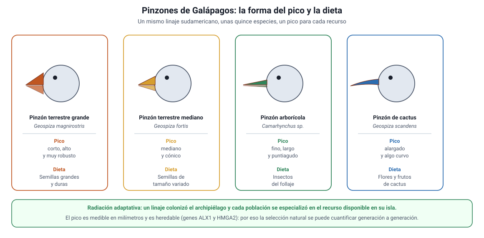

## 8. Los pinzones y la selección natural

Los pinzones de Galápagos son el ejemplo más completo de selección natural que existe, porque en ellos se puede seguir el proceso en **dos escalas a la vez**: la radiación de un linaje en millones de años y el cambio medible de una población de un año al siguiente.

### a. Un ancestro, muchos picos

El archipiélago de Galápagos está a unos 1000 km de la costa de Ecuador y es de origen volcánico: emergió del océano sin vida. Todas las especies terrestres que hoy lo habitan llegaron desde el continente. Entre ellas llegó, hace algunos millones de años, una **especie de ave granívora sudamericana**.

A partir de ese único linaje se originaron alrededor de **quince especies** de las llamadas «pinzones de Darwin», repartidas entre las islas. Se parecen mucho en tamaño, color y conducta general, pero difieren claramente en una cosa: el **pico**, y con él, la dieta.

<figure><figcaption>Figura 6. Relación entre la forma del pico y la dieta en los pinzones de Galápagos. Diagrama propio.</figcaption></figure>

| Tipo de pico | Dieta | Ejemplo |
|---|---|---|
| Corto, alto y muy robusto | Semillas grandes y duras, que hay que quebrar | Pinzón terrestre grande (*Geospiza magnirostris*) |
| Mediano y cónico | Semillas de tamaño variado | Pinzón terrestre mediano (*Geospiza fortis*) |
| Pequeño y fino | Semillas pequeñas y blandas | Pinzón terrestre pequeño (*Geospiza fuliginosa*) |
| Fino, largo y puntiagudo | Insectos del follaje | Pinzones arborícolas (*Camarhynchus*) |
| Alargado y algo curvo | Flores y frutos de cactus | Pinzón de cactus (*Geospiza scandens*) |

Esta es una **radiación adaptativa**: un linaje que llega a un territorio con muchos modos de vida disponibles y sin competidores se diversifica rápidamente, especializándose cada población en un recurso distinto. El aislamiento entre islas aporta el paso 1 de la especiación (sección 7f) y la distinta oferta de alimento aporta las presiones de selección.

::: nota
**Por qué el pico es tan informativo.** El pico es la herramienta con la que el ave consigue el alimento, de modo que su forma y su tamaño se traducen **directamente** en supervivencia. Además es **medible con precisión** (largo, ancho y profundidad, en milímetros) y es **heredable**: los hijos de padres de pico grande tienden a tener pico grande. Se conocen incluso los genes implicados: variantes del gen *ALX1* se asocian a la **forma** del pico y variantes de *HMGA2*, a su **tamaño**. Es decir, en los pinzones están documentados los pasos 1 y 2 del mecanismo con datos moleculares, no por suposición.
:::

### b. El experimento natural de Daphne Major

Desde 1973, **Peter y Rosemary Grant** midieron, anillaron y siguieron individualmente a los pinzones de **Daphne Major**, un islote pequeño del archipiélago, durante más de cuatro décadas. Ese seguimiento permitió capturar el proceso en directo.

**La sequía de 1977.** En 1976 la isla tenía semillas abundantes y de todos los tamaños. En 1977 prácticamente no llovió, las plantas produjeron muy pocas semillas y los pinzones consumieron primero las pequeñas y blandas, que son las más fáciles. Lo que quedó disponible fueron **semillas grandes y duras**.

Lo que ocurrió en la población de *Geospiza fortis*, el pinzón terrestre mediano:

- La población **se desplomó**, desde alrededor de 1400 individuos a unos pocos cientos en poco más de dos años.
- La mortalidad **no fue al azar**: sobrevivieron en mayor proporción las aves de **cuerpo grande y pico profundo**, las únicas capaces de quebrar las semillas duras que quedaban.
- La profundidad de pico **más frecuente** en la población pasó de unos **8,8 mm** antes de la sequía a unos **10,3 mm** entre las sobrevivientes.
- Como el tamaño del pico es heredable, la **generación siguiente** nació con picos en promedio más profundos que la de antes de la sequía.

Aquí están los cuatro pasos, con datos:

| Paso del mecanismo | Evidencia en Daphne Major |
|---|---|
| **1. Variación** | La población tenía picos de profundidades distintas antes de la sequía |
| **2. Herencia** | El tamaño del pico se transmite de padres a hijos (y se conocen los genes asociados) |
| **3. Superproducción / competencia** | Faltó alimento para todos: la mayoría de la población murió |
| **4. Reproducción diferencial** | Sobrevivieron y se reprodujeron preferentemente las de pico más profundo |
| **Resultado** | La distribución de la profundidad del pico se desplazó en la generación siguiente |

::: tip
**El punto que la PAES pregunta y que se responde mal.** Durante la sequía **ningún pinzón cambió su pico**. Cada ave nació con el pico que tenía y murió con él. Lo que cambió fue la **composición de la población**: la proporción de individuos de pico grande aumentó porque los de pico pequeño dejaron menos descendencia. Si una alternativa dice que «las aves desarrollaron picos más grandes para poder comer las semillas duras», es lamarckismo (sección 6d) y es incorrecta.
:::

### c. Cuando el ambiente cambia, la selección cambia de dirección

Esta es la parte más instructiva del estudio de los Grant, porque desmonta la idea de que la evolución «avanza» hacia un óptimo.

- **El Niño de 1983.** Llovió muchísimo, las plantas de semillas pequeñas y blandas se multiplicaron y pasaron a ser el recurso dominante. Ahora las aves de pico **pequeño**, más eficientes con esas semillas, tuvieron la ventaja, y el promedio de la población se desplazó **en sentido contrario** al de 1977.
- **La sequía de 2003–2004.** Poco antes se había establecido en Daphne Major el pinzón terrestre grande, *G. magnirostris*, un competidor mucho más eficaz con las semillas grandes. Cuando volvió a faltar el alimento, los *G. fortis* de pico grande quedaron compitiendo de frente con él y les fue peor: esta vez la selección favoreció a los *G. fortis* de pico **más pequeño**, que explotaban el recurso que el competidor no usaba. La presión de selección no vino del clima, sino de **otra especie**.

::: nota
**Tres conclusiones generales del caso.**

1. **La evolución es medible.** No hace falta esperar millones de años: en Daphne Major se detectó un cambio estadísticamente significativo **entre una generación y la siguiente**.
2. **No tiene dirección fija.** La misma característica fue ventajosa en 1977 y desventajosa en 1983. «Adaptado» significa siempre *adaptado a un ambiente determinado*.
3. **La presión de selección puede ser biótica.** El clima, los depredadores, los patógenos y los **competidores** son todos presiones de selección.
:::

### d. Cómo se convierte esto en una pregunta de PAES

Los ítems sobre este contenido casi nunca piden recordar el caso: piden **trabajar con los datos**. Las tareas habituales son cuatro:

1. **Leer un gráfico de distribución** de un rasgo antes y después de un evento, y decidir en qué dirección se desplazó.
2. **Identificar la presión de selección** que describe el enunciado (¿qué recurso faltó? ¿qué depredador apareció? ¿qué competidor llegó?).
3. **Elegir la explicación correcta** entre una darwiniana y una lamarckiana disfrazada.
4. **Proponer el procedimiento** para poner a prueba una hipótesis: qué medir, en cuántos individuos, antes y después, y con qué grupo de comparación.

::: tip
**Guion de resolución.** Frente a un ítem de este tipo, responde en este orden: (i) ¿cuál es el **rasgo** heredable medido?; (ii) ¿cuál es la **presión** que cambió en el ambiente?; (iii) ¿qué variante tuvo **más descendencia** en esas condiciones?; (iv) por lo tanto, ¿en qué dirección se desplaza la **población** en la generación siguiente? Si el enunciado entrega una tabla o un gráfico, compara siempre el **promedio o el valor más frecuente** antes y después, no los valores extremos de un individuo.
:::
