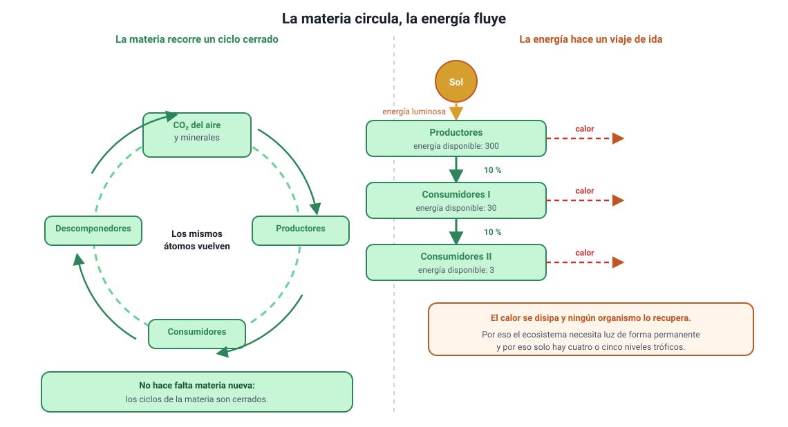

## 2. Los dos recorridos: la materia circula, la energía se degrada

Este capítulo trata de dos cosas que atraviesan el ecosistema al mismo tiempo, pero que se comportan de manera opuesta. Distinguirlas es lo primero, porque buena parte de los ítems de esta unidad se resuelve sabiendo si la pregunta habla de materia o de energía.

<figure><figcaption>Figura 1. La materia circula en un ciclo cerrado; la energía entra como luz, recorre los niveles tróficos y sale como calor. Diagrama propio.</figcaption></figure>

### a. La materia circula

Los átomos que forman a los seres vivos —carbono, hidrógeno, oxígeno, nitrógeno, fósforo— son los mismos desde que existe la vida. No se crean ni se destruyen: **se reutilizan**. Un átomo de carbono pasa del aire a una hoja, de la hoja a un herbívoro, del herbívoro a un descomponedor y de vuelta al aire, y puede recorrer ese trayecto muchas veces. Por eso hablamos de **ciclos** de la materia, que son cerrados: la Tierra no necesita recibir carbono nuevo desde el espacio.

### b. La energía se degrada

La energía, en cambio, hace un viaje de ida. Entra al ecosistema como **luz solar**, los productores capturan una parte y la guardan en enlaces químicos, y de ahí en adelante cada transferencia y cada reacción pierden una fracción como **calor**. El calor se disipa al ambiente y ningún organismo puede volver a usarlo para fabricar materia orgánica. Por eso el flujo de energía es **unidireccional** y por eso el ecosistema necesita un aporte permanente de luz: si el Sol se apagara, los ciclos de la materia se detendrían en pocos años.

::: nota
**La diferencia en una línea.** La materia **circula** (ciclos cerrados, se recicla); la energía **fluye** (recorrido lineal, se degrada a calor y se pierde). Esa asimetría explica por qué hay descomponedores que devuelven la materia, pero no existe ningún organismo que «devuelva» la energía.
:::

### c. Por qué esto importa para la prueba

El temario reúne en un mismo conocimiento (el 4.1.1) la fotosíntesis, la respiración celular y el flujo de energía, y no es casualidad: son las tres piezas del mismo mecanismo.

| Proceso | Qué hace con la materia | Qué hace con la energía |
|---|---|---|
| **Fotosíntesis** | Incorpora carbono inorgánico (CO2) a moléculas orgánicas | Transforma energía luminosa en energía química almacenada |
| **Respiración celular** | Devuelve el carbono al ambiente como CO2 | Libera la energía química y la vuelve utilizable como ATP, con pérdida de calor |
| **Alimentación** | Traspasa moléculas orgánicas de un nivel trófico al siguiente | Traspasa energía química, con una pérdida cercana al 90 % en cada paso |

::: tip
**El error más frecuente de la unidad.** Decir que «la energía se recicla» o que «la materia se pierde». Es exactamente al revés. Si una alternativa afirma que la energía vuelve al Sol, que los descomponedores devuelven energía a los productores o que la materia se agota en el ecosistema, es incorrecta.
:::
