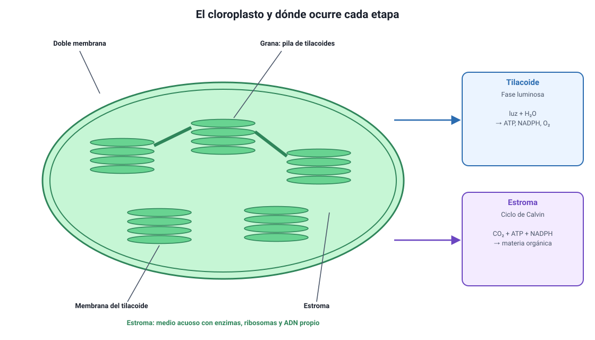

## 4. La fotosíntesis: lugar, reactantes y productos

Es el conocimiento **4.1.3** del temario DEMRE 2027, en su parte de estructura y balance global. Las etapas vienen en la sección 5.

### a. Dónde ocurre

En las células eucariontes fotosintéticas, la fotosíntesis ocurre dentro del **cloroplasto**, un organelo con doble membrana que se estudió en el capítulo 4. Su interior tiene dos compartimientos, y cada etapa de la fotosíntesis ocurre en uno distinto:

<figure><figcaption>Figura 2. Estructura del cloroplasto y ubicación de las dos etapas de la fotosíntesis. Diagrama propio.</figcaption></figure>

| Compartimiento | Qué es | Qué ocurre ahí |
|---|---|---|
| **Tilacoides** | Sacos de membrana apilados en **granas**, con clorofila y otros pigmentos | **Fase luminosa**: captura de luz, fotólisis del agua, síntesis de ATP y NADPH, liberación de O2 |
| **Estroma** | Medio acuoso que rodea a los tilacoides, con enzimas y ADN propio | **Ciclo de Calvin**: fijación del CO2 y síntesis de materia orgánica |

::: tip
**Un ítem que se repite.** «¿En qué estructura del cloroplasto hay que buscar tal actividad?» Si lo que se mide tiene que ver con **luz, pigmentos u oxígeno**, la respuesta es el **tilacoide**. Si tiene que ver con **fijación de CO2, RuBisCO o síntesis de azúcares**, es el **estroma**. La prueba oficial de Invierno 2027 preguntó las dos cosas en ítems distintos.
:::

En los organismos procariontes fotosintéticos, como las cianobacterias, no hay cloroplastos: los pigmentos están en repliegues de la membrana plasmática. El proceso es el mismo; cambia solo dónde está montada la maquinaria.

### b. La ecuación química global

El balance completo de la fotosíntesis se resume así:

> 6 CO2 + 6 H2O + energía luminosa → C6H12O6 + 6 O2

Conviene leerla con calma, porque cada término responde a una pregunta típica:

| Término | Qué es | De dónde viene o adónde va |
|---|---|---|
| **CO2** | Reactante; aporta el **carbono** | Entra desde el aire por los **estomas** de la hoja |
| **H2O** | Reactante; aporta los **electrones y el hidrógeno** | Sube desde la raíz por el xilema |
| **Energía luminosa** | No es materia: es el aporte energético | La absorbe la clorofila de los tilacoides |
| **C6H12O6** | Producto; la **materia orgánica** fabricada | Se usa, se transporta como sacarosa o se guarda como almidón |
| **O2** | Producto; se libera al ambiente | Sale por los estomas |

::: nota
**El oxígeno liberado viene del agua, no del CO2.** Se demostró marcando el agua con oxígeno-18: el isótopo apareció en el O2 liberado. La fotosíntesis **rompe el agua** (fotólisis) para obtener electrones, y el oxígeno queda como residuo de esa ruptura. Es uno de los datos que más se pregunta y uno de los que más se responde mal.
:::

### c. Qué significa «fijar» carbono

Se llama **fijación de carbono** a incorporar el carbono que estaba en una molécula inorgánica —el CO2 del aire— a una molécula orgánica. Es el paso que introduce materia al mundo vivo: todo el carbono de tu cuerpo, del de un ballenato y del de un hongo pasó alguna vez por una reacción de fijación dentro de un autótrofo.

Por eso la fotosíntesis no es solo «cómo se alimentan las plantas». Es la **puerta de entrada** de la materia y de la energía a casi todos los ecosistemas del planeta.
