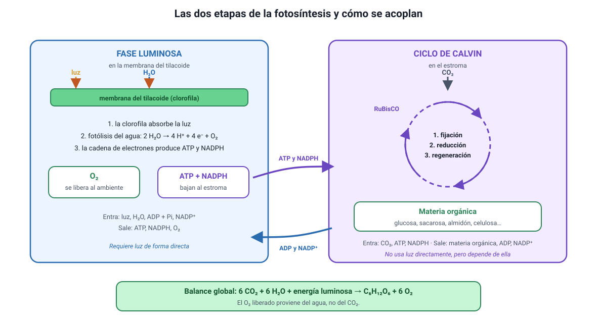

## 5. Las etapas de la fotosíntesis

Sigue el conocimiento **4.1.3**. La fotosíntesis tiene dos etapas que ocurren en compartimientos distintos y que están **acopladas**: la primera fabrica lo que la segunda gasta.

<figure><figcaption>Figura 3. Las dos etapas de la fotosíntesis y las moléculas que las conectan. Diagrama propio.</figcaption></figure>

### a. Fase luminosa (en la membrana del tilacoide)

Necesita luz de manera directa. Ocurre en tres pasos encadenados:

1. **Captura de la luz.** Los pigmentos, sobre todo la **clorofila**, absorben fotones. La energía absorbida excita electrones de la clorofila, que quedan con más energía de la que tenían.
2. **Fotólisis del agua.** La clorofila que cedió electrones debe reponerlos, y los toma del **agua**, que se rompe: 2 H2O → 4 H+ + 4 e− + O2. Aquí se produce **todo el oxígeno** que libera la fotosíntesis.
3. **Síntesis de ATP y NADPH.** Los electrones excitados recorren una cadena de transporte en la membrana del tilacoide. Ese recorrido bombea H+ hacia el interior del tilacoide y el gradiente resultante impulsa la síntesis de **ATP**. Al final de la cadena, los electrones se entregan al NADP+, que se reduce a **NADPH**.

| Fase luminosa | |
|---|---|
| **Dónde** | Membrana de los tilacoides |
| **Entra** | Luz, H2O, ADP + Pi, NADP+ |
| **Sale** | ATP, NADPH, O2 |

### b. Ciclo de Calvin (en el estroma)

No necesita luz de forma directa, pero **sí depende de ella**, porque consume el ATP y el NADPH que solo se fabrican con luz. Sus tres momentos son:

1. **Fijación.** La enzima **RuBisCO** une el CO2 a una molécula de cinco carbonos que ya estaba en el estroma. El producto se parte de inmediato en dos moléculas de tres carbonos.
2. **Reducción.** Esas moléculas reciben energía del **ATP** y electrones del **NADPH**, y se transforman en un azúcar de tres carbonos. Parte de ese azúcar sale del ciclo: es la ganancia neta, con la que la célula fabrica glucosa, sacarosa, almidón, celulosa, aminoácidos y lípidos.
3. **Regeneración.** El resto del azúcar se reordena, gastando más ATP, para reponer la molécula de cinco carbonos con la que empezó el ciclo. Así el ciclo puede repetirse.

| Ciclo de Calvin | |
|---|---|
| **Dónde** | Estroma del cloroplasto |
| **Entra** | CO2, ATP, NADPH |
| **Sale** | Materia orgánica, ADP + Pi, NADP+ |

::: nota
**Cómo se acoplan.** La fase luminosa entrega **ATP y NADPH** al ciclo de Calvin; el ciclo de Calvin devuelve **ADP y NADP+** a la fase luminosa. Son dos etapas que se alimentan mutuamente, y esa es la razón de que ninguna funcione sola por mucho tiempo.
:::

::: tip
**«Fase oscura» es un nombre engañoso.** Al ciclo de Calvin se le llamó así porque no requiere luz directamente, no porque ocurra de noche. En la práctica funciona **de día**, mientras la fase luminosa le está entregando ATP y NADPH; al oscurecer se detiene en pocos minutos. Si una alternativa dice que el ciclo de Calvin ocurre durante la noche, es incorrecta.
:::

### c. La RuBisCO, la enzima más abundante de la biosfera

Vale la pena conocerla porque aparece con frecuencia en los ítems:

- Es la enzima que **fija el CO2**, y está en el **estroma**.
- Se estima que es la proteína más abundante del planeta, porque las plantas necesitan enormes cantidades de ella.
- Es **lenta y poco selectiva**: también puede unir O2 en lugar de CO2, en un proceso llamado fotorrespiración, que no produce azúcar y desperdicia energía. Ese problema se agrava cuando hace calor y la planta cierra los estomas, porque adentro baja el CO2 y sube el O2.

Por eso mejorar la RuBisCO es un objetivo de investigación agrícola: la prueba oficial de Invierno 2027 incluyó un experimento con plantas de tabaco transgénicas que expresaban distintos niveles de esta enzima, cultivadas a distintas concentraciones de CO2.
