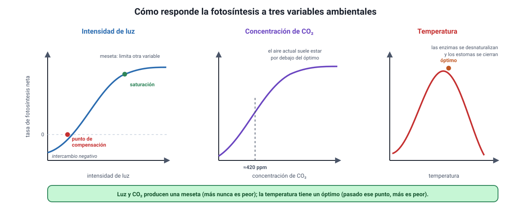

## 6. Variables ambientales que afectan la fotosíntesis

Es el conocimiento **4.1.4** del temario DEMRE 2027 y, en la práctica, **la sección más rentable del capítulo**: casi siempre se pregunta con un gráfico o con un diseño experimental, que son las habilidades científicas que más pesan en la prueba.

<figure><figcaption>Figura 4. Respuesta de la fotosíntesis a la luz, al CO2 y a la temperatura. Diagrama propio.</figcaption></figure>

### a. La idea que ordena todo: el factor limitante

En un momento dado, la velocidad de la fotosíntesis está determinada por **la variable que está más escasa**, no por el promedio de todas. Esa variable es el **factor limitante**: aumentarla acelera el proceso, mientras que aumentar cualquier otra no cambia nada.

Es la misma lógica de una fila de cajas en el supermercado: si hay una sola caja abierta, poner más carros no hace avanzar la fila más rápido; hay que abrir otra caja.

::: nota
**Cómo se reconoce el factor limitante en un gráfico.** Mientras la curva **sube**, la variable del eje horizontal es el factor limitante. Cuando la curva se aplana (**meseta**), esa variable dejó de limitar y el proceso pasó a estar limitado por **otra**.
:::

### b. Intensidad de luz

La curva de luz tiene tres tramos y dos puntos con nombre:

1. **Tramo inicial ascendente.** A poca luz, cada aumento de intensidad aumenta la fotosíntesis casi en proporción directa: la luz es el factor limitante.
2. **Punto de compensación.** Es la intensidad a la que la fotosíntesis **iguala exactamente a la respiración**. La planta consume tanto O2 como produce y libera tanto CO2 como fija, de modo que el **intercambio neto de gases es cero**. Por debajo de ese punto la planta pierde materia orgánica; por encima, la acumula.
3. **Punto de saturación y meseta.** Desde cierta intensidad, más luz ya no aumenta la tasa: la maquinaria trabaja al máximo y el límite pasa a estar en el CO2, en la temperatura o en la cantidad de enzimas.

Con luz muy intensa, además, puede haber **fotoinhibición**: un exceso de energía daña el aparato fotosintético y la tasa baja.

::: tip
**El punto de compensación no es «cero fotosíntesis».** En ese punto la planta **sí** está fotosintetizando; lo que ocurre es que produce exactamente lo mismo que gasta respirando. Si un gráfico muestra intercambio neto de O2 igual a cero, la respuesta no es «la planta no fotosintetiza», sino «fotosíntesis y respiración se igualan».
:::

### c. Concentración de CO2

La curva tiene la misma forma que la de la luz: sube y luego se satura. El CO2 atmosférico ronda las 420 ppm, un valor que para muchas plantas **está por debajo del óptimo**; por eso en invernaderos se enriquece el aire con CO2 y por eso las plantas acuáticas suelen estar más limitadas todavía, ya que el CO2 difunde unas diez mil veces más lento en agua que en aire.

Hay un detalle que la prueba usa: la entrada de CO2 depende de los **estomas**. Si hace mucho calor o falta agua, la planta los cierra para no deshidratarse, y al cerrarlos también **corta el suministro de CO2**. Así, una sequía baja la fotosíntesis aunque haya luz de sobra.

### d. Temperatura

Aquí la curva es distinta: tiene forma de **campana**, con un óptimo.

| Tramo | Qué ocurre |
|---|---|
| **Temperaturas bajas** | Las enzimas trabajan lento; la tasa es baja pero sube al calentar |
| **Óptimo** | Máxima actividad enzimática; el valor depende de la especie y del ambiente en que vive |
| **Temperaturas altas** | Las enzimas se **desnaturalizan** y los estomas se cierran: la tasa **cae**, y el daño puede ser irreversible |

La diferencia de forma no es un detalle: la luz y el CO2 producen **mesetas** (más nunca es peor, salvo fotoinhibición extrema), mientras que la temperatura produce un **óptimo** (más sí es peor pasado cierto punto).

### e. Otras variables

- **Agua.** Es reactante de la fotosíntesis, pero su efecto principal es indirecto: la falta de agua cierra los estomas y corta el CO2.
- **Nutrientes minerales.** El nitrógeno y el magnesio forman parte de la clorofila y de las enzimas; su carencia reduce la capacidad fotosintética.
- **Cantidad de enzima.** Con luz y CO2 abundantes, el límite puede estar en cuánta **RuBisCO** tiene la planta.

### f. Cómo diseñar y leer un experimento de esta sección

La forma clásica de medir fotosíntesis en el colegio es contar **burbujas de O2** que desprende una planta acuática, o seguir el cambio de CO2 en una cámara cerrada. Para que el resultado sea interpretable:

1. **Se manipula una sola variable** (por ejemplo, la distancia a la lámpara) y se **mantienen constantes** las demás (temperatura del agua, concentración de CO2, misma planta, mismo tiempo de medición).
2. **Se incluye un control**, como un montaje en oscuridad o sin la planta.
3. **Se repite** cada condición para poder promediar.
4. Cuidado con un detalle real: acercar una lámpara incandescente aumenta la luz **y** la temperatura. Si no se interpone un filtro de agua, quedan dos variables cambiando a la vez y el experimento no prueba nada.

::: tip
**La pregunta típica.** «La curva se aplanó al aumentar la luz. ¿Qué convendría hacer para aumentar la tasa?» La respuesta correcta nunca es «subir más la luz»: hay que actuar sobre **otra** variable, porque la luz ya dejó de ser el factor limitante.
:::
