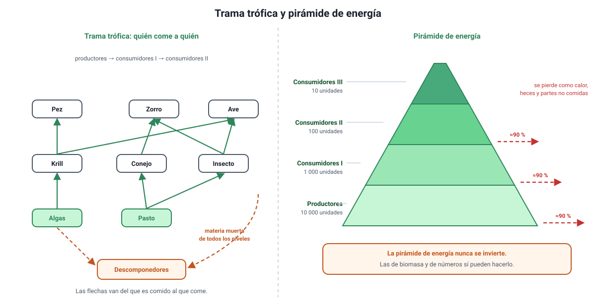

## 8. Flujo de energía: niveles tróficos, cadenas, tramas y pirámides

Cierra el conocimiento **4.1.1**. Ya sabemos cómo entra la energía al ecosistema; ahora veremos qué le pasa cuando recorre a los organismos.

### a. Los niveles tróficos

Un **nivel trófico** es la posición que ocupa un organismo según de dónde obtiene su materia y su energía.

| Nivel | Quiénes | Qué hacen |
|---|---|---|
| **Productores** | Plantas, algas, cianobacterias | Fijan CO2 y fabrican la materia orgánica del ecosistema |
| **Consumidores primarios** | Herbívoros | Comen productores |
| **Consumidores secundarios** | Carnívoros que comen herbívoros | Comen consumidores primarios |
| **Consumidores terciarios** | Depredadores de carnívoros | Comen consumidores secundarios |
| **Descomponedores** | Hongos y muchas bacterias | Degradan materia orgánica muerta de **todos** los niveles y liberan materia inorgánica |

Los descomponedores merecen un párrafo aparte: sin ellos la materia quedaría atrapada en los cuerpos muertos y el ciclo se detendría. Son los que devuelven el carbono, el nitrógeno y el fósforo al ambiente para que los productores puedan volver a usarlos.

### b. Cadenas y tramas tróficas

Una **cadena trófica** es una secuencia lineal: alga → krill → pez → lobo marino. Es útil para explicar, pero simplifica demasiado.

Una **trama trófica** es la red real: la mayoría de los organismos comen de varias fuentes y son comidos por varios depredadores. Un **omnívoro** ocupa más de un nivel a la vez.

<figure><figcaption>Figura 5. Trama trófica y pirámide de energía. Diagrama propio.</figcaption></figure>

::: tip
**Las flechas indican hacia dónde va la materia y la energía**, es decir, apuntan del que es comido al que come. Una flecha de la lechuga al conejo significa «el conejo come lechuga». Invertir la lectura de las flechas es uno de los errores más frecuentes en los ítems con trama trófica.
:::

Una consecuencia práctica de las tramas es que son más **estables** que las cadenas: si desaparece una presa, un depredador con varias fuentes de alimento puede cambiar de dieta, mientras que en una cadena lineal el nivel superior colapsa.

### c. Por qué las pirámides se estrechan

Al pasar de un nivel al siguiente, solo alrededor del **10 %** de la energía queda incorporada en el nivel de arriba. Esa fracción se llama **eficiencia ecológica** y es un promedio, no una ley exacta: varía aproximadamente entre el 5 % y el 20 % según el ecosistema.

El 90 % restante no desaparece: se va en tres cosas.

1. **Respiración celular.** La mayor parte de lo que un organismo come lo quema para vivir, y esa energía termina como **calor**.
2. **Materia no asimilada.** Huesos, pelos, celulosa y todo lo que se elimina en las heces pasa a los descomponedores, no al depredador.
3. **Partes no consumidas.** Nadie se come el organismo entero.

::: nota
**Por eso hay pocos niveles tróficos.** Con un 10 % de eficiencia, de 10 000 unidades de energía en los productores quedan 1000 en los herbívoros, 100 en los carnívoros y 10 en el nivel siguiente. Alrededor del cuarto o quinto nivel ya no queda energía suficiente para sostener una población, y la cadena se corta. También es la razón por la que una dieta basada en vegetales alimenta a más personas por hectárea que una basada en carne.
:::

### d. Los tres tipos de pirámide

| Pirámide | Qué representa | ¿Puede aparecer invertida? |
|---|---|---|
| **De energía** | Energía que fluye por cada nivel en un tiempo dado | **Nunca.** Lo impide la degradación de la energía |
| **De biomasa** | Masa de materia orgánica presente en cada nivel | **Sí**, si el nivel inferior se renueva muy rápido |
| **De números** | Cantidad de individuos por nivel | **Sí**, por ejemplo un árbol que sostiene miles de insectos |

El caso clásico de pirámide de biomasa invertida es el **océano**: en un momento cualquiera, la masa de fitoplancton es menor que la del zooplancton que se lo come, porque el fitoplancton se reproduce en horas y se consume casi por completo. Medida como energía **por unidad de tiempo**, en cambio, la pirámide vuelve a tener la base ancha.

::: tip
**Una regla segura.** Si un ítem muestra una pirámide invertida y pregunta de qué tipo puede ser, la respuesta nunca es «de energía». Y si pregunta por qué una de biomasa está invertida, la razón siempre tiene que ver con la **velocidad de renovación** del nivel inferior, no con que haya más energía arriba.
:::

### e. Bioacumulación: lo que sí se concentra hacia arriba

Hay algo que aumenta al subir de nivel: ciertos contaminantes que el organismo no puede degradar ni eliminar, como el **mercurio** o algunos pesticidas. Como un depredador consume mucha biomasa del nivel inferior a lo largo de su vida, acumula el contaminante de todas sus presas. Por eso las recomendaciones sanitarias sobre consumo de mercurio apuntan a los peces depredadores grandes y de vida larga, y no a los pequeños.
