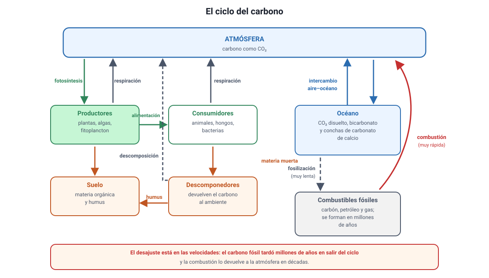

## 9. El ciclo del carbono y el ecosistema chileno

Esta sección junta lo anterior en la escala del planeta y lo aterriza en Chile. Sigue dentro del conocimiento **4.1.1**, en su parte de **reciclaje de carbono y oxígeno**.

<figure><figcaption>Figura 6. Ciclo del carbono y los procesos que mueven el carbono entre sus reservorios. Diagrama propio.</figcaption></figure>

### a. Los reservorios y los flujos

El carbono está guardado en unos pocos **reservorios** y se mueve entre ellos por unos pocos **procesos**:

| Reservorio | Forma en que está el carbono |
|---|---|
| **Atmósfera** | CO2 |
| **Seres vivos** | Moléculas orgánicas |
| **Suelo** | Materia orgánica en descomposición y humus |
| **Océano** | CO2 disuelto, bicarbonato y conchas de carbonato de calcio |
| **Rocas y combustibles fósiles** | Caliza, carbón, petróleo y gas |

| Proceso | Hacia dónde mueve el carbono |
|---|---|
| **Fotosíntesis** | Atmósfera u océano → seres vivos |
| **Respiración celular** | Seres vivos → atmósfera u océano |
| **Descomposición** | Materia muerta → suelo y atmósfera |
| **Sedimentación y fosilización** | Seres vivos → rocas y combustibles fósiles (muy lento) |
| **Combustión** | Combustibles fósiles y biomasa → atmósfera (muy rápido) |

::: nota
**Dónde se rompe el equilibrio.** Formar un combustible fósil toma millones de años; quemarlo toma segundos. La combustión devuelve a la atmósfera, en pocas décadas, carbono que había quedado fuera del ciclo durante eras geológicas. Ese desajuste entre la velocidad de entrada y la de salida es la raíz del aumento del CO2 atmosférico.
:::

### b. Sumideros y fuentes

Un **sumidero** de carbono es un sistema que capta más CO2 del que emite; una **fuente**, uno que emite más del que capta. Un bosque en crecimiento es un sumidero, porque acumula carbono en su madera y en su suelo. Un bosque quemado es, en cambio, una fuente: libera de golpe el carbono que había acumulado durante décadas.

En Chile esto tiene una dimensión concreta. El país cuenta con alrededor de **14 millones de hectáreas de bosque nativo**, además de plantaciones forestales, y su rol como sumidero forma parte de la Estrategia Nacional de Bosques y Cambio Climático. Los incendios forestales y la deforestación operan en la dirección contraria.

El **océano** es el otro gran sumidero: el fitoplancton fija enormes cantidades de carbono, y el sistema de la corriente de Humboldt, frente a la costa chilena, es uno de los más productivos del mundo gracias a la **surgencia**, que trae nutrientes desde el fondo a la zona iluminada. Esa productividad primaria es la base de la pesquería nacional. La contrapartida es que, al disolverse, el CO2 forma ácido carbónico y **acidifica** el agua, lo que dificulta a los organismos con conchas fabricar su carbonato de calcio.

### c. Cómo conecta todo el capítulo

Vale la pena ver el recorrido completo en una sola frase: la **luz** entra al ecosistema, la **fotosíntesis** la guarda en materia orgánica fijando carbono del aire, la **respiración** de todos los organismos libera esa energía como ATP y calor y devuelve el carbono al aire, los **niveles tróficos** trasladan lo que queda perdiendo un 90 % en cada paso, y los **descomponedores** cierran el circuito de la materia. La energía, en cambio, no cierra ningún circuito: ya se fue como calor.

### d. Lo que conviene llevar de este capítulo

1. **La materia circula; la energía fluye y se degrada.** Ante cualquier alternativa que hable de reciclar energía, descártala.
2. **Autótrofo = fija carbono inorgánico.** No importa si es planta, alga o bacteria, ni si vive dentro de otro organismo.
3. **Tilacoide o estroma.** Luz, pigmentos y O2 → tilacoide. CO2, RuBisCO y azúcares → estroma.
4. **El O2 viene del agua**, no del CO2.
5. **Las dos etapas están acopladas:** ATP y NADPH bajan al estroma; ADP y NADP+ vuelven al tilacoide.
6. **Factor limitante:** mientras la curva sube, esa variable limita; en la meseta, limita otra. Luz y CO2 dan mesetas; la temperatura da un óptimo.
7. **Punto de compensación:** intercambio neto cero, no fotosíntesis cero.
8. **Las plantas también respiran**, de día y de noche.
9. **PPN = PPB − respiración de los productores**, y es lo que llega a los herbívoros.
10. **Un 10 % pasa al nivel siguiente**; el resto se va en respiración, heces y partes no consumidas. La pirámide de energía nunca se invierte.
