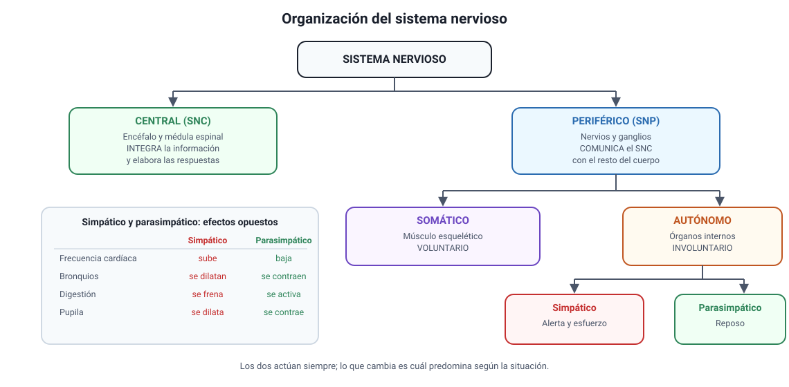

## 2. Organización general del sistema nervioso

El sistema nervioso hace tres cosas, siempre en el mismo orden: **detecta** lo que ocurre dentro y fuera del cuerpo, **integra** esa información y la compara con lo que ya sabe, y **ordena** una respuesta. Todo el capítulo desarrolla ese esquema.

<figure><figcaption>Figura 1. Organización del sistema nervioso. Diagrama propio.</figcaption></figure>

### a. Las dos grandes divisiones

| División | Qué la compone | Función |
|---|---|---|
| **Sistema nervioso central (SNC)** | Encéfalo y médula espinal | **Integra** la información y elabora las respuestas |
| **Sistema nervioso periférico (SNP)** | Nervios y ganglios fuera del SNC | **Comunica** el SNC con el resto del cuerpo |

El sistema nervioso periférico se divide a su vez según lo que controla:

- **Somático**: lleva la información de los sentidos hacia el SNC y las órdenes hacia los **músculos esqueléticos**. Es el de los movimientos **voluntarios**.
- **Autónomo**: controla los órganos internos, el músculo liso, el corazón y las glándulas, de forma **involuntaria**. Se divide en dos, con efectos opuestos:

| | Simpático | Parasimpático |
|---|---|---|
| **Cuándo predomina** | Situaciones de alerta, esfuerzo o peligro | Reposo, digestión, recuperación |
| **Frecuencia cardíaca** | Aumenta | Disminuye |
| **Bronquios** | Se dilatan | Se contraen |
| **Digestión** | Se enlentece | Se activa |
| **Pupila** | Se dilata | Se contrae |

::: tip
**Cómo se pregunta.** Un ítem puede describir una situación —un susto, una carrera, una siesta después de almorzar— y pedir qué división predomina o qué cambios son esperables. La regla es simple: si el cuerpo se prepara para actuar, es **simpático**; si se prepara para descansar y digerir, es **parasimpático**. Ambos actúan siempre, y lo que cambia es cuál predomina.
:::

### b. Los tres tipos funcionales de neurona

| Tipo | Hacia dónde lleva la señal | También se llama |
|---|---|---|
| **Sensitiva** | Desde el receptor **hacia** el SNC | Aferente |
| **Interneurona** | Dentro del SNC, entre neuronas | De asociación |
| **Motora** | Desde el SNC **hacia** el efector | Eferente |

::: nota
**Una regla para no confundirlas.** «Aferente» viene de *llevar hacia*; «eferente», de *llevar fuera*. La referencia es siempre el **sistema nervioso central**: aferente entra, eferente sale. Las interneuronas, que son la gran mayoría en el encéfalo humano, conectan a las otras dos y hacen posible que la respuesta no sea siempre la misma.
:::

### c. Las células gliales

Las neuronas no están solas. Las **células gliales** son al menos tan numerosas como ellas y cumplen funciones sin las cuales el tejido nervioso no funcionaría:

- **Sostén y nutrición** de las neuronas.
- **Aislamiento eléctrico**: las que forman la **vaina de mielina** alrededor de los axones.
- **Defensa**: eliminan restos celulares y agentes extraños.
- **Regulación del ambiente**: controlan la concentración de iones y retiran el exceso de neurotransmisor de la sinapsis.

::: tip
**Un error frecuente.** Las células gliales **no conducen impulsos nerviosos**. Su papel es de apoyo, pero ese apoyo es determinante: si la mielina se daña, la conducción se enlentece o se interrumpe, y eso es lo que ocurre en las enfermedades desmielinizantes.
:::

### d. El tejido nervioso está hecho de células separadas

Durante el siglo XIX se discutió si el tejido nervioso era una red continua, una especie de malla sin límites entre sus partes, o si estaba formado por células individuales. **Santiago Ramón y Cajal** defendió la segunda posibilidad, conocida como **teoría neuronal**: las neuronas son células independientes, separadas entre sí, que se comunican por contacto y no por continuidad.

::: nota
**Por qué importa y cómo lo pregunta la PAES.** Que las neuronas estén separadas es lo que obliga a que exista la **sinapsis** (sección 5): si formaran una sola red continua, la señal pasaría sin más y no habría nada que regular. Un ítem puede entregar un resultado experimental —por ejemplo, que un marcador inyectado en una neurona **no** aparece en las vecinas— y pedir si sustenta o no la teoría neuronal. La clave está en razonar qué esperaría cada hipótesis: si el tejido fuera continuo, el marcador debería difundir; si las células están separadas, debería quedarse donde se inyectó.
:::
