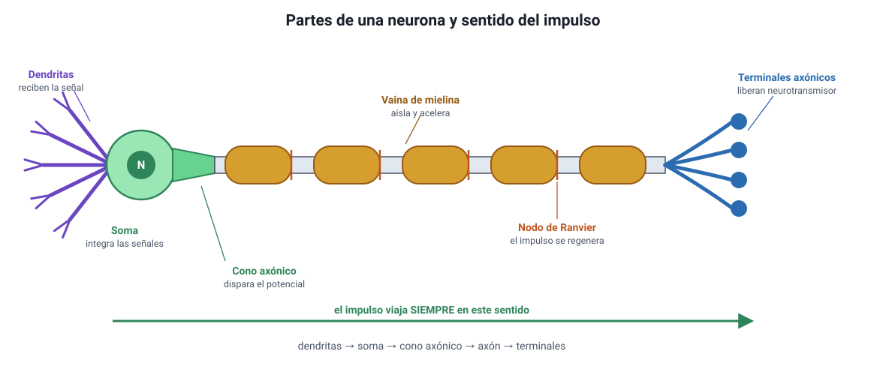

## 3. La neurona: estructura y función

Es el conocimiento **2.1.1** del temario DEMRE 2027. La neurona es una célula eucarionte animal como las del capítulo 4: tiene núcleo, mitocondrias, retículo y los demás organelos. Lo que la distingue es su **forma**, y esa forma se entiende leyendo la dirección en que viaja la señal.

<figure><figcaption>Figura 2. Partes de una neurona y sentido de conducción del impulso. Diagrama propio.</figcaption></figure>

### a. Las partes y para qué sirve cada una

| Parte | Qué hace |
|---|---|
| **Dendritas** | **Reciben** las señales de otras neuronas. Son muchas y muy ramificadas, lo que aumenta la superficie de contacto |
| **Soma** (cuerpo celular) | Contiene el núcleo y los organelos. **Integra** todas las señales recibidas y decide si se supera el umbral |
| **Cono axónico** | Zona donde nace el axón. Es donde **se dispara** el potencial de acción si la suma de las señales alcanza el umbral |
| **Axón** | **Conduce** el potencial de acción, siempre en un solo sentido, a veces por más de un metro |
| **Vaina de mielina** | Aísla el axón y **acelera** la conducción |
| **Nodos de Ranvier** | Espacios sin mielina donde el potencial de acción **se regenera** |
| **Terminales axónicos** | **Transmiten** la señal a la célula siguiente liberando neurotransmisor |

::: tip
**La regla que resuelve la mitad de los ítems.** La señal entra por las **dendritas**, se integra en el **soma**, se dispara en el **cono axónico**, viaja por el **axón** y sale por los **terminales**. Ese sentido no se invierte nunca. Si una alternativa dice que el impulso viaja desde el terminal hacia las dendritas de la misma neurona, es incorrecta.
:::

### b. La forma sigue a la función

Tres rasgos de la neurona se explican por lo que hace:

1. **Muchas dendritas, un solo axón.** Una neurona recibe información de cientos o miles de neuronas y debe integrarla, pero emite una sola conclusión. Por eso las entradas son múltiples y la salida, única.
2. **El axón es largo.** Una misma neurona puede conectar la médula espinal con un músculo del pie. Eso exige una prolongación de gran longitud, y explica por qué la neurona es una de las células más largas del cuerpo.
3. **Muchas mitocondrias.** Mantener el potencial de reposo cuesta ATP de forma permanente (sección 4), así que la neurona necesita producir energía sin parar. Es también la razón de que sea tan sensible a la falta de oxígeno o de glucosa.

### c. La mielina y la velocidad

La vaina de mielina es una envoltura formada por células gliales que se enrollan alrededor del axón. No es continua: se interrumpe en los **nodos de Ranvier**.

| Tipo de axón | Velocidad de conducción aproximada | Ejemplo |
|---|---|---|
| **Mielinizado y grueso** | Hasta unos 120 m/s | Vías motoras y de tacto fino |
| **No mielinizado y delgado** | Alrededor de 1 m/s | Fibras del dolor lento y del sistema autónomo |

La diferencia es de dos órdenes de magnitud, y la razón está en la **conducción saltatoria** (sección 4d): en un axón mielinizado el potencial de acción no se regenera en cada punto, sino que salta de un nodo al siguiente.

::: nota
**Por qué el cuerpo no mieliniza todo.** La mielina ocupa espacio y consume recursos. El organismo la reserva para las vías donde la velocidad importa: retirar la mano de una superficie caliente exige milisegundos, mientras que la señal que regula la digestión puede tardar segundos sin ninguna consecuencia. Esta es también la razón de que el dolor tenga dos componentes: uno **rápido y preciso**, por fibras mielinizadas, y otro **lento y difuso**, por fibras sin mielina.
:::

::: tip
**Un dato clínico que la PAES usa como contexto.** En las enfermedades desmielinizantes, como la esclerosis múltiple, la vaina se daña y la conducción se enlentece o se bloquea, aunque la neurona siga viva y el axón esté intacto. Si un enunciado describe una pérdida de velocidad de conducción sin muerte neuronal, apunta a la mielina.
:::
