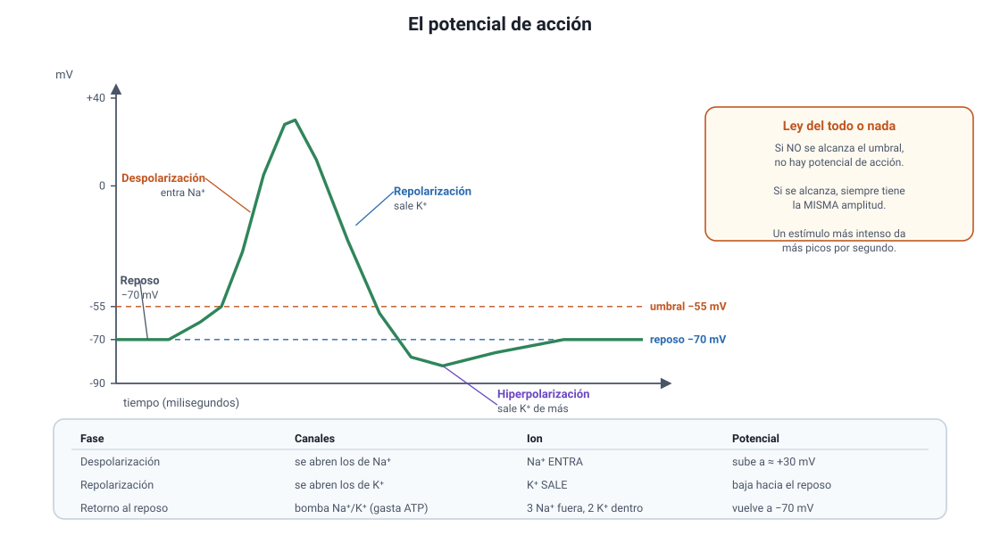

## 4. El impulso nervioso

Este apartado y el siguiente cubren el conocimiento **2.1.2** del temario. Es el contenido más preguntado del capítulo, porque se presta para gráficos.

### a. El potencial de reposo

Una neurona en reposo **no está descargada**: mantiene una diferencia de carga entre el interior y el exterior de su membrana, de alrededor de **−70 mV**, con el interior negativo respecto del exterior. Esa diferencia se llama **potencial de reposo** y se mantiene gracias a tres cosas:

1. **La bomba de sodio-potasio.** Es una proteína de transporte activo que, gastando ATP, expulsa **3 Na+** e introduce **2 K+** en cada ciclo. Como saca más cargas positivas de las que mete, contribuye a que el interior quede negativo.
2. **La permeabilidad desigual.** En reposo, la membrana deja salir K+ con mucha más facilidad de lo que deja entrar Na+.
3. **Los aniones intracelulares.** Proteínas y otras moléculas con carga negativa que no pueden salir de la célula.

| Ion | Dónde está más concentrado | Hacia dónde tiende a moverse |
|---|---|---|
| **Sodio (Na+)** | Fuera de la célula | Hacia **adentro** |
| **Potasio (K+)** | Dentro de la célula | Hacia **afuera** |

::: tip
**El error más frecuente.** La bomba de sodio-potasio **gasta ATP**: es transporte activo, porque mueve los iones **en contra** de su gradiente. Si una alternativa dice que funciona por difusión simple o sin gasto de energía, es incorrecta. El movimiento **a favor** del gradiente, en cambio, ocurre durante el potencial de acción y sí es pasivo, a través de canales.
:::

### b. El potencial de acción

Si un estímulo despolariza la membrana hasta el **umbral**, cercano a **−55 mV**, se dispara un potencial de acción: una inversión rápida y transitoria de la polaridad.

<figure><figcaption>Figura 3. Fases del potencial de acción. Diagrama propio.</figcaption></figure>

| Fase | Qué ocurre con los canales | Qué pasa con el potencial |
|---|---|---|
| **Reposo** | Canales de Na+ y K+ dependientes de voltaje cerrados | Se mantiene en torno a −70 mV |
| **Despolarización** | Se abren los canales de **Na+**: el sodio **entra** masivamente | Sube desde el umbral hasta cerca de **+30 mV** |
| **Repolarización** | Se cierran los de Na+ y se abren los de **K+**: el potasio **sale** | Baja de nuevo hacia valores negativos |
| **Hiperpolarización** | Los canales de K+ se cierran con retraso y sale K+ de más | Queda por debajo de −70 mV por un instante |
| **Retorno al reposo** | La bomba de sodio-potasio restablece las concentraciones | Vuelve a −70 mV |

::: nota
**Ley del todo o nada.** Si el estímulo **no alcanza** el umbral, no hay potencial de acción. Si lo **alcanza o lo supera**, el potencial de acción se produce siempre con la **misma amplitud**. Un estímulo más intenso no genera un potencial de acción más grande: genera **más potenciales de acción por segundo**. Así es como el sistema nervioso codifica la intensidad, y es una pregunta clásica: ante un estímulo doblemente intenso, lo que cambia es la **frecuencia**, no la amplitud.
:::

### c. El período refractario

Inmediatamente después de un potencial de acción, la membrana **no puede generar otro**, porque los canales de sodio quedan temporalmente inactivados. Ese lapso es el **período refractario** y tiene dos consecuencias importantes:

- **El impulso avanza en un solo sentido.** La zona que el impulso acaba de recorrer está refractaria, de modo que no puede reexcitarse y el potencial solo puede propagarse hacia adelante.
- **Hay un límite a la frecuencia.** Por muy intenso que sea el estímulo, una neurona no puede disparar más allá de cierto número de potenciales por segundo.

### d. La propagación y la conducción saltatoria

El potencial de acción no se desplaza como una onda que se debilita: **se regenera** en cada punto, de modo que llega al final del axón con la misma amplitud con que empezó. Cómo se regenera depende de la mielina:

| | Axón **sin** mielina | Axón **con** mielina |
|---|---|---|
| **Dónde se regenera** | En cada punto de la membrana, de forma continua | Solo en los **nodos de Ranvier** |
| **Cómo avanza** | Punto por punto | **Saltando** de nodo a nodo |
| **Velocidad** | Baja, alrededor de 1 m/s | Alta, hasta unos 120 m/s |
| **Gasto de energía** | Mayor: hay que restablecer los iones en toda la superficie | Menor: solo en los nodos |

::: tip
**Dos preguntas que se repiten.** Primera: *si se daña la mielina, ¿qué ocurre?* La conducción se enlentece o se bloquea, aunque la neurona esté viva. Segunda: *¿qué determina la velocidad?* Dos cosas a la vez, el **diámetro** del axón y la **presencia de mielina**; a mayor diámetro y con mielina, más rápido.
:::

### e. Cómo leer un gráfico de potencial de acción

Es el formato más probable en la prueba. Conviene tener el guion:

1. **Mira el eje vertical.** Está en milivoltios. Ubica el −70 (reposo) y el −55 (umbral).
2. **Identifica el tramo que sube.** Es la despolarización, y la produce la **entrada de Na+**.
3. **Identifica el tramo que baja.** Es la repolarización, y la produce la **salida de K+**.
4. **Si baja por debajo de −70**, es la hiperpolarización.
5. **Si el trazado no llega al umbral y vuelve**, el estímulo fue **subumbral**: no hubo potencial de acción.
6. **Si hay varios picos**, cuenta cuántos por unidad de tiempo: eso es la frecuencia, y codifica la **intensidad** del estímulo.

::: nota
**Un ítem típico con fármacos.** Si una sustancia **bloquea los canales de sodio**, no hay despolarización y no se genera el potencial de acción: así actúan los anestésicos locales. Si **bloquea los canales de potasio**, la repolarización se enlentece y el potencial dura más. Razonar con la tabla de la sección 4b permite resolver cualquier variante de este enunciado.
:::
