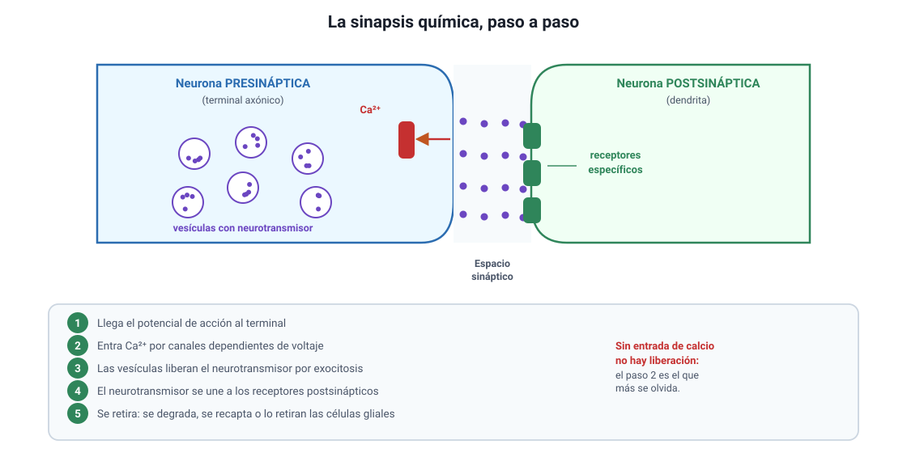

## 5. La sinapsis química

Las neuronas están separadas (sección 2d). Para que la señal pase de una a otra hace falta un mecanismo, y ese mecanismo es la **sinapsis**. En la sinapsis química, la señal deja de ser eléctrica por un instante y se convierte en **química**.

<figure><figcaption>Figura 4. Etapas de la transmisión en una sinapsis química. Diagrama propio.</figcaption></figure>

### a. Las partes

| Parte | Qué es |
|---|---|
| **Neurona presináptica** | La que **envía** la señal. Su terminal axónico contiene las vesículas |
| **Espacio sináptico** | Hendidura de unos 20 a 40 nanómetros entre ambas células |
| **Neurona postsináptica** | La que **recibe**. Su membrana tiene los receptores |

### b. Las cinco etapas

1. **Llega el potencial de acción** al terminal axónico de la neurona presináptica.
2. **Entra calcio.** La despolarización abre canales de **Ca2+** dependientes de voltaje, y el calcio entra al terminal.
3. **Se libera el neurotransmisor.** El calcio hace que las vesículas se fusionen con la membrana y vacíen su contenido al espacio sináptico por **exocitosis**.
4. **Se une a los receptores.** El neurotransmisor difunde por el espacio y se une a receptores específicos de la membrana postsináptica, lo que abre canales iónicos y cambia el potencial de esa célula.
5. **Se retira el neurotransmisor.** Se degrada por enzimas, se recapta hacia el terminal presináptico o lo retiran las células gliales. Sin este paso, la señal no terminaría nunca.

::: tip
**El calcio es el paso que más se olvida.** Sin entrada de Ca2+ no hay liberación de neurotransmisor, por más que el potencial de acción llegue al terminal. Si un enunciado describe un fármaco que bloquea los canales de calcio del terminal, la consecuencia es que **no se libera neurotransmisor** y la sinapsis se interrumpe, aunque el axón conduzca con normalidad.
:::

### c. Excitatoria o inhibitoria

Lo que determina el efecto **no es el neurotransmisor por sí solo, sino el receptor** al que se une:

| Tipo de sinapsis | Qué ocurre en la célula postsináptica | Efecto |
|---|---|---|
| **Excitatoria** | Entra Na+: la membrana se despolariza y se **acerca** al umbral | Hace **más probable** el potencial de acción |
| **Inhibitoria** | Entra Cl− o sale K+: la membrana se hiperpolariza y se **aleja** del umbral | Hace **menos probable** el potencial de acción |

::: nota
**Por qué el soma tiene que sumar.** Una neurona recibe a la vez miles de señales, unas excitatorias y otras inhibitorias. El soma las **integra**, y solo si el resultado alcanza el umbral en el cono axónico se dispara un potencial de acción. Esto explica por qué el sistema nervioso puede hacer algo más que reaccionar: puede **decidir** entre respuestas, y por eso el mismo estímulo no siempre produce el mismo resultado.
:::

### d. Algunos neurotransmisores

| Neurotransmisor | Dónde actúa y para qué |
|---|---|
| **Acetilcolina** | Unión entre la neurona motora y el músculo esquelético: produce la contracción |
| **Dopamina** | Movimiento, motivación y circuito de recompensa |
| **Serotonina** | Estado de ánimo, sueño y apetito |
| **GABA** | Principal neurotransmisor **inhibitorio** del sistema nervioso central |
| **Glutamato** | Principal neurotransmisor **excitatorio** del sistema nervioso central |
| **Noradrenalina** | Alerta y respuesta del sistema simpático |

### e. Agonistas y antagonistas

Muchas sustancias actúan sobre la sinapsis, y casi siempre de una de estas maneras. Esta tabla es la herramienta para entender la sección 7.

| Modo de acción | Qué hace la sustancia | Efecto sobre la señal |
|---|---|---|
| **Agonista** | Se une al receptor y lo activa, como haría el neurotransmisor | **Imita** la señal |
| **Antagonista** | Se une al receptor y lo bloquea sin activarlo | **Impide** la señal |
| **Inhibidor de la recaptación** | Impide que el neurotransmisor sea retirado del espacio sináptico | **Prolonga y potencia** la señal |
| **Inhibidor de la degradación** | Bloquea la enzima que destruye el neurotransmisor | **Prolonga** la señal |
| **Bloqueador de la liberación** | Impide la exocitosis de las vesículas | **Suprime** la señal |

::: tip
**Cómo resolver cualquier ítem de este tipo.** Pregúntate primero **dónde** actúa la sustancia: en el terminal presináptico, en el espacio o en el receptor. Después pregúntate **qué le hace a la señal**: la imita, la bloquea o la prolonga. Con esas dos respuestas se deduce el efecto sin necesidad de recordar el caso particular.
:::

### f. Por qué la sinapsis es química y no simplemente eléctrica

Convertir la señal a química parece un rodeo, y tiene un costo: introduce un **retardo** de aproximadamente medio milisegundo. A cambio entrega tres ventajas:

1. **Permite amplificar o atenuar** la señal, según cuánto neurotransmisor se libere.
2. **Permite invertirla**: una señal excitatoria puede convertirse en inhibitoria en la célula siguiente.
3. **Asegura un solo sentido**: el neurotransmisor se libera en un lado y los receptores están en el otro.

Sobre esa flexibilidad se construyen el aprendizaje y la memoria, y también es el punto donde actúan casi todos los fármacos y las drogas que afectan al sistema nervioso.
