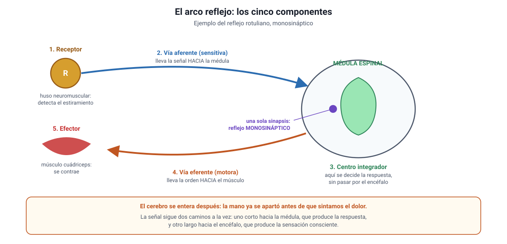

## 6. El arco reflejo simple

Es el conocimiento **2.1.3** del temario. Un **reflejo** es una respuesta rápida, involuntaria y estereotipada a un estímulo. El circuito que la produce se llama **arco reflejo**.

<figure><figcaption>Figura 5. Componentes del arco reflejo, en el ejemplo del reflejo rotuliano. Diagrama propio.</figcaption></figure>

### a. Los cinco componentes

Siempre son estos cinco, en este orden. Conviene memorizarlos, porque la PAES los pregunta ordenados, desordenados o por omisión.

| # | Componente | Qué hace | En el reflejo rotuliano |
|---|---|---|---|
| **1** | **Receptor** | Detecta el estímulo | Huso neuromuscular del cuádriceps, que detecta el estiramiento |
| **2** | **Vía aferente** | Lleva la señal hacia el SNC | Neurona sensitiva, entra por la raíz dorsal |
| **3** | **Centro integrador** | Procesa y decide la respuesta | Médula espinal |
| **4** | **Vía eferente** | Lleva la orden hacia el efector | Neurona motora, sale por la raíz ventral |
| **5** | **Efector** | Ejecuta la respuesta | Músculo cuádriceps, que se contrae |

### b. Por qué el reflejo es tan rápido

Porque **el centro integrador está en la médula espinal y no en el encéfalo**. La señal no sube hasta el cerebro para decidir: se procesa en el camino, y la orden sale de inmediato.

| | Reflejo medular | Respuesta voluntaria |
|---|---|---|
| **Centro integrador** | Médula espinal | Encéfalo |
| **Control de la voluntad** | No | Sí |
| **Tiempo** | Milisegundos | Bastante mayor |
| **Ejemplo** | Retirar la mano de una superficie caliente | Decidir tomar un vaso |

::: nota
**El cerebro se entera después.** En el reflejo de retirada, la mano ya se apartó **antes** de que sintamos el dolor. La señal sigue dos caminos a la vez: uno corto hacia la médula, que produce la respuesta, y otro largo hacia el encéfalo, que produce la sensación consciente. Por eso primero retiramos la mano y solo después decimos «ay». Esto no es una curiosidad: es la prueba de que el centro integrador del reflejo está en la médula.
:::

### c. Monosináptico y polisináptico

| | Monosináptico | Polisináptico |
|---|---|---|
| **Neuronas involucradas** | Dos: sensitiva y motora | Tres o más: se agregan interneuronas |
| **Sinapsis en el centro integrador** | Una | Varias |
| **Velocidad** | La máxima posible | Algo menor |
| **Ejemplo** | Reflejo rotuliano | Reflejo de retirada ante el dolor |

::: tip
**Cómo se distinguen en un ítem.** Cuenta las **sinapsis dentro del centro integrador**, no las neuronas del dibujo. Si la neurona sensitiva contacta directamente con la motora, es **monosináptico**. Si hay al menos una interneurona en medio, es **polisináptico**. El reflejo rotuliano es el ejemplo clásico de monosináptico, y por eso es el más rápido del cuerpo humano.
:::

### d. Para qué sirven los reflejos

- **Protegen.** Retirar la mano del fuego o cerrar el párpado ante un objeto que se acerca evita un daño antes de que la conciencia alcance a intervenir.
- **Mantienen la postura.** El reflejo de estiramiento corrige continuamente la posición de los músculos, y por eso no nos caemos al estar de pie.
- **Sirven para el diagnóstico.** Como el circuito es siempre el mismo, un reflejo ausente, disminuido o exagerado indica dónde puede estar la lesión. Por eso el médico golpea el tendón rotuliano en un examen neurológico.

::: nota
**Un razonamiento que la PAES pide.** Si un reflejo desaparece, la lesión puede estar en cualquiera de los cinco componentes, y la prueba sirve justamente para acotar dónde. Un ítem puede entregar datos —el músculo se contrae al estimularlo directamente, pero el reflejo no aparece— y pedir dónde está el problema. En ese caso el efector funciona, de modo que la falla está antes: en el receptor, en alguna de las dos vías o en el centro integrador.
:::
