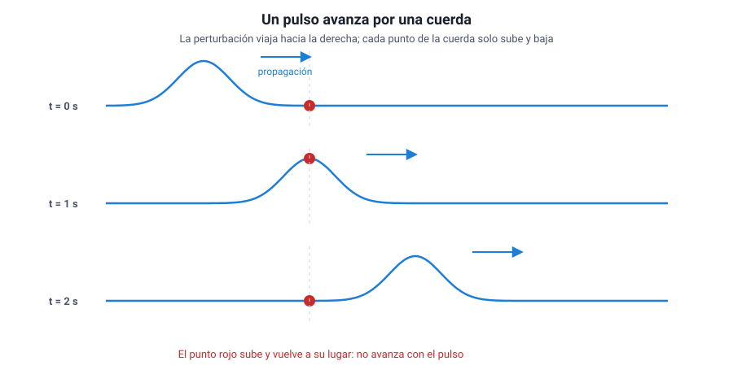

## 2. Qué es una onda

<figure><figcaption>Figura 1. El pulso avanza por la cuerda, pero el punto rojo solo sube y baja: la cuerda no viaja. Diagrama propio.</figcaption></figure>

### a. Una perturbación que viaja

Si sacudes una vez el extremo de una cuerda tensa, verás que una «joroba» recorre la cuerda hasta el otro extremo. Si dejas caer una piedra en un estanque, se forman anillos que se alejan del punto de impacto. En los dos casos pasa lo mismo: una **perturbación** —un cambio en el estado de un lugar— se transmite de un punto al siguiente. Eso es una **onda**.

La clave está en la palabra «transmite». Cada trozo de cuerda tira del trozo vecino; cada porción de agua empuja a la de al lado. La perturbación pasa de mano en mano, como en una fila de personas que se van pasando un balde.

### b. Viaja la energía, no la materia

Esta es la idea más importante del capítulo, y la más preguntada:

::: nota
**Una onda transporta energía (y también información) de un lugar a otro, pero no transporta materia.** Las partículas del medio solo **oscilan alrededor de su posición de equilibrio** y, cuando la onda ya pasó, vuelven a donde estaban.
:::

Hay dos observaciones sencillas que lo demuestran:

| Observación | Qué muestra |
|---|---|
| Un corcho flotando en un estanque sube y baja cuando pasan las ondas, pero no se acerca a la orilla | El agua bajo el corcho oscila en su lugar; la perturbación avanza, el agua no |
| En un estadio, la «ola» da la vuelta completa a la galería, pero cada espectador solo se para y se sienta en su asiento | Lo que viaja es el patrón de movimiento, no las personas |

Y una que muestra que sí viaja energía: una ola que llega a la playa puede mover arena y piedras, y el sonido de un parlante muy fuerte hace vibrar los vidrios de una ventana. Algo tuvo que llevar esa energía hasta allí.

::: tip
**Error típico en la PAES.** Pensar que en una onda «el agua viaja hacia la playa» o que «el aire viaja desde el parlante hasta el oído». Lo que viaja es la perturbación. Si una alternativa dice que la onda traslada partículas del medio de un lugar a otro, desconfía: esa es la confusión que la pregunta está buscando.
:::

### c. Pulso y onda periódica

Según cuántas veces se repita la perturbación, se distinguen dos casos:

- **Pulso**: una perturbación única. Una sacudida aislada de la cuerda, un aplauso, un golpe en la mesa.
- **Onda periódica**: una sucesión de perturbaciones que se repiten a intervalos de tiempo iguales. Ocurre cuando la **fuente oscila** de manera regular: una mano que sube y baja la cuerda con ritmo constante, la membrana de un parlante que vibra, los electrones que oscilan en la antena de una radio.

En este capítulo vamos a trabajar sobre todo con ondas periódicas, porque es en ellas donde tienen sentido el período, la frecuencia y la longitud de onda.

### d. Toda onda nace de algo que oscila

Detrás de toda onda hay una **fuente** que vibra. La fuente decide el ritmo de la onda (su frecuencia), y el medio decide qué tan rápido viaja (su rapidez de propagación). Esta división de tareas se retoma en la sección 5, porque explica qué cambia y qué no cuando una onda pasa de un medio a otro.

::: ejemplo
**Cómo se pone a prueba la idea.** Un curso quiere comprobar que las ondas de agua no arrastran lo que flota. Deja caer gotas en el centro de una bandeja con agua a ritmo constante y pone un trozo de corcho a 20 cm del punto de caída. Registra la posición del corcho cada 5 segundos durante un minuto.

- **Si las ondas arrastraran materia**, el corcho se alejaría del centro de forma sostenida.
- **Si solo transportan energía**, el corcho subiría y bajaría, sin desplazarse de manera apreciable.

El resultado es el segundo. Fíjate en la lógica: el experimento no se limita a mirar; compara lo que predice cada hipótesis y deja que los datos decidan. Eso es lo que la PAES pide cuando pregunta por la evidencia que apoya una idea.
:::
